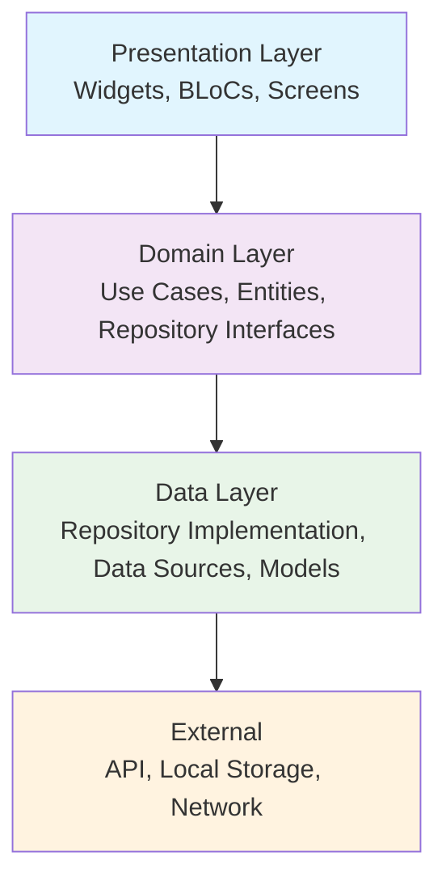
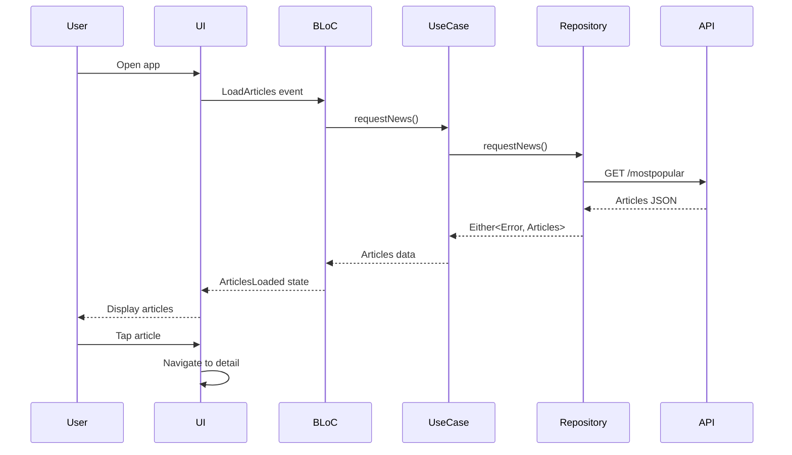

# 📱 Project Overview

> **Understanding the NY Times News Reader app and key learning outcomes**

---

## 🎯 **What We're Building**

A professional-grade news reader application that demonstrates industry best practices for Flutter development.

### **App Features**

#### **📰 Article List Screen**
- Displays NY Times most popular articles
- Infinite scrolling with pagination
- Article images and metadata
- Loading states and error handling
- Pull-to-refresh functionality

#### **📖 Article Detail Screen**
- Full article content display
- High-quality images with caching
- Proper navigation and back handling
- Responsive design for different screen sizes

#### **🔄 Error Handling**
- Network connectivity issues
- API rate limiting
- Server errors
- Graceful fallbacks and retry mechanisms

---

## 🏗️ **Architecture Overview**

### **Clean Architecture Layers**



### **Project Structure**
```
lib/
├── article_detail/              # Feature: Article Detail
│   └── presentation/
│       └── screen/
├── articles_list/               # Feature: Articles List
│   ├── data/                   # Data Layer
│   │   ├── model/              # Data Models (Article, Media)
│   │   ├── remote/             # Network Layer
│   │   │   ├── service/        # API Service (Retrofit)
│   │   │   └── source/         # Data Source Implementation
│   │   └── repository/         # Repository Implementation
│   ├── domain/                 # Domain Layer
│   │   ├── repository/         # Repository Interface
│   │   └── usecase/            # Business Logic
│   └── presentation/           # Presentation Layer
│       ├── bloc/               # State Management (BLoC)
│       ├── screen/             # UI Screens
│       └── widget/             # Reusable Components
├── common/                     # Shared Constants
├── core/                       # Core Utilities
├── di/                        # Dependency Injection
└── main.dart                  # App Entry Point
```

---

## 🎓 **Key Learning Outcomes**

By studying this project, you will master:

### **🏛️ Architecture Principles**
- **Clean Architecture**: Separation of concerns and dependency inversion
- **SOLID Principles**: Applied in real-world Flutter development
- **Feature-based organization**: Scalable project structure

### **🎨 State Management**
- **BLoC Pattern**: Events, states, and business logic separation
- **Immutable States**: Using Freezed for type-safe state management
- **State Transitions**: Loading, success, error, and empty states

### **🌐 Network & Data**
- **REST API Integration**: Using Retrofit for type-safe HTTP calls
- **Error Handling**: Comprehensive network error management
- **Data Modeling**: JSON serialization with code generation

### **🧪 Testing Strategies**
- **Unit Testing**: Repository, use case, and BLoC testing
- **Integration Testing**: End-to-end user flow testing
- **Mocking**: Proper dependency mocking with Mockito

### **🔧 Modern Tools**
- **Code Generation**: Freezed, JSON serialization, DI setup
- **Dependency Injection**: Injectable with get_it
- **Static Analysis**: Comprehensive linting rules

---

## 💡 **Real-World Applications**

### **Industry Patterns Demonstrated**

#### **📱 Mobile Development**
- Responsive UI design
- Performance optimization
- Memory management
- Offline capabilities

#### **🏢 Enterprise Development**
- Scalable architecture
- Maintainable codebase
- Comprehensive testing
- CI/CD integration

#### **👥 Team Development**
- Code organization
- Documentation practices
- Code review guidelines
- Best practices enforcement

---

## 🔍 **Technical Stack**

### **Core Dependencies**
```yaml
dependencies:
  # Framework
  flutter: sdk
  
  # State Management
  flutter_bloc: ^8.1.3          # BLoC pattern implementation
  
  # Functional Programming
  dartz: ^0.10.1                 # Either, Option monads
  
  # Networking
  dio: ^5.3.4                    # HTTP client
  retrofit: ^4.0.3               # Type-safe REST client
  
  # Dependency Injection
  injectable: ^2.3.2             # DI annotations
  get_it: ^7.6.4                 # Service locator
  
  # Serialization
  json_annotation: ^4.8.1        # JSON annotations
  freezed_annotation: ^2.4.1     # Immutable classes
  
  # UI & UX
  cached_network_image: ^3.3.0   # Image caching
```

### **Development Dependencies**
```yaml
dev_dependencies:
  # Testing
  flutter_test: sdk
  integration_test: sdk
  mockito: ^5.4.2               # Mocking framework
  
  # Code Generation
  build_runner: ^2.4.7          # Code generation runner
  json_serializable: ^6.7.1     # JSON serialization
  freezed: ^2.4.6               # Immutable classes
  injectable_generator: ^2.4.1   # DI code generation
  retrofit_generator: ^8.0.6     # REST client generation
  
  # Quality
  lint: ^2.3.0                  # Linting rules
```

---

## 🚀 **App Flow Demonstration**

### **User Journey**


### **Data Flow**
```
API Response → Model Parsing → Repository → Use Case → BLoC → UI State → Widget Rendering
```

---

## 🎯 **Why This Project?**

### **Educational Value**
- **Real-world complexity**: Not a toy example
- **Industry standards**: Follows professional practices
- **Comprehensive coverage**: Touches all aspects of app development
- **Progressive difficulty**: Build knowledge step by step

### **Career Preparation**
- **Interview readiness**: Common architecture questions covered
- **Portfolio project**: Demonstrable skills
- **Best practices**: Industry-standard approaches
- **Testing knowledge**: Critical for professional development

---

## 📊 **Learning Path Progress**

Track your progress through the modules:

- [ ] **Prerequisites & Setup** ✅ (Completed)
- [ ] **Project Overview** ✅ (Current)
- [ ] **Module 1**: Clean Architecture fundamentals
- [ ] **Module 2**: Data modeling and serialization
- [ ] **Module 3**: Network layer implementation
- [ ] **Module 4**: Repository pattern
- [ ] **Module 5**: Business logic separation
- [ ] **Module 6**: BLoC state management
- [ ] **Module 7**: UI implementation
- [ ] **Module 8**: Dependency injection
- [ ] **Module 9**: Testing strategies
- [ ] **Module 10**: Error handling and UX

---

## 🤔 **What Makes This Special?**

### **Not Just Another Tutorial**
- ✅ **Production-ready code**: Not simplified examples
- ✅ **Complete testing suite**: Unit, widget, and integration tests
- ✅ **CI/CD pipeline**: Real deployment practices
- ✅ **Error handling**: Comprehensive edge case coverage
- ✅ **Performance optimized**: Memory and network efficiency

### **Industry-Relevant Skills**
- ✅ **Scalable architecture**: Handles complex requirements
- ✅ **Team collaboration**: Code organization for multiple developers
- ✅ **Maintenance**: Easy to update and extend
- ✅ **Quality assurance**: Testing at every layer

---

## 🚀 **Ready to Dive In?**

Now that you understand what we're building and why, let's start with the fundamentals:

**Next Step**: [Module 1: Project Structure & Clean Architecture](03-project-structure-clean-architecture.md)

---

## 💡 **Study Tips for This Project**

1. **🔍 Explore First**: Navigate the codebase before reading explanations
2. **🏃‍♂️ Run the App**: See the features in action
3. **🧪 Experiment**: Modify code and observe changes
4. **📝 Take Notes**: Document your understanding
5. **🔄 Practice**: Recreate patterns in your own projects

---

**Let's build something amazing!** 🎉 