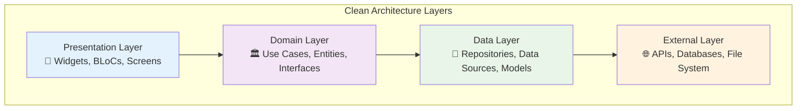
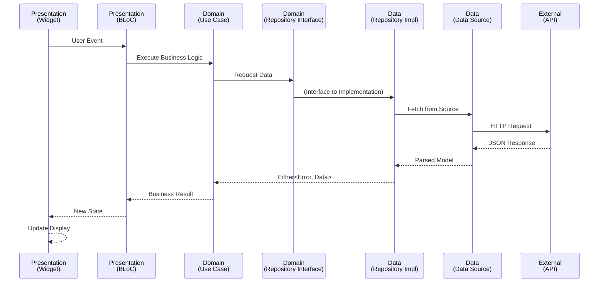

# 🏗️ Module 1: Project Structure & Clean Architecture

> **Master the fundamentals of Clean Architecture and understand the project organization**

---

## 🎯 **Learning Objectives**

After completing this module, you will:
- ✅ Understand Clean Architecture layers and their responsibilities
- ✅ Navigate the project structure confidently
- ✅ Identify dependency flow and separation of concerns
- ✅ Recognize the benefits of layered architecture

---

## 📚 **Clean Architecture Fundamentals**

### **What is Clean Architecture?**

Clean Architecture is a software design philosophy that separates concerns into distinct layers, each with specific responsibilities. It ensures that:

- **Business logic is independent** of frameworks, UI, and databases
- **Code is testable** at every layer
- **Dependencies point inward** toward business logic
- **Changes are isolated** to specific layers

### **The Dependency Rule**

> **"Source code dependencies can only point inwards"**



---

## 🗂️ **Project Structure Deep Dive**

### **Feature-Based Organization**

Our project uses **feature-based organization** rather than layer-based:

```
lib/
├── 📁 article_detail/           # Feature Module
├── 📁 articles_list/            # Feature Module  
├── 📁 common/                   # Shared Code
├── 📁 core/                     # Core Utilities
├── 📁 di/                       # Dependency Injection
└── 📄 main.dart                 # App Entry Point
```

### **Feature Module Structure**

Each feature follows Clean Architecture layers:

```
articles_list/
├── 📁 data/                     # Data Layer
│   ├── 📁 model/                # Data Transfer Objects
│   │   ├── 📄 article.dart
│   │   ├── 📄 article.g.dart          # Generated
│   │   ├── 📄 most_popular_response.dart
│   │   └── 📄 most_popular_response.g.dart  # Generated
│   ├── 📁 remote/               # External Data Sources
│   │   ├── 📁 service/          # API Services
│   │   │   ├── 📄 article_service.dart
│   │   │   └── 📄 article_service.g.dart    # Generated
│   │   └── 📁 source/           # Data Source Implementation
│   │       ├── 📄 article_remote_data_source.dart
│   │       └── 📄 article_remote_data_source_impl.dart
│   └── 📁 repository/           # Repository Implementation
│       └── 📄 article_repo_impl.dart
├── 📁 domain/                   # Domain Layer
│   ├── 📁 repository/           # Repository Interfaces
│   │   └── 📄 article_repo.dart
│   └── 📁 usecase/              # Business Logic
│       ├── 📄 article_usecase.dart
│       └── 📄 article_usecase_impl.dart
└── 📁 presentation/             # Presentation Layer
    ├── 📁 bloc/                 # State Management
    │   ├── 📄 article_list_bloc.dart
    │   ├── 📄 article_list_bloc.freezed.dart   # Generated
    │   ├── 📄 article_list_event.dart
    │   └── 📄 article_list_state.dart
    ├── 📁 screen/               # UI Screens
    │   └── 📄 articles_list_screen.dart
    └── 📁 widget/               # Reusable Components
        └── 📄 article_list_item.dart
```

---

## 🔍 **Layer Responsibilities**

### **1. Presentation Layer** 📱

**Responsibility**: Handle user interface and user interactions

**Contains**:
- **Widgets**: UI components and screens
- **BLoCs**: State management and business logic coordination
- **Models**: View-specific data structures

**Example**:
```dart
// articles_list/presentation/screen/articles_list_screen.dart
class ArticlesListScreen extends StatefulWidget {
  @override
  Widget build(BuildContext context) {
    return BlocProvider<ArticleListBloc>(
      create: (_) => getIt<ArticleListBloc>(),
      child: BlocBuilder<ArticleListBloc, ArticleListState>(
        builder: (context, state) => _buildUI(state),
      ),
    );
  }
}
```

**Key Principles**:
- ✅ Only knows about Domain layer
- ✅ Contains UI logic only
- ✅ Responds to user events
- ✅ Displays data received from BLoC

### **2. Domain Layer** 🏛️

**Responsibility**: Contains business logic and rules

**Contains**:
- **Use Cases**: Application-specific business rules
- **Entities**: Business objects
- **Repository Interfaces**: Contracts for data access

**Example**:
```dart
// articles_list/domain/usecase/article_usecase.dart
abstract class ArticleUseCase {
  Future<Either<Error, MostPopularResponse>> requestNews();
}

// Implementation
@Injectable(as: ArticleUseCase)
class ArticleUseCaseImpl implements ArticleUseCase {
  ArticleUseCaseImpl(this._articleRepo);
  final ArticleRepo _articleRepo;

  @override
  Future<Either<Error, MostPopularResponse>> requestNews() => 
      _articleRepo.requestNews();
}
```

**Key Principles**:
- ✅ Independent of external frameworks
- ✅ Contains core business logic
- ✅ Defines interfaces for data access
- ✅ No knowledge of UI or data implementation

### **3. Data Layer** 💾

**Responsibility**: Provide data to the domain layer

**Contains**:
- **Repository Implementations**: Concrete data access
- **Data Sources**: Remote API, local database access
- **Models**: Data transfer objects with JSON serialization

**Example**:
```dart
// articles_list/data/repository/article_repo_impl.dart
@Injectable(as: ArticleRepo)
class ArticleRepoImpl implements ArticleRepo {
  ArticleRepoImpl(this._remoteDataSource);
  final ArticleRemoteDataSource _remoteDataSource;

  @override
  Future<Either<Error, MostPopularResponse>> requestNews() async {
    try {
      final result = await _remoteDataSource.getTasks(apiKey);
      return right(result);
    } on DioException catch (exception) {
      return left(_handleError(exception));
    }
  }
}
```

**Key Principles**:
- ✅ Implements domain interfaces
- ✅ Handles data source coordination
- ✅ Manages error handling
- ✅ Converts between data and domain models

---

## 🔄 **Dependency Flow**

### **The Clean Architecture Flow**



### **Code Flow Example**

1. **User Action**: Tap "Load Articles"
2. **UI Layer**: Widget dispatches event to BLoC
3. **BLoC**: Calls use case
4. **Use Case**: Calls repository interface
5. **Repository**: Implements business rules and calls data source
6. **Data Source**: Makes API call
7. **Response**: Flows back through layers
8. **UI Update**: BLoC emits new state, UI rebuilds

---

## 🎯 **Hands-On Activity**

### **Exercise 1: Navigate the Codebase**

1. **Explore each layer**:
   - Open `lib/articles_list/` folder
   - Navigate through `data/`, `domain/`, and `presentation/`
   - Identify the purpose of each file

2. **Trace a feature**:
   - Start from `ArticlesListScreen`
   - Follow the dependency chain to `ArticleService`
   - Identify how each layer interacts

3. **Identify patterns**:
   - Find interfaces and their implementations
   - Locate dependency injection annotations
   - Spot code generation files (*.g.dart, *.freezed.dart)

### **Exercise 2: Dependency Analysis**

Create a diagram showing:
- Which classes depend on which interfaces
- How the dependency inversion principle is applied
- Where the boundaries between layers exist

### **Exercise 3: Compare Approaches**

**Bad Architecture** (Anti-pattern):
```dart
// ❌ Widget directly calling API
class ArticleWidget extends StatelessWidget {
  @override
  Widget build(BuildContext context) {
    return FutureBuilder(
      future: Dio().get('https://api.nytimes.com/articles'),
      builder: (context, snapshot) => // UI logic mixed with data access
    );
  }
}
```

**Good Architecture** (Our approach):
```dart
// ✅ Proper separation through layers
class ArticleWidget extends StatelessWidget {
  @override
  Widget build(BuildContext context) {
    return BlocBuilder<ArticleBloc, ArticleState>(
      builder: (context, state) => state.when(
        loading: () => LoadingWidget(),
        loaded: (articles) => ArticleList(articles),
        error: (error) => ErrorWidget(error),
      ),
    );
  }
}
```

---

## 💡 **Key Benefits of This Architecture**

### **🧪 Testability**
- Each layer can be tested independently
- Dependencies can be easily mocked
- Business logic is isolated from UI and data concerns

### **🔧 Maintainability**
- Changes are localized to specific layers
- New features follow established patterns
- Code is self-documenting through clear structure

### **🔄 Flexibility**
- Easy to swap implementations (e.g., API to local storage)
- UI changes don't affect business logic
- Business rules changes don't affect data layer

### **👥 Team Collaboration**
- Clear boundaries for team responsibilities
- Parallel development possible
- Consistent code organization

---

## 🚨 **Common Mistakes to Avoid**

### **❌ Layer Violations**
```dart
// BAD: UI directly accessing data layer
class ArticleWidget extends StatelessWidget {
  @override
  Widget build(BuildContext context) {
    final repo = getIt<ArticleRepoImpl>(); // Accessing concrete implementation
    // ...
  }
}
```

### **❌ Circular Dependencies**
```dart
// BAD: Domain depending on Data
class ArticleUseCase {
  final ArticleRepoImpl _repo; // Should depend on interface, not implementation
}
```

### **❌ Mixed Responsibilities**
```dart
// BAD: Business logic in UI
class ArticleWidget extends StatelessWidget {
  Widget build(BuildContext context) {
    final isPopular = article.views > 1000; // Business logic in UI
    return PopularityBadge(visible: isPopular);
  }
}
```

---

## 🎓 **Knowledge Check**

### **Questions to Test Understanding**:

1. **Architecture Questions**:
   - What are the three main layers in Clean Architecture?
   - Which direction should dependencies flow?
   - Why do we use interfaces in the domain layer?

2. **Project Structure Questions**:
   - Where would you put shared utility functions?
   - How do you decide what belongs in which layer?
   - What files are generated and should not be edited?

3. **Practical Questions**:
   - How would you add a new feature to this project?
   - Where would you implement caching logic?
   - How would you add user authentication?

### **Answers**:

1. **Architecture**:
   - Presentation, Domain, Data layers
   - Dependencies point inward (toward business logic)
   - Interfaces allow dependency inversion and testability

2. **Structure**:
   - Shared utilities go in `common/` or `core/`
   - Each layer has specific responsibilities (UI, business logic, data access)
   - Files ending in `.g.dart`, `.freezed.dart`, `.config.dart` are generated

3. **Practical**:
   - Create new feature folder with data/domain/presentation structure
   - Caching logic goes in repository implementation (data layer)
   - Authentication would be a separate feature module with similar structure

---

## 🔗 **What's Next?**

Now that you understand the architecture foundation, let's dive into the data layer:

**Next Module**: [Module 2: Models & Serialization](04-models-serialization.md)

---

## 📚 **Additional Resources**

- [Clean Architecture by Uncle Bob](https://blog.cleancoder.com/uncle-bob/2012/08/13/the-clean-architecture.html)
- [Flutter Clean Architecture Guide](https://resocoder.com/flutter-clean-architecture-tdd/)
- [SOLID Principles in Dart](https://dart.academy/solid-principles-in-dart/)

---

**Great job!** You've mastered the architectural foundation. Ready for the next challenge? 🚀 