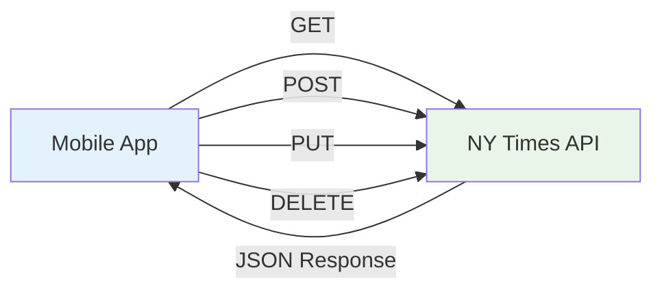

# 🌐 Module 3: Networking & Data Sources

> **Master REST API integration with Retrofit, Dio, and proper data source patterns**

---

## 🎯 **Learning Objectives**

After completing this module, you will:
- ✅ Understand REST API integration patterns
- ✅ Implement type-safe API calls with Retrofit
- ✅ Handle network errors gracefully
- ✅ Create efficient data source abstractions
- ✅ Manage API configurations and interceptors
- ✅ Test network layers effectively

---

## 📚 **REST API Fundamentals**

### **HTTP Methods Overview**



### **NY Times API Structure**

```
Base URL: https://api.nytimes.com/svc/
Endpoints:
├── /mostpopular/v2/emailed/{period}.json
├── /mostpopular/v2/shared/{period}.json
├── /mostpopular/v2/viewed/{period}.json
└── /search/v2/articlesearch.json

Parameters:
├── api-key: YOUR_API_KEY (required)
├── period: 1, 7, or 30 days
└── page: pagination support
```

---

## 🔧 **Dio HTTP Client Setup**

### **Basic Dio Configuration**

```dart
// lib/core/network/dio_client.dart
import 'package:dio/dio.dart';
import 'package:pretty_dio_logger/pretty_dio_logger.dart';

class DioClient {
  static const String _baseUrl = 'https://api.nytimes.com/svc/';
  static const int _connectionTimeOut = 30000;
  static const int _receiveTimeOut = 30000;

  static Dio createDio() {
    final dio = Dio(BaseOptions(
      baseUrl: _baseUrl,
      connectTimeout: const Duration(milliseconds: _connectionTimeOut),
      receiveTimeout: const Duration(milliseconds: _receiveTimeOut),
      headers: {
        'Content-Type': 'application/json',
        'Accept': 'application/json',
      },
    ));

    // Add interceptors
    _addInterceptors(dio);
    
    return dio;
  }

  static void _addInterceptors(Dio dio) {
    // Logging interceptor (only in debug mode)
    if (kDebugMode) {
      dio.interceptors.add(PrettyDioLogger(
        requestHeader: true,
        requestBody: true,
        responseBody: true,
        responseHeader: false,
        error: true,
        compact: true,
      ));
    }

    // API key interceptor
    dio.interceptors.add(ApiKeyInterceptor());
    
    // Error handling interceptor
    dio.interceptors.add(ErrorInterceptor());
  }
}
```

### **Custom Interceptors**

```dart
// API Key Interceptor
class ApiKeyInterceptor extends Interceptor {
  @override
  void onRequest(RequestOptions options, RequestInterceptorHandler handler) {
    // Add API key to all requests
    options.queryParameters['api-key'] = apiKey;
    super.onRequest(options, handler);
  }
}

// Error Handling Interceptor
class ErrorInterceptor extends Interceptor {
  @override
  void onError(DioException err, ErrorInterceptorHandler handler) {
    AppLogger.error(
      'Network Error: ${err.message}',
      err,
      err.stackTrace,
    );
    super.onError(err, handler);
  }
}

// Retry Interceptor
class RetryInterceptor extends Interceptor {
  final int maxRetries;
  final Duration retryDelay;

  RetryInterceptor({
    this.maxRetries = 3,
    this.retryDelay = const Duration(seconds: 1),
  });

  @override
  Future<void> onError(DioException err, ErrorInterceptorHandler handler) async {
    if (_shouldRetry(err) && err.requestOptions.extra['retries'] < maxRetries) {
      err.requestOptions.extra['retries'] = 
          (err.requestOptions.extra['retries'] ?? 0) + 1;
      
      await Future.delayed(retryDelay);
      
      try {
        final response = await Dio().fetch(err.requestOptions);
        handler.resolve(response);
        return;
      } catch (e) {
        // Continue with original error if retry fails
      }
    }
    super.onError(err, handler);
  }

  bool _shouldRetry(DioException err) {
    return err.type == DioExceptionType.connectionTimeout ||
           err.type == DioExceptionType.receiveTimeout ||
           err.type == DioExceptionType.connectionError ||
           (err.response?.statusCode != null && 
            err.response!.statusCode! >= 500);
  }
}
```

---

## 🏗️ **Retrofit Service Implementation**

### **Article Service Definition**

```dart
// lib/articles_list/data/remote/service/article_service.dart
import 'package:retrofit/retrofit.dart';
import 'package:dio/dio.dart';

part 'article_service.g.dart';

@RestApi()
abstract class ArticleService {
  factory ArticleService(Dio dio) = _ArticleService;

  /// Get most popular articles by email
  @GET('/mostpopular/v2/emailed/{period}.json')
  Future<MostPopularResponse> getEmailedArticles(
    @Path('period') int period,
  );

  /// Get most popular articles by shares
  @GET('/mostpopular/v2/shared/{period}.json') 
  Future<MostPopularResponse> getSharedArticles(
    @Path('period') int period,
  );

  /// Get most popular articles by views
  @GET('/mostpopular/v2/viewed/{period}.json')
  Future<MostPopularResponse> getViewedArticles(
    @Path('period') int period,
  );

  /// Search articles
  @GET('/search/v2/articlesearch.json')
  Future<SearchResponse> searchArticles(
    @Query('q') String query,
    @Query('page') int page,
    @Query('sort') String sort,
  );

  /// Get article details
  @GET('/mostpopular/v2/emailed/{period}.json')
  Future<MostPopularResponse> getArticlesByCategory(
    @Path('period') int period,
    @Query('section') String section,
  );
}
```

### **Service Usage Examples**

```dart
// Usage in repository
class ArticleRepositoryImpl implements ArticleRepository {
  final ArticleService _service;

  const ArticleRepositoryImpl(this._service);

  @override
  Future<Either<Error, MostPopularResponse>> getPopularArticles() async {
    try {
      final response = await _service.getEmailedArticles(7);
      return right(response);
    } on DioException catch (e) {
      return left(_handleDioError(e));
    } catch (e) {
      return left(Error.unknown(e.toString()));
    }
  }

  @override
  Future<Either<Error, SearchResponse>> searchArticles(
    String query, 
    int page,
  ) async {
    try {
      final response = await _service.searchArticles(
        query,
        page,
        'newest',
      );
      return right(response);
    } on DioException catch (e) {
      return left(_handleDioError(e));
    }
  }
}
```

---

## 🔧 **Data Source Pattern**

### **Abstract Data Source**

```dart
// lib/articles_list/data/remote/source/article_remote_data_source.dart
abstract class ArticleRemoteDataSource {
  Future<MostPopularResponse> getPopularArticles();
  Future<MostPopularResponse> getArticlesByPeriod(int period);
  Future<SearchResponse> searchArticles(String query, int page);
  Future<MostPopularResponse> getArticlesBySection(String section);
}
```

### **Concrete Implementation**

```dart
// lib/articles_list/data/remote/source/article_remote_data_source_impl.dart
@Injectable(as: ArticleRemoteDataSource)
class ArticleRemoteDataSourceImpl implements ArticleRemoteDataSource {
  final ArticleService _service;

  const ArticleRemoteDataSourceImpl(this._service);

  @override
  Future<MostPopularResponse> getPopularArticles() async {
    return await _service.getEmailedArticles(7);
  }

  @override
  Future<MostPopularResponse> getArticlesByPeriod(int period) async {
    _validatePeriod(period);
    return await _service.getEmailedArticles(period);
  }

  @override
  Future<SearchResponse> searchArticles(String query, int page) async {
    if (query.trim().isEmpty) {
      throw ArgumentError('Search query cannot be empty');
    }
    if (page < 0) {
      throw ArgumentError('Page number must be non-negative');
    }
    
    return await _service.searchArticles(query, page, 'newest');
  }

  @override
  Future<MostPopularResponse> getArticlesBySection(String section) async {
    if (section.trim().isEmpty) {
      throw ArgumentError('Section cannot be empty');
    }
    
    return await _service.getArticlesByCategory(7, section);
  }

  void _validatePeriod(int period) {
    if (![1, 7, 30].contains(period)) {
      throw ArgumentError('Period must be 1, 7, or 30 days');
    }
  }
}
```

---

## 🚨 **Error Handling**

### **Comprehensive Error Mapping**

```dart
// lib/core/network/network_error_handler.dart
class NetworkErrorHandler {
  static Error handleDioError(DioException error) {
    switch (error.type) {
      case DioExceptionType.connectionTimeout:
        return const Error.timeoutError();
        
      case DioExceptionType.receiveTimeout:
        return const Error.timeoutError();
        
      case DioExceptionType.sendTimeout:
        return const Error.timeoutError();
        
      case DioExceptionType.badResponse:
        return _handleResponseError(error.response!);
        
      case DioExceptionType.connectionError:
        return Error.networkError('Connection failed: ${error.message}');
        
      case DioExceptionType.cancel:
        return const Error.networkError('Request was cancelled');
        
      case DioExceptionType.badCertificate:
        return const Error.networkError('SSL certificate error');
        
      case DioExceptionType.unknown:
      default:
        return Error.unknown('Unknown network error: ${error.message}');
    }
  }

  static Error _handleResponseError(Response response) {
    final statusCode = response.statusCode ?? 0;
    final data = response.data;
    
    switch (statusCode) {
      case 400:
        return Error.httpBadRequest(_extractErrorMessage(data));
        
      case 401:
        return const Error.httpUnAuthorizedError();
        
      case 403:
        return const Error.httpForbiddenError();
        
      case 404:
        return const Error.httpNotFoundError();
        
      case 429:
        return const Error.httpRateLimitError();
        
      case 500:
        return Error.httpInternalServerError(_extractErrorMessage(data));
        
      case 502:
      case 503:
      case 504:
        return const Error.httpServerUnavailableError();
        
      default:
        return Error.httpUnknownError(
          'HTTP $statusCode: ${_extractErrorMessage(data)}',
        );
    }
  }

  static String _extractErrorMessage(dynamic data) {
    if (data is Map<String, dynamic>) {
      return data['message'] ?? 
             data['error'] ?? 
             data['fault']?['faultstring'] ?? 
             'Unknown error occurred';
    }
    return data?.toString() ?? 'Unknown error occurred';
  }
}
```

### **API Response Validation**

```dart
// lib/core/network/response_validator.dart
class ResponseValidator {
  static bool isValidResponse(Response response) {
    // Check status code
    if (response.statusCode == null || response.statusCode! < 200 || response.statusCode! >= 300) {
      return false;
    }

    // Check if response has data
    if (response.data == null) {
      return false;
    }

    // For NY Times API, check specific structure
    if (response.data is Map<String, dynamic>) {
      final data = response.data as Map<String, dynamic>;
      
      // NY Times API should have 'status' field
      if (data.containsKey('status')) {
        return data['status'] == 'OK';
      }
      
      // Or should have 'results' for most endpoints
      return data.containsKey('results');
    }

    return true;
  }

  static void validateMostPopularResponse(MostPopularResponse response) {
    if (response.status != 'OK') {
      throw InvalidResponseException('Invalid API response status: ${response.status}');
    }
    
    if (response.articles.isEmpty) {
      AppLogger.warning('API returned empty results');
    }
  }
}

class InvalidResponseException implements Exception {
  final String message;
  const InvalidResponseException(this.message);
  
  @override
  String toString() => 'InvalidResponseException: $message';
}
```

---

## 🧪 **Testing Network Layer**

### **Service Testing with Mock Dio**

```dart
// test/unit-tests/network/article_service_test.dart
@GenerateMocks([Dio])
void main() {
  group('ArticleService', () {
    late MockDio mockDio;
    late ArticleService service;

    setUp(() {
      mockDio = MockDio();
      service = ArticleService(mockDio);
    });

    group('getEmailedArticles', () {
      test('should return MostPopularResponse when call is successful', () async {
        // Arrange
        final responseData = {
          'status': 'OK',
          'copyright': 'Copyright (c) 2023 The New York Times Company.',
          'results': [
            {
              'id': 1,
              'title': 'Test Article',
              'abstract': 'Test Abstract',
              'url': 'https://example.com',
              'published_date': '2023-01-01',
              'media': [],
            }
          ],
        };

        when(mockDio.get('/mostpopular/v2/emailed/7.json'))
            .thenAnswer((_) async => Response(
                  data: responseData,
                  statusCode: 200,
                  requestOptions: RequestOptions(path: '/mostpopular/v2/emailed/7.json'),
                ));

        // Act
        final result = await service.getEmailedArticles(7);

        // Assert
        expect(result.status, 'OK');
        expect(result.articles.length, 1);
        expect(result.articles.first.title, 'Test Article');
        verify(mockDio.get('/mostpopular/v2/emailed/7.json')).called(1);
      });

      test('should throw DioException when network call fails', () async {
        // Arrange
        when(mockDio.get('/mostpopular/v2/emailed/7.json'))
            .thenThrow(DioException(
              requestOptions: RequestOptions(path: '/mostpopular/v2/emailed/7.json'),
              type: DioExceptionType.connectionTimeout,
            ));

        // Act & Assert
        expect(
          () => service.getEmailedArticles(7),
          throwsA(isA<DioException>()),
        );
      });
    });
  });
}
```

### **Data Source Testing**

```dart
// test/unit-tests/data/remote/article_remote_data_source_test.dart
@GenerateMocks([ArticleService])
void main() {
  group('ArticleRemoteDataSourceImpl', () {
    late MockArticleService mockService;
    late ArticleRemoteDataSourceImpl dataSource;

    setUp(() {
      mockService = MockArticleService();
      dataSource = ArticleRemoteDataSourceImpl(mockService);
    });

    group('getPopularArticles', () {
      test('should return articles when service call succeeds', () async {
        // Arrange
        final expectedResponse = MostPopularResponse('OK', 'copyright', []);
        when(mockService.getEmailedArticles(7))
            .thenAnswer((_) async => expectedResponse);

        // Act
        final result = await dataSource.getPopularArticles();

        // Assert
        expect(result, expectedResponse);
        verify(mockService.getEmailedArticles(7)).called(1);
      });
    });

    group('getArticlesByPeriod', () {
      test('should validate period parameter', () async {
        // Act & Assert
        expect(
          () => dataSource.getArticlesByPeriod(5),
          throwsA(isA<ArgumentError>()),
        );
        expect(
          () => dataSource.getArticlesByPeriod(0),
          throwsA(isA<ArgumentError>()),
        );
      });

      test('should accept valid periods', () async {
        // Arrange
        final expectedResponse = MostPopularResponse('OK', 'copyright', []);
        when(mockService.getEmailedArticles(any))
            .thenAnswer((_) async => expectedResponse);

        // Act & Assert
        for (final period in [1, 7, 30]) {
          await dataSource.getArticlesByPeriod(period);
          verify(mockService.getEmailedArticles(period)).called(1);
        }
      });
    });

    group('searchArticles', () {
      test('should validate query parameter', () async {
        // Act & Assert
        expect(
          () => dataSource.searchArticles('', 0),
          throwsA(isA<ArgumentError>()),
        );
        expect(
          () => dataSource.searchArticles('   ', 0),
          throwsA(isA<ArgumentError>()),
        );
      });

      test('should validate page parameter', () async {
        // Act & Assert
        expect(
          () => dataSource.searchArticles('query', -1),
          throwsA(isA<ArgumentError>()),
        );
      });
    });
  });
}
```

---

## 🎯 **Advanced Networking Patterns**

### **Request Caching**

```dart
// lib/core/network/cache_interceptor.dart
class CacheInterceptor extends Interceptor {
  final Map<String, CacheEntry> _cache = {};
  final Duration _defaultExpiry = const Duration(minutes: 5);

  @override
  Future<void> onRequest(
    RequestOptions options,
    RequestInterceptorHandler handler,
  ) async {
    // Only cache GET requests
    if (options.method.toLowerCase() != 'get') {
      return handler.next(options);
    }

    final cacheKey = _generateCacheKey(options);
    final cachedEntry = _cache[cacheKey];

    // Return cached response if valid
    if (cachedEntry != null && !cachedEntry.isExpired) {
      final response = Response(
        data: cachedEntry.data,
        statusCode: 200,
        requestOptions: options,
      );
      return handler.resolve(response);
    }

    handler.next(options);
  }

  @override
  void onResponse(Response response, ResponseInterceptorHandler handler) {
    // Cache successful responses
    if (response.statusCode == 200 && response.requestOptions.method.toLowerCase() == 'get') {
      final cacheKey = _generateCacheKey(response.requestOptions);
      _cache[cacheKey] = CacheEntry(
        data: response.data,
        expiry: DateTime.now().add(_defaultExpiry),
      );
    }
    
    handler.next(response);
  }

  String _generateCacheKey(RequestOptions options) {
    return '${options.method}_${options.path}_${options.queryParameters}';
  }
}

class CacheEntry {
  final dynamic data;
  final DateTime expiry;

  CacheEntry({required this.data, required this.expiry});

  bool get isExpired => DateTime.now().isAfter(expiry);
}
```

### **Offline Support**

```dart
// lib/core/network/offline_interceptor.dart
class OfflineInterceptor extends Interceptor {
  final ConnectivityService _connectivityService;
  final LocalStorageService _localStorage;

  OfflineInterceptor(this._connectivityService, this._localStorage);

  @override
  Future<void> onRequest(
    RequestOptions options,
    RequestInterceptorHandler handler,
  ) async {
    final isConnected = await _connectivityService.isConnected();
    
    if (!isConnected && options.method.toLowerCase() == 'get') {
      // Try to serve from local storage
      final cachedData = await _localStorage.getCachedResponse(options.path);
      if (cachedData != null) {
        final response = Response(
          data: cachedData,
          statusCode: 200,
          requestOptions: options,
        );
        return handler.resolve(response);
      }
      
      // No cached data available
      handler.reject(DioException(
        requestOptions: options,
        type: DioExceptionType.connectionError,
        message: 'No internet connection and no cached data available',
      ));
      return;
    }
    
    handler.next(options);
  }

  @override
  void onResponse(Response response, ResponseInterceptorHandler handler) async {
    // Cache successful responses for offline use
    if (response.statusCode == 200) {
      await _localStorage.cacheResponse(
        response.requestOptions.path,
        response.data,
      );
    }
    
    handler.next(response);
  }
}
```

---

## 🎯 **Hands-On Exercise**

### **Exercise 1: Extend Article Service**

Add these endpoints to the ArticleService:

```dart
// TODO: Add these methods to ArticleService
@GET('/search/v2/articlesearch.json')
Future<SearchResponse> searchByDateRange(
  @Query('q') String query,
  @Query('begin_date') String beginDate,
  @Query('end_date') String endDate,
);

@GET('/mostpopular/v2/viewed/{period}.json')
Future<MostPopularResponse> getViewedBySection(
  @Path('period') int period,
  @Query('section') String section,
);
```

### **Exercise 2: Custom Error Handling**

Create a custom error handler for NY Times API specific errors:

```dart
// TODO: Implement NYTimesErrorHandler
class NYTimesErrorHandler {
  static Error handleApiError(Response response) {
    // Handle NY Times specific error responses
    // Example: Rate limiting, invalid API key, etc.
  }
}
```

### **Exercise 3: Request Analytics**

Implement analytics tracking for API calls:

```dart
// TODO: Create AnalyticsInterceptor
class AnalyticsInterceptor extends Interceptor {
  // Track API call frequency, response times, error rates
}
```

---

## 🎓 **Knowledge Check**

### **Questions**:

1. **What's the difference between Dio and Retrofit?**
2. **When should you use interceptors vs direct service methods?**
3. **How do you handle API versioning in your service?**
4. **What's the best way to handle authentication tokens?**

### **Practical Scenarios**:

1. **API Rate Limiting**: How would you implement exponential backoff?
2. **Large Response Handling**: How would you handle paginated responses?
3. **Multiple Environments**: How would you switch between dev/staging/prod APIs?

---

## 🔗 **What's Next?**

Now that you understand networking, let's explore how to organize data access with the Repository pattern:

**Next Module**: [Module 4: Repository Pattern](06-repository-pattern.md)

---

## 📚 **Additional Resources**

- [Dio Package Documentation](https://pub.dev/packages/dio)
- [Retrofit Package Documentation](https://pub.dev/packages/retrofit)
- [HTTP Status Codes Reference](https://httpstatuses.com/)
- [REST API Best Practices](https://restfulapi.net/rest-api-best-practices/)

---

**Great progress!** You've mastered networking and data sources. Ready to organize data access? 🚀 