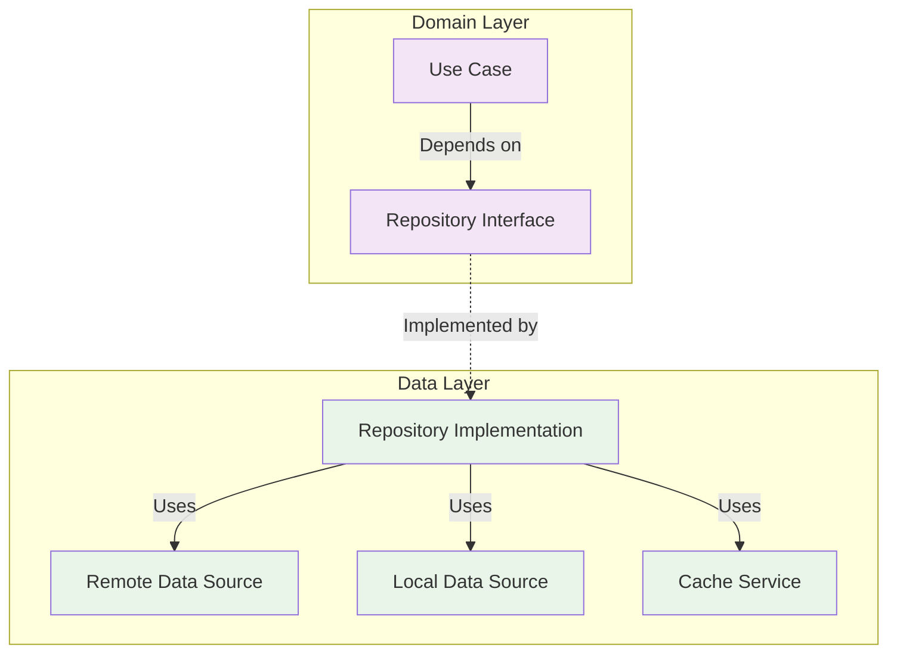

# 🗄️ Module 4: Repository Pattern

> **Master data abstraction and repository pattern implementation for clean architecture**

---

## 🎯 **Learning Objectives**

After completing this module, you will:
- ✅ Understand the Repository pattern and its benefits
- ✅ Implement repository interfaces and concrete implementations
- ✅ Handle data source coordination and error mapping
- ✅ Create testable data access layers
- ✅ Apply caching strategies within repositories
- ✅ Coordinate multiple data sources effectively

---

## 📚 **Repository Pattern Fundamentals**

### **What is the Repository Pattern?**

The Repository pattern encapsulates the logic needed to access data sources. It centralizes common data access functionality, providing better maintainability and decoupling infrastructure or technology used to access databases from the domain model layer.



### **Benefits of Repository Pattern**

- ✅ **Decoupling**: Business logic independent of data access
- ✅ **Testability**: Easy to mock data sources
- ✅ **Maintainability**: Centralized data access logic
- ✅ **Flexibility**: Switch between different data sources
- ✅ **Consistency**: Uniform data access interface

---

## 🏗️ **Repository Interface Design**

### **Article Repository Interface**

```dart
// lib/articles_list/domain/repository/article_repo.dart
abstract class ArticleRepo {
  /// Fetches the most popular articles
  Future<Either<Error, MostPopularResponse>> requestNews();
  
  /// Fetches articles by specific period
  Future<Either<Error, MostPopularResponse>> getArticlesByPeriod(int period);
  
  /// Searches articles by query
  Future<Either<Error, SearchResponse>> searchArticles(
    String query, {
    int page = 0,
    String sort = 'newest',
  });
  
  /// Fetches articles by section
  Future<Either<Error, MostPopularResponse>> getArticlesBySection(
    String section, {
    int period = 7,
  });
  
  /// Gets cached articles (offline support)
  Future<Either<Error, List<Article>>> getCachedArticles();
  
  /// Clears article cache
  Future<Either<Error, void>> clearCache();
  
  /// Gets article by ID
  Future<Either<Error, Article>> getArticleById(int id);
}
```

### **Interface Design Principles**

#### **✅ Good Interface Design**
```dart
abstract class ArticleRepo {
  // Return Either<Error, Data> for error handling
  Future<Either<Error, MostPopularResponse>> requestNews();
  
  // Use descriptive method names
  Future<Either<Error, List<Article>>> getFavoriteArticles();
  
  // Include optional parameters with defaults
  Future<Either<Error, SearchResponse>> searchArticles(
    String query, {
    int page = 0,
    int limit = 20,
    String sort = 'newest',
  });
  
  // Provide specific methods for different use cases
  Future<Either<Error, List<Article>>> getTrendingArticles();
  Future<Either<Error, List<Article>>> getRecentArticles();
}
```

#### **❌ Poor Interface Design**
```dart
abstract class ArticleRepo {
  // Throws exceptions instead of returning Either
  Future<List<Article>> getArticles(); // Can throw
  
  // Generic method with unclear parameters
  Future<dynamic> getData(Map<String, dynamic> params);
  
  // No error handling indication
  Future<List<Article>> searchStuff(String thing);
  
  // Unclear return types
  Future<Object> getWhatever();
}
```

---

## 🔧 **Repository Implementation**

### **Complete Repository Implementation**

```dart
// lib/articles_list/data/repository/article_repo_impl.dart
@Injectable(as: ArticleRepo)
class ArticleRepoImpl implements ArticleRepo {
  final ArticleRemoteDataSource _remoteDataSource;
  final ArticleLocalDataSource _localDataSource;
  final ConnectivityService _connectivityService;
  final CacheService _cacheService;
  final Logger _logger;

  const ArticleRepoImpl(
    this._remoteDataSource,
    this._localDataSource,
    this._connectivityService,
    this._cacheService,
    this._logger,
  );

  @override
  Future<Either<Error, MostPopularResponse>> requestNews() async {
    return _executeWithFallback(
      remoteOperation: () => _remoteDataSource.getPopularArticles(),
      cacheKey: 'popular_articles',
      mapper: (response) => response,
    );
  }

  @override
  Future<Either<Error, MostPopularResponse>> getArticlesByPeriod(
    int period,
  ) async {
    if (![1, 7, 30].contains(period)) {
      return left(Error.validationError(
        'period',
        'Period must be 1, 7, or 30 days',
      ));
    }

    return _executeWithFallback(
      remoteOperation: () => _remoteDataSource.getArticlesByPeriod(period),
      cacheKey: 'articles_period_$period',
      mapper: (response) => response,
    );
  }

  @override
  Future<Either<Error, SearchResponse>> searchArticles(
    String query, {
    int page = 0,
    String sort = 'newest',
  }) async {
    // Validate inputs
    if (query.trim().isEmpty) {
      return left(Error.validationError(
        'query',
        'Search query cannot be empty',
      ));
    }

    if (page < 0) {
      return left(Error.validationError(
        'page',
        'Page number must be non-negative',
      ));
    }

    if (!['newest', 'oldest', 'relevance'].contains(sort)) {
      return left(Error.validationError(
        'sort',
        'Sort must be newest, oldest, or relevance',
      ));
    }

    try {
      _logger.info('Searching articles', {
        'query': query,
        'page': page,
        'sort': sort,
      });

      final result = await _remoteDataSource.searchArticles(query, page, sort);
      
      _logger.info('Search completed successfully', {
        'resultsCount': result.articles.length,
      });

      return right(result);
    } on DioException catch (exception, stackTrace) {
      _logger.error('Search failed', exception, stackTrace);
      return left(_handleDioError(exception));
    } catch (error, stackTrace) {
      _logger.error('Unexpected search error', error, stackTrace);
      return left(Error.unknown(error.toString()));
    }
  }

  @override
  Future<Either<Error, MostPopularResponse>> getArticlesBySection(
    String section, {
    int period = 7,
  }) async {
    if (section.trim().isEmpty) {
      return left(Error.validationError(
        'section',
        'Section cannot be empty',
      ));
    }

    return _executeWithFallback(
      remoteOperation: () => _remoteDataSource.getArticlesBySection(
        section,
        period,
      ),
      cacheKey: 'articles_section_${section}_$period',
      mapper: (response) => response,
    );
  }

  @override
  Future<Either<Error, List<Article>>> getCachedArticles() async {
    try {
      final articles = await _localDataSource.getArticles();
      return right(articles);
    } catch (error, stackTrace) {
      _logger.error('Failed to get cached articles', error, stackTrace);
      return left(Error.cacheError('Failed to load cached articles'));
    }
  }

  @override
  Future<Either<Error, void>> clearCache() async {
    try {
      await _localDataSource.clearArticles();
      await _cacheService.clearAll();
      return right(null);
    } catch (error, stackTrace) {
      _logger.error('Failed to clear cache', error, stackTrace);
      return left(Error.cacheError('Failed to clear cache'));
    }
  }

  @override
  Future<Either<Error, Article>> getArticleById(int id) async {
    if (id <= 0) {
      return left(Error.validationError(
        'id',
        'Article ID must be positive',
      ));
    }

    try {
      // Try local first
      final localArticle = await _localDataSource.getArticleById(id);
      if (localArticle != null) {
        return right(localArticle);
      }

      // Fall back to remote
      final article = await _remoteDataSource.getArticleById(id);
      
      // Cache the result
      await _localDataSource.saveArticle(article);
      
      return right(article);
    } on DioException catch (exception, stackTrace) {
      _logger.error('Failed to get article by ID', exception, stackTrace);
      return left(_handleDioError(exception));
    } catch (error, stackTrace) {
      _logger.error('Unexpected error getting article', error, stackTrace);
      return left(Error.unknown(error.toString()));
    }
  }

  /// Generic method for operations with fallback support
  Future<Either<Error, T>> _executeWithFallback<T>({
    required Future<T> Function() remoteOperation,
    required String cacheKey,
    required T Function(T) mapper,
  }) async {
    try {
      // Check connectivity
      final isConnected = await _connectivityService.isConnected();
      
      if (isConnected) {
        // Try remote first
        final result = await remoteOperation();
        final mappedResult = mapper(result);
        
        // Cache successful result
        await _cacheService.set(cacheKey, mappedResult);
        
        // Save to local storage if it's article data
        if (mappedResult is MostPopularResponse) {
          await _localDataSource.saveArticles(mappedResult.articles);
        }
        
        _logger.info('Remote operation successful', {'cacheKey': cacheKey});
        return right(mappedResult);
      } else {
        _logger.warning('No connectivity, trying cache', {'cacheKey': cacheKey});
        return _tryFromCache<T>(cacheKey);
      }
    } on DioException catch (exception, stackTrace) {
      _logger.error('Remote operation failed, trying cache', exception, stackTrace);
      
      // Try cache on network error
      final cacheResult = await _tryFromCache<T>(cacheKey);
      if (cacheResult.isRight()) {
        return cacheResult;
      }
      
      // Return network error if cache also fails
      return left(_handleDioError(exception));
    } catch (error, stackTrace) {
      _logger.error('Unexpected error in repository', error, stackTrace);
      return left(Error.unknown(error.toString()));
    }
  }

  Future<Either<Error, T>> _tryFromCache<T>(String cacheKey) async {
    try {
      final cached = await _cacheService.get<T>(cacheKey);
      if (cached != null) {
        _logger.info('Cache hit', {'cacheKey': cacheKey});
        return right(cached);
      } else {
        _logger.warning('Cache miss', {'cacheKey': cacheKey});
        return left(const Error.dataNotFoundError());
      }
    } catch (error, stackTrace) {
      _logger.error('Cache error', error, stackTrace);
      return left(Error.cacheError('Failed to read from cache'));
    }
  }

  Error _handleDioError(DioException exception) {
    switch (exception.type) {
      case DioExceptionType.connectionTimeout:
      case DioExceptionType.receiveTimeout:
      case DioExceptionType.sendTimeout:
        return const Error.timeoutError();
        
      case DioExceptionType.connectionError:
        return Error.networkError(
          exception.message ?? 'Connection failed',
        );
        
      case DioExceptionType.badResponse:
        return _handleHttpError(exception.response!);
        
      case DioExceptionType.cancel:
        return const Error.networkError('Request was cancelled');
        
      case DioExceptionType.unknown:
      default:
        return Error.unknown(
          exception.message ?? 'Unknown network error',
        );
    }
  }

  Error _handleHttpError(Response response) {
    final statusCode = response.statusCode!;
    final responseData = response.data;
    
    switch (statusCode) {
      case 400:
        return Error.httpBadRequest(_extractErrorMessage(responseData));
      case 401:
        return const Error.httpUnAuthorizedError();
      case 403:
        return const Error.httpForbiddenError();
      case 404:
        return const Error.httpNotFoundError();
      case 429:
        return const Error.httpRateLimitError();
      case 500:
        return Error.httpInternalServerError(_extractErrorMessage(responseData));
      case 502:
      case 503:
      case 504:
        return const Error.httpServerUnavailableError();
      default:
        return Error.httpUnknownError(
          'HTTP $statusCode: ${_extractErrorMessage(responseData)}',
        );
    }
  }

  String _extractErrorMessage(dynamic data) {
    if (data is Map<String, dynamic>) {
      return data['message'] ?? 
             data['error'] ?? 
             data['fault']?['faultstring'] ?? 
             'Unknown error occurred';
    }
    return data?.toString() ?? 'Unknown error occurred';
  }
}
```

---

## 🧪 **Repository Testing**

### **Unit Testing Strategy**

```dart
// test/unit-tests/repository/article_repo_impl_test.dart
@GenerateMocks([
  ArticleRemoteDataSource,
  ArticleLocalDataSource,
  ConnectivityService,
  CacheService,
  Logger,
])
void main() {
  group('ArticleRepoImpl', () {
    late ArticleRepoImpl repository;
    late MockArticleRemoteDataSource mockRemoteDataSource;
    late MockArticleLocalDataSource mockLocalDataSource;
    late MockConnectivityService mockConnectivityService;
    late MockCacheService mockCacheService;
    late MockLogger mockLogger;

    setUp(() {
      mockRemoteDataSource = MockArticleRemoteDataSource();
      mockLocalDataSource = MockArticleLocalDataSource();
      mockConnectivityService = MockConnectivityService();
      mockCacheService = MockCacheService();
      mockLogger = MockLogger();

      repository = ArticleRepoImpl(
        mockRemoteDataSource,
        mockLocalDataSource,
        mockConnectivityService,
        mockCacheService,
        mockLogger,
      );
    });

    group('requestNews', () {
      final testArticles = [
        Article('Title 1', 'Abstract 1', 1, 'url1', 'date1', []),
      ];
      final testResponse = MostPopularResponse('OK', 'copyright', testArticles);

      test('should return articles when remote call succeeds and connected', () async {
        // Arrange
        when(mockConnectivityService.isConnected())
            .thenAnswer((_) async => true);
        when(mockRemoteDataSource.getPopularArticles())
            .thenAnswer((_) async => testResponse);
        when(mockCacheService.set(any, any))
            .thenAnswer((_) async {});
        when(mockLocalDataSource.saveArticles(any))
            .thenAnswer((_) async {});

        // Act
        final result = await repository.requestNews();

        // Assert
        expect(result.isRight(), true);
        result.fold(
          (error) => fail('Expected success but got error: $error'),
          (response) => expect(response.articles, testArticles),
        );

        verify(mockConnectivityService.isConnected()).called(1);
        verify(mockRemoteDataSource.getPopularArticles()).called(1);
        verify(mockCacheService.set('popular_articles', testResponse)).called(1);
        verify(mockLocalDataSource.saveArticles(testArticles)).called(1);
      });

      test('should return cached data when offline', () async {
        // Arrange
        when(mockConnectivityService.isConnected())
            .thenAnswer((_) async => false);
        when(mockCacheService.get<MostPopularResponse>('popular_articles'))
            .thenAnswer((_) async => testResponse);

        // Act
        final result = await repository.requestNews();

        // Assert
        expect(result.isRight(), true);
        result.fold(
          (error) => fail('Expected success but got error: $error'),
          (response) => expect(response.articles, testArticles),
        );

        verify(mockConnectivityService.isConnected()).called(1);
        verify(mockCacheService.get<MostPopularResponse>('popular_articles')).called(1);
        verifyNever(mockRemoteDataSource.getPopularArticles());
      });

      test('should return error when offline and no cache', () async {
        // Arrange
        when(mockConnectivityService.isConnected())
            .thenAnswer((_) async => false);
        when(mockCacheService.get<MostPopularResponse>('popular_articles'))
            .thenAnswer((_) async => null);

        // Act
        final result = await repository.requestNews();

        // Assert
        expect(result.isLeft(), true);
        result.fold(
          (error) => expect(error, const Error.dataNotFoundError()),
          (response) => fail('Expected error but got success'),
        );
      });

      test('should fallback to cache when remote fails', () async {
        // Arrange
        when(mockConnectivityService.isConnected())
            .thenAnswer((_) async => true);
        when(mockRemoteDataSource.getPopularArticles())
            .thenThrow(DioException(
              requestOptions: RequestOptions(path: ''),
              type: DioExceptionType.connectionTimeout,
            ));
        when(mockCacheService.get<MostPopularResponse>('popular_articles'))
            .thenAnswer((_) async => testResponse);

        // Act
        final result = await repository.requestNews();

        // Assert
        expect(result.isRight(), true);
        result.fold(
          (error) => fail('Expected success but got error: $error'),
          (response) => expect(response.articles, testArticles),
        );

        verify(mockCacheService.get<MostPopularResponse>('popular_articles')).called(1);
      });
    });

    group('getArticlesByPeriod', () {
      test('should validate period parameter', () async {
        // Act & Assert
        final result1 = await repository.getArticlesByPeriod(5);
        final result2 = await repository.getArticlesByPeriod(0);
        final result3 = await repository.getArticlesByPeriod(-1);

        expect(result1.isLeft(), true);
        expect(result2.isLeft(), true);
        expect(result3.isLeft(), true);

        result1.fold(
          (error) => expect(error, isA<ValidationError>()),
          (success) => fail('Expected validation error'),
        );
      });

      test('should accept valid periods', () async {
        // Arrange
        final testResponse = MostPopularResponse('OK', 'copyright', []);
        when(mockConnectivityService.isConnected())
            .thenAnswer((_) async => true);
        when(mockRemoteDataSource.getArticlesByPeriod(any))
            .thenAnswer((_) async => testResponse);
        when(mockCacheService.set(any, any))
            .thenAnswer((_) async {});
        when(mockLocalDataSource.saveArticles(any))
            .thenAnswer((_) async {});

        // Act & Assert
        for (final period in [1, 7, 30]) {
          final result = await repository.getArticlesByPeriod(period);
          expect(result.isRight(), true);
          verify(mockRemoteDataSource.getArticlesByPeriod(period)).called(1);
        }
      });
    });

    group('searchArticles', () {
      test('should validate search parameters', () async {
        // Act & Assert
        final result1 = await repository.searchArticles('');
        final result2 = await repository.searchArticles('   ');
        final result3 = await repository.searchArticles('query', page: -1);
        final result4 = await repository.searchArticles('query', sort: 'invalid');

        expect(result1.isLeft(), true);
        expect(result2.isLeft(), true);
        expect(result3.isLeft(), true);
        expect(result4.isLeft(), true);
      });

      test('should perform search with valid parameters', () async {
        // Arrange
        final testResponse = SearchResponse('OK', []);
        when(mockRemoteDataSource.searchArticles(any, any, any))
            .thenAnswer((_) async => testResponse);

        // Act
        final result = await repository.searchArticles(
          'flutter',
          page: 1,
          sort: 'newest',
        );

        // Assert
        expect(result.isRight(), true);
        verify(mockRemoteDataSource.searchArticles('flutter', 1, 'newest')).called(1);
      });
    });
  });
}
```

---

## 🎯 **Advanced Repository Patterns**

### **Repository with Multiple Data Sources**

```dart
// lib/articles_list/data/repository/advanced_article_repo_impl.dart
class AdvancedArticleRepoImpl implements ArticleRepo {
  final ArticleRemoteDataSource _remoteDataSource;
  final ArticleLocalDataSource _localDataSource;
  final ArticleCacheDataSource _cacheDataSource;
  final ConnectivityService _connectivityService;
  final SyncService _syncService;

  // Repository strategies
  final Map<String, DataSourceStrategy> _strategies = {
    'popular_articles': DataSourceStrategy.cacheFirst,
    'search_results': DataSourceStrategy.networkFirst,
    'user_favorites': DataSourceStrategy.localFirst,
  };

  @override
  Future<Either<Error, MostPopularResponse>> requestNews() async {
    final strategy = _strategies['popular_articles'] ?? DataSourceStrategy.networkFirst;
    
    return _executeWithStrategy(
      strategy: strategy,
      networkOperation: () => _remoteDataSource.getPopularArticles(),
      cacheKey: 'popular_articles',
      localOperation: () => _getFromLocalStorage(),
    );
  }

  Future<Either<Error, T>> _executeWithStrategy<T>({
    required DataSourceStrategy strategy,
    required Future<T> Function() networkOperation,
    required String cacheKey,
    Future<T> Function()? localOperation,
  }) async {
    switch (strategy) {
      case DataSourceStrategy.networkFirst:
        return _networkFirstStrategy(networkOperation, cacheKey, localOperation);
      case DataSourceStrategy.cacheFirst:
        return _cacheFirstStrategy(networkOperation, cacheKey);
      case DataSourceStrategy.localFirst:
        return _localFirstStrategy(localOperation!, networkOperation);
      case DataSourceStrategy.networkOnly:
        return _networkOnlyStrategy(networkOperation);
      case DataSourceStrategy.cacheOnly:
        return _cacheOnlyStrategy(cacheKey);
    }
  }

  Future<Either<Error, T>> _networkFirstStrategy<T>(
    Future<T> Function() networkOperation,
    String cacheKey,
    Future<T> Function()? localOperation,
  ) async {
    try {
      final result = await networkOperation();
      await _cacheDataSource.set(cacheKey, result);
      return right(result);
    } catch (error) {
      // Try cache fallback
      final cacheResult = await _cacheDataSource.get<T>(cacheKey);
      if (cacheResult != null) {
        return right(cacheResult);
      }
      
      // Try local fallback
      if (localOperation != null) {
        try {
          final localResult = await localOperation();
          return right(localResult);
        } catch (localError) {
          // Continue to return original network error
        }
      }
      
      return left(_handleError(error));
    }
  }

  // Other strategy implementations...
}

enum DataSourceStrategy {
  networkFirst,
  cacheFirst,
  localFirst,
  networkOnly,
  cacheOnly,
}
```

---

## 🎯 **Hands-On Exercise**

### **Exercise 1: Implement User Repository**

Create a repository for user management:

```dart
// TODO: Create UserRepository
abstract class UserRepository {
  Future<Either<Error, User>> getCurrentUser();
  Future<Either<Error, User>> updateUser(User user);
  Future<Either<Error, void>> logout();
  Future<Either<Error, List<Article>>> getUserFavorites();
  Future<Either<Error, void>> addToFavorites(Article article);
  Future<Either<Error, void>> removeFromFavorites(int articleId);
}

// TODO: Implement UserRepositoryImpl with:
// - Local storage for user data
// - Sync with remote server
// - Offline support for favorites
// - Proper error handling
// - Comprehensive testing
```

### **Exercise 2: Create Repository Decorator**

Implement a decorator pattern for adding features:

```dart
// TODO: Create RepositoryDecorator
class CachedArticleRepository implements ArticleRepo {
  final ArticleRepo _repository;
  final CacheService _cache;

  // Decorator that adds caching to any repository implementation
  // Features to implement:
  // - TTL-based cache expiration
  // - Cache invalidation strategies
  // - Cache warming
  // - Performance metrics
}
```

---

## 🔗 **What's Next?**

Now that you understand the Repository pattern, let's explore Use Cases and business logic:

**Next Module**: [Module 5: Use Cases & Business Logic](07-use-cases-business-logic.md)

---

## 📚 **Additional Resources**

- [Repository Pattern Explained](https://martinfowler.com/eaaCatalog/repository.html)
- [Clean Architecture Repository Layer](https://blog.cleancoder.com/uncle-bob/2012/08/13/the-clean-architecture.html)
- [Flutter Repository Pattern Best Practices](https://resocoder.com/2019/08/27/flutter-tdd-clean-architecture-course-1-explanation-project-structure/)

---

**Excellent!** You've mastered the Repository pattern. Ready to implement business logic? 🚀 