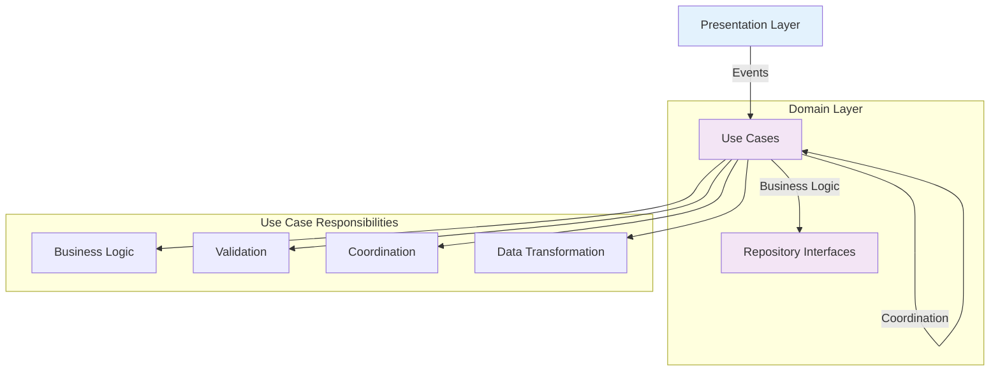

# 🏛️ Module 5: Use Cases & Business Logic

> **Master business logic separation and use case implementation in Clean Architecture**

---

## 🎯 **Learning Objectives**

After completing this module, you will:
- ✅ Understand the role of Use Cases in Clean Architecture
- ✅ Implement business logic separation from data and presentation layers
- ✅ Create testable and reusable business operations
- ✅ Apply the Single Responsibility Principle to use cases
- ✅ Handle complex business rules and validation
- ✅ Coordinate multiple repositories within use cases

---

## 📚 **Use Case Fundamentals**

### **What are Use Cases?**

Use Cases represent **application-specific business rules**. They orchestrate the flow of data between repositories and contain the business logic that defines how your application behaves.



### **Key Principles**

- ✅ **Single Responsibility**: Each use case handles one business operation
- ✅ **Independence**: No knowledge of UI or data implementation details
- ✅ **Testability**: Pure business logic that's easy to unit test
- ✅ **Reusability**: Can be used by different presentation layers
- ✅ **Coordination**: Orchestrates multiple repositories when needed

---

## 🏗️ **Project Use Case Implementation**

### **Article Use Case Interface**

```dart
// lib/articles_list/domain/usecase/article_usecase.dart
abstract class ArticleUseCase {
  /// Fetches the most popular articles
  Future<Either<Error, MostPopularResponse>> requestNews();
  
  /// Fetches articles by specific criteria
  Future<Either<Error, MostPopularResponse>> getArticlesByCriteria({
    int period = 7,
    String? section,
    int limit = 20,
  });
  
  /// Searches articles with business rules applied
  Future<Either<Error, SearchResponse>> searchArticles({
    required String query,
    int page = 0,
    String sort = 'newest',
    List<String> excludedSections = const [],
  });
  
  /// Gets trending articles based on business rules
  Future<Either<Error, List<Article>>> getTrendingArticles({
    Duration timeWindow = const Duration(hours: 24),
    int minimumViews = 1000,
  });
  
  /// Validates and processes article sharing
  Future<Either<Error, ShareResult>> shareArticle({
    required Article article,
    required ShareMethod method,
    Map<String, dynamic>? metadata,
  });
}
```

### **Use Case Implementation**

```dart
// lib/articles_list/domain/usecase/article_usecase_impl.dart
@Injectable(as: ArticleUseCase)
class ArticleUseCaseImpl implements ArticleUseCase {
  final ArticleRepo _articleRepo;
  final UserRepo _userRepo;
  final AnalyticsService _analyticsService;
  final Logger _logger;

  const ArticleUseCaseImpl(
    this._articleRepo,
    this._userRepo,
    this._analyticsService,
    this._logger,
  );

  @override
  Future<Either<Error, MostPopularResponse>> requestNews() async {
    _logger.info('Requesting popular articles');
    
    // Track user action
    _analyticsService.trackEvent('articles_requested', {
      'timestamp': DateTime.now().toIso8601String(),
    });

    // Simple delegation to repository for basic case
    final result = await _articleRepo.requestNews();
    
    return result.fold(
      (error) {
        _logger.error('Failed to fetch articles', error);
        _analyticsService.trackError('article_fetch_failed', error.toString());
        return left(error);
      },
      (response) {
        _logger.info('Successfully fetched ${response.articles.length} articles');
        _analyticsService.trackEvent('articles_loaded', {
          'count': response.articles.length,
        });
        return right(response);
      },
    );
  }

  @override
  Future<Either<Error, MostPopularResponse>> getArticlesByCriteria({
    int period = 7,
    String? section,
    int limit = 20,
  }) async {
    // Business validation
    final validationResult = _validateCriteria(period, section, limit);
    if (validationResult != null) {
      return left(validationResult);
    }

    _logger.info('Fetching articles with criteria', {
      'period': period,
      'section': section,
      'limit': limit,
    });

    try {
      Either<Error, MostPopularResponse> result;
      
      if (section != null) {
        result = await _articleRepo.getArticlesBySection(section, period: period);
      } else {
        result = await _articleRepo.getArticlesByPeriod(period);
      }

      return result.fold(
        (error) => left(error),
        (response) {
          // Apply business rules: limit results
          final limitedArticles = response.articles.take(limit).toList();
          final limitedResponse = MostPopularResponse(
            response.status,
            response.copyright,
            limitedArticles,
          );
          
          _analyticsService.trackEvent('articles_filtered', {
            'original_count': response.articles.length,
            'filtered_count': limitedArticles.length,
            'criteria': {
              'period': period,
              'section': section,
              'limit': limit,
            },
          });
          
          return right(limitedResponse);
        },
      );
    } catch (error) {
      _logger.error('Unexpected error in getArticlesByCriteria', error);
      return left(Error.unknown(error.toString()));
    }
  }

  @override
  Future<Either<Error, SearchResponse>> searchArticles({
    required String query,
    int page = 0,
    String sort = 'newest',
    List<String> excludedSections = const [],
  }) async {
    // Business validation
    if (query.trim().length < 2) {
      return left(Error.validationError(
        'query',
        'Search query must be at least 2 characters long',
      ));
    }

    if (page < 0) {
      return left(Error.validationError(
        'page',
        'Page number cannot be negative',
      ));
    }

    // Check user's search quota (business rule)
    final userQuotaCheck = await _checkUserSearchQuota();
    if (userQuotaCheck.isLeft()) {
      return left(userQuotaCheck.value);
    }

    _logger.info('Searching articles', {
      'query': query,
      'page': page,
      'sort': sort,
      'excluded_sections': excludedSections,
    });

    try {
      final result = await _articleRepo.searchArticles(
        query,
        page: page,
        sort: sort,
      );

      return result.fold(
        (error) => left(error),
        (response) {
          // Apply business rules: filter out excluded sections
          final filteredArticles = _applySearchFilters(
            response.articles,
            excludedSections,
          );
          
          final filteredResponse = SearchResponse(
            response.status,
            filteredArticles,
          );

          // Update user's search history (business logic)
          _updateSearchHistory(query);
          
          _analyticsService.trackEvent('search_completed', {
            'query': query,
            'results_count': filteredArticles.length,
            'page': page,
          });

          return right(filteredResponse);
        },
      );
    } catch (error) {
      _logger.error('Unexpected error in searchArticles', error);
      return left(Error.unknown(error.toString()));
    }
  }

  @override
  Future<Either<Error, List<Article>>> getTrendingArticles({
    Duration timeWindow = const Duration(hours: 24),
    int minimumViews = 1000,
  }) async {
    _logger.info('Getting trending articles', {
      'time_window_hours': timeWindow.inHours,
      'minimum_views': minimumViews,
    });

    try {
      // Get recent articles from multiple periods
      final recentResult = await _articleRepo.getArticlesByPeriod(1);
      final weeklyResult = await _articleRepo.getArticlesByPeriod(7);

      if (recentResult.isLeft()) return left(recentResult.value);
      if (weeklyResult.isLeft()) return left(weeklyResult.value);

      final recentArticles = recentResult.getOrElse(() => throw Exception()).articles;
      final weeklyArticles = weeklyResult.getOrElse(() => throw Exception()).articles;

      // Business logic: Calculate trending score
      final trendingArticles = _calculateTrendingArticles(
        recentArticles,
        weeklyArticles,
        timeWindow,
        minimumViews,
      );

      _analyticsService.trackEvent('trending_calculated', {
        'trending_count': trendingArticles.length,
        'time_window_hours': timeWindow.inHours,
      });

      return right(trendingArticles);
    } catch (error) {
      _logger.error('Error calculating trending articles', error);
      return left(Error.unknown(error.toString()));
    }
  }

  @override
  Future<Either<Error, ShareResult>> shareArticle({
    required Article article,
    required ShareMethod method,
    Map<String, dynamic>? metadata,
  }) async {
    // Business validation
    if (article.url.isEmpty) {
      return left(Error.validationError(
        'article',
        'Article must have a valid URL to share',
      ));
    }

    // Check user permissions (business rule)
    final userResult = await _userRepo.getCurrentUser();
    if (userResult.isLeft()) {
      return left(Error.businessRuleError(
        'User must be logged in to share articles',
      ));
    }

    final user = userResult.getOrElse(() => throw Exception());
    
    // Check if user can share (business rule)
    if (!_canUserShare(user, method)) {
      return left(Error.businessRuleError(
        'User does not have permission to share via ${method.name}',
      ));
    }

    try {
      // Business logic: Format share content
      final shareContent = _formatShareContent(article, method, metadata);
      
      // Business logic: Track sharing metrics
      await _updateSharingMetrics(article, user, method);
      
      _analyticsService.trackEvent('article_shared', {
        'article_id': article.id,
        'method': method.name,
        'user_id': user.id,
      });

      return right(ShareResult(
        success: true,
        shareUrl: shareContent.url,
        message: shareContent.message,
        sharedAt: DateTime.now(),
      ));
    } catch (error) {
      _logger.error('Error sharing article', error);
      return left(Error.unknown('Failed to share article: $error'));
    }
  }

  // Private helper methods for business logic

  Error? _validateCriteria(int period, String? section, int limit) {
    if (![1, 7, 30].contains(period)) {
      return Error.validationError(
        'period',
        'Period must be 1, 7, or 30 days',
      );
    }

    if (section != null && section.trim().isEmpty) {
      return Error.validationError(
        'section',
        'Section cannot be empty',
      );
    }

    if (limit <= 0 || limit > 100) {
      return Error.validationError(
        'limit',
        'Limit must be between 1 and 100',
      );
    }

    return null;
  }

  Future<Either<Error, void>> _checkUserSearchQuota() async {
    final userResult = await _userRepo.getCurrentUser();
    if (userResult.isLeft()) {
      // Anonymous users have limited searches
      return right(null);
    }

    final user = userResult.getOrElse(() => throw Exception());
    
    // Business rule: Premium users have unlimited searches
    if (user.isPremium) {
      return right(null);
    }

    // Business rule: Free users limited to 10 searches per hour
    final searchCount = await _userRepo.getSearchCountLastHour(user.id);
    if (searchCount >= 10) {
      return left(Error.businessRuleError(
        'Search quota exceeded. Upgrade to premium for unlimited searches.',
      ));
    }

    return right(null);
  }

  List<Article> _applySearchFilters(
    List<Article> articles,
    List<String> excludedSections,
  ) {
    if (excludedSections.isEmpty) return articles;

    return articles.where((article) {
      // Business logic: Filter based on article content/section
      // This would typically check article.section field
      return !excludedSections.any((excluded) =>
          article.title.toLowerCase().contains(excluded.toLowerCase()) ||
          article.abstract.toLowerCase().contains(excluded.toLowerCase()));
    }).toList();
  }

  List<Article> _calculateTrendingArticles(
    List<Article> recentArticles,
    List<Article> weeklyArticles,
    Duration timeWindow,
    int minimumViews,
  ) {
    // Business logic: Calculate trending score based on:
    // - Recency boost
    // - View count
    // - Engagement metrics
    
    final Map<int, double> trendingScores = {};
    
    for (final article in recentArticles) {
      // Boost score for recent articles
      trendingScores[article.id] = (trendingScores[article.id] ?? 0) + 2.0;
    }
    
    for (final article in weeklyArticles) {
      // Base score for weekly popular articles
      trendingScores[article.id] = (trendingScores[article.id] ?? 0) + 1.0;
    }
    
    // Combine and sort by trending score
    final allArticles = {...recentArticles, ...weeklyArticles}.toList();
    
    allArticles.sort((a, b) {
      final scoreA = trendingScores[a.id] ?? 0;
      final scoreB = trendingScores[b.id] ?? 0;
      return scoreB.compareTo(scoreA);
    });
    
    // Apply business rules: minimum views and time window
    return allArticles
        .where((article) => _isWithinTimeWindow(article, timeWindow))
        .take(10) // Business rule: Top 10 trending
        .toList();
  }

  bool _isWithinTimeWindow(Article article, Duration timeWindow) {
    if (article.publishedData == null) return false;
    
    try {
      final publishedDate = DateTime.parse(article.publishedData!);
      final cutoffDate = DateTime.now().subtract(timeWindow);
      return publishedDate.isAfter(cutoffDate);
    } catch (e) {
      return false;
    }
  }

  bool _canUserShare(User user, ShareMethod method) {
    // Business rules for sharing permissions
    switch (method) {
      case ShareMethod.email:
        return user.isVerified;
      case ShareMethod.social:
        return user.hasConnectedSocialAccounts;
      case ShareMethod.link:
        return true; // Everyone can share links
      case ShareMethod.embed:
        return user.isPremium; // Only premium users can embed
    }
  }

  ShareContent _formatShareContent(
    Article article,
    ShareMethod method,
    Map<String, dynamic>? metadata,
  ) {
    // Business logic: Format content based on sharing method
    switch (method) {
      case ShareMethod.email:
        return ShareContent(
          url: article.url,
          message: 'Check out this article: ${article.title}\n\n${article.abstract}',
        );
      case ShareMethod.social:
        return ShareContent(
          url: article.url,
          message: '${article.title} #news #nytimes',
        );
      case ShareMethod.link:
        return ShareContent(
          url: article.url,
          message: article.title,
        );
      case ShareMethod.embed:
        return ShareContent(
          url: _generateEmbedCode(article),
          message: 'Embedded article: ${article.title}',
        );
    }
  }

  String _generateEmbedCode(Article article) {
    // Business logic: Generate embed HTML
    return '''
<div class="nyt-article-embed">
  <h3>${article.title}</h3>
  <p>${article.abstract}</p>
  <a href="${article.url}" target="_blank">Read full article</a>
</div>
''';
  }

  Future<void> _updateSearchHistory(String query) async {
    // Business logic: Update user's search history
    try {
      final userResult = await _userRepo.getCurrentUser();
      if (userResult.isRight()) {
        final user = userResult.getOrElse(() => throw Exception());
        await _userRepo.addToSearchHistory(user.id, query);
      }
    } catch (error) {
      _logger.warning('Failed to update search history', error);
      // Don't fail the main operation for this
    }
  }

  Future<void> _updateSharingMetrics(
    Article article,
    User user,
    ShareMethod method,
  ) async {
    // Business logic: Track sharing for analytics and recommendations
    try {
      await _analyticsService.trackSharingAction(
        articleId: article.id,
        userId: user.id,
        method: method,
        timestamp: DateTime.now(),
      );
    } catch (error) {
      _logger.warning('Failed to update sharing metrics', error);
      // Don't fail the main operation for this
    }
  }
}

// Supporting models for business logic
enum ShareMethod { email, social, link, embed }

class ShareResult {
  final bool success;
  final String shareUrl;
  final String message;
  final DateTime sharedAt;

  const ShareResult({
    required this.success,
    required this.shareUrl,
    required this.message,
    required this.sharedAt,
  });
}

class ShareContent {
  final String url;
  final String message;

  const ShareContent({
    required this.url,
    required this.message,
  });
}

class User {
  final String id;
  final bool isPremium;
  final bool isVerified;
  final bool hasConnectedSocialAccounts;

  const User({
    required this.id,
    required this.isPremium,
    required this.isVerified,
    required this.hasConnectedSocialAccounts,
  });
}
```

---

## 🧪 **Use Case Testing**

### **Comprehensive Unit Testing**

```dart
// test/unit-tests/domain/article_usecase_impl_test.dart
@GenerateMocks([
  ArticleRepo,
  UserRepo,
  AnalyticsService,
  Logger,
])
void main() {
  group('ArticleUseCaseImpl', () {
    late ArticleUseCaseImpl useCase;
    late MockArticleRepo mockArticleRepo;
    late MockUserRepo mockUserRepo;
    late MockAnalyticsService mockAnalyticsService;
    late MockLogger mockLogger;

    setUp(() {
      mockArticleRepo = MockArticleRepo();
      mockUserRepo = MockUserRepo();
      mockAnalyticsService = MockAnalyticsService();
      mockLogger = MockLogger();

      useCase = ArticleUseCaseImpl(
        mockArticleRepo,
        mockUserRepo,
        mockAnalyticsService,
        mockLogger,
      );
    });

    group('requestNews', () {
      final testResponse = MostPopularResponse('OK', 'copyright', []);

      test('should return articles when repository call succeeds', () async {
        // Arrange
        when(mockArticleRepo.requestNews())
            .thenAnswer((_) async => right(testResponse));
        when(mockAnalyticsService.trackEvent(any, any))
            .thenAnswer((_) async {});

        // Act
        final result = await useCase.requestNews();

        // Assert
        expect(result, right(testResponse));
        verify(mockArticleRepo.requestNews()).called(1);
        verify(mockAnalyticsService.trackEvent('articles_requested', any)).called(1);
        verify(mockAnalyticsService.trackEvent('articles_loaded', any)).called(1);
      });

      test('should track error when repository call fails', () async {
        // Arrange
        const testError = Error.networkError('Connection failed');
        when(mockArticleRepo.requestNews())
            .thenAnswer((_) async => left(testError));
        when(mockAnalyticsService.trackError(any, any))
            .thenAnswer((_) async {});

        // Act
        final result = await useCase.requestNews();

        // Assert
        expect(result, left(testError));
        verify(mockAnalyticsService.trackError('article_fetch_failed', any)).called(1);
      });
    });

    group('getArticlesByCriteria', () {
      test('should validate period parameter', () async {
        // Act & Assert
        final result1 = await useCase.getArticlesByCriteria(period: 5);
        final result2 = await useCase.getArticlesByCriteria(period: 0);

        expect(result1.isLeft(), true);
        expect(result2.isLeft(), true);
        
        result1.fold(
          (error) => expect(error, isA<ValidationError>()),
          (success) => fail('Expected validation error'),
        );
      });

      test('should validate limit parameter', () async {
        // Act & Assert
        final result1 = await useCase.getArticlesByCriteria(limit: 0);
        final result2 = await useCase.getArticlesByCriteria(limit: 101);

        expect(result1.isLeft(), true);
        expect(result2.isLeft(), true);
      });

      test('should limit results based on business rules', () async {
        // Arrange
        final articles = List.generate(50, (i) => 
            Article('Title $i', 'Abstract $i', i, 'url$i', 'date$i', []));
        final response = MostPopularResponse('OK', 'copyright', articles);
        
        when(mockArticleRepo.getArticlesByPeriod(7))
            .thenAnswer((_) async => right(response));
        when(mockAnalyticsService.trackEvent(any, any))
            .thenAnswer((_) async {});

        // Act
        final result = await useCase.getArticlesByCriteria(
          period: 7,
          limit: 10,
        );

        // Assert
        expect(result.isRight(), true);
        result.fold(
          (error) => fail('Expected success but got error: $error'),
          (response) {
            expect(response.articles.length, 10);
            verify(mockAnalyticsService.trackEvent('articles_filtered', any)).called(1);
          },
        );
      });
    });

    group('searchArticles', () {
      test('should validate query length', () async {
        // Act & Assert
        final result1 = await useCase.searchArticles(query: '');
        final result2 = await useCase.searchArticles(query: 'a');

        expect(result1.isLeft(), true);
        expect(result2.isLeft(), true);
      });

      test('should check user search quota for free users', () async {
        // Arrange
        final freeUser = User(
          id: 'user1',
          isPremium: false,
          isVerified: true,
          hasConnectedSocialAccounts: false,
        );
        
        when(mockUserRepo.getCurrentUser())
            .thenAnswer((_) async => right(freeUser));
        when(mockUserRepo.getSearchCountLastHour('user1'))
            .thenAnswer((_) async => 10); // Quota exceeded

        // Act
        final result = await useCase.searchArticles(query: 'flutter');

        // Assert
        expect(result.isLeft(), true);
        result.fold(
          (error) => expect(error, isA<BusinessRuleError>()),
          (success) => fail('Expected quota error'),
        );
      });

      test('should allow unlimited searches for premium users', () async {
        // Arrange
        final premiumUser = User(
          id: 'user1',
          isPremium: true,
          isVerified: true,
          hasConnectedSocialAccounts: true,
        );
        final searchResponse = SearchResponse('OK', []);
        
        when(mockUserRepo.getCurrentUser())
            .thenAnswer((_) async => right(premiumUser));
        when(mockArticleRepo.searchArticles(any, page: anyNamed('page'), sort: anyNamed('sort')))
            .thenAnswer((_) async => right(searchResponse));
        when(mockAnalyticsService.trackEvent(any, any))
            .thenAnswer((_) async {});

        // Act
        final result = await useCase.searchArticles(query: 'flutter');

        // Assert
        expect(result.isRight(), true);
        verifyNever(mockUserRepo.getSearchCountLastHour(any));
      });

      test('should filter excluded sections', () async {
        // Arrange
        final articles = [
          Article('Sports Title', 'Sports content', 1, 'url1', 'date1', []),
          Article('Tech Title', 'Technology content', 2, 'url2', 'date2', []),
          Article('News Title', 'General news', 3, 'url3', 'date3', []),
        ];
        final searchResponse = SearchResponse('OK', articles);
        
        when(mockUserRepo.getCurrentUser())
            .thenAnswer((_) async => left(const Error.dataNotFoundError()));
        when(mockArticleRepo.searchArticles(any, page: anyNamed('page'), sort: anyNamed('sort')))
            .thenAnswer((_) async => right(searchResponse));
        when(mockAnalyticsService.trackEvent(any, any))
            .thenAnswer((_) async {});

        // Act
        final result = await useCase.searchArticles(
          query: 'flutter',
          excludedSections: ['sports'],
        );

        // Assert
        expect(result.isRight(), true);
        result.fold(
          (error) => fail('Expected success but got error: $error'),
          (response) {
            expect(response.articles.length, 2); // Sports article filtered out
            expect(response.articles.any((a) => a.title.contains('Sports')), false);
          },
        );
      });
    });

    group('shareArticle', () {
      final testArticle = Article('Title', 'Abstract', 1, 'https://example.com', 'date', []);
      final testUser = User(
        id: 'user1',
        isPremium: false,
        isVerified: true,
        hasConnectedSocialAccounts: true,
      );

      test('should validate article URL', () async {
        // Arrange
        final invalidArticle = Article('Title', 'Abstract', 1, '', 'date', []);

        // Act
        final result = await useCase.shareArticle(
          article: invalidArticle,
          method: ShareMethod.email,
        );

        // Assert
        expect(result.isLeft(), true);
        result.fold(
          (error) => expect(error, isA<ValidationError>()),
          (success) => fail('Expected validation error'),
        );
      });

      test('should check user login requirement', () async {
        // Arrange
        when(mockUserRepo.getCurrentUser())
            .thenAnswer((_) async => left(const Error.dataNotFoundError()));

        // Act
        final result = await useCase.shareArticle(
          article: testArticle,
          method: ShareMethod.email,
        );

        // Assert
        expect(result.isLeft(), true);
        result.fold(
          (error) => expect(error, isA<BusinessRuleError>()),
          (success) => fail('Expected business rule error'),
        );
      });

      test('should check sharing permissions based on method', () async {
        // Arrange
        final unverifiedUser = User(
          id: 'user1',
          isPremium: false,
          isVerified: false,
          hasConnectedSocialAccounts: false,
        );
        
        when(mockUserRepo.getCurrentUser())
            .thenAnswer((_) async => right(unverifiedUser));

        // Act
        final result = await useCase.shareArticle(
          article: testArticle,
          method: ShareMethod.email, // Requires verified user
        );

        // Assert
        expect(result.isLeft(), true);
        result.fold(
          (error) => expect(error, isA<BusinessRuleError>()),
          (success) => fail('Expected permission error'),
        );
      });

      test('should successfully share when all conditions are met', () async {
        // Arrange
        when(mockUserRepo.getCurrentUser())
            .thenAnswer((_) async => right(testUser));
        when(mockAnalyticsService.trackSharingAction(
          articleId: anyNamed('articleId'),
          userId: anyNamed('userId'),
          method: anyNamed('method'),
          timestamp: anyNamed('timestamp'),
        )).thenAnswer((_) async {});
        when(mockAnalyticsService.trackEvent(any, any))
            .thenAnswer((_) async {});

        // Act
        final result = await useCase.shareArticle(
          article: testArticle,
          method: ShareMethod.link,
        );

        // Assert
        expect(result.isRight(), true);
        result.fold(
          (error) => fail('Expected success but got error: $error'),
          (shareResult) {
            expect(shareResult.success, true);
            expect(shareResult.shareUrl, testArticle.url);
            verify(mockAnalyticsService.trackEvent('article_shared', any)).called(1);
          },
        );
      });
    });
  });
}
```

---

## 🎯 **Advanced Use Case Patterns**

### **Composite Use Case**

```dart
// Complex use case that coordinates multiple operations
class ArticleRecommendationUseCase {
  final ArticleRepo _articleRepo;
  final UserRepo _userRepo;
  final MLService _mlService;

  Future<Either<Error, List<Article>>> getPersonalizedRecommendations(
    String userId,
  ) async {
    try {
      // 1. Get user preferences and history
      final userResult = await _userRepo.getUserById(userId);
      if (userResult.isLeft()) return left(userResult.value);
      
      final user = userResult.getOrElse(() => throw Exception());
      
      // 2. Get user's reading history
      final historyResult = await _userRepo.getReadingHistory(userId);
      if (historyResult.isLeft()) return left(historyResult.value);
      
      final history = historyResult.getOrElse(() => throw Exception());
      
      // 3. Get current popular articles
      final popularResult = await _articleRepo.requestNews();
      if (popularResult.isLeft()) return left(popularResult.value);
      
      final popular = popularResult.getOrElse(() => throw Exception());
      
      // 4. Apply ML recommendations
      final recommendations = await _mlService.generateRecommendations(
        user: user,
        history: history,
        candidates: popular.articles,
      );
      
      // 5. Apply business rules
      final filteredRecommendations = _applyRecommendationRules(
        recommendations,
        user,
      );
      
      return right(filteredRecommendations);
    } catch (error) {
      return left(Error.unknown(error.toString()));
    }
  }

  List<Article> _applyRecommendationRules(
    List<Article> recommendations,
    User user,
  ) {
    // Business rules for recommendations
    return recommendations
        .where((article) => _isAppropriateForUser(article, user))
        .take(user.isPremium ? 20 : 10) // Premium users get more recommendations
        .toList();
  }
}
```

### **Transactional Use Case**

```dart
class ArticleBookmarkUseCase {
  final ArticleRepo _articleRepo;
  final UserRepo _userRepo;
  final NotificationService _notificationService;

  Future<Either<Error, BookmarkResult>> bookmarkArticle(
    String userId,
    int articleId,
  ) async {
    try {
      // Start transaction-like operation
      
      // 1. Validate article exists
      final articleResult = await _articleRepo.getArticleById(articleId);
      if (articleResult.isLeft()) return left(articleResult.value);
      
      final article = articleResult.getOrElse(() => throw Exception());
      
      // 2. Check if already bookmarked
      final existingBookmark = await _userRepo.getBookmark(userId, articleId);
      if (existingBookmark.isRight()) {
        return left(Error.businessRuleError('Article already bookmarked'));
      }
      
      // 3. Add bookmark
      final bookmarkResult = await _userRepo.addBookmark(userId, articleId);
      if (bookmarkResult.isLeft()) return left(bookmarkResult.value);
      
      // 4. Send notification (side effect)
      try {
        await _notificationService.sendBookmarkConfirmation(userId, article);
      } catch (e) {
        // Log but don't fail the main operation
        print('Failed to send notification: $e');
      }
      
      // 5. Update user statistics
      try {
        await _userRepo.incrementBookmarkCount(userId);
      } catch (e) {
        // Log but don't fail the main operation
        print('Failed to update stats: $e');
      }
      
      return right(BookmarkResult(
        success: true,
        article: article,
        bookmarkedAt: DateTime.now(),
      ));
    } catch (error) {
      return left(Error.unknown(error.toString()));
    }
  }
}
```

---

## 🎯 **Hands-On Exercise**

### **Exercise 1: User Authentication Use Case**

Create a comprehensive authentication use case:

```dart
// TODO: Implement AuthenticationUseCase
abstract class AuthenticationUseCase {
  Future<Either<Error, AuthResult>> login(String email, String password);
  Future<Either<Error, AuthResult>> register(String email, String password, String name);
  Future<Either<Error, void>> logout();
  Future<Either<Error, User>> getCurrentUser();
  Future<Either<Error, void>> resetPassword(String email);
  Future<Either<Error, AuthResult>> refreshToken();
}

// Business rules to implement:
// - Email validation
// - Password strength requirements
// - Rate limiting for login attempts
// - Session management
// - Security logging
// - Multi-factor authentication support
```

### **Exercise 2: Article Analytics Use Case**

Design an analytics use case for tracking user behavior:

```dart
// TODO: Implement ArticleAnalyticsUseCase
abstract class ArticleAnalyticsUseCase {
  Future<Either<Error, void>> trackArticleView(int articleId, String userId);
  Future<Either<Error, void>> trackReadingTime(int articleId, Duration timeSpent);
  Future<Either<Error, AnalyticsReport>> getUserReadingReport(String userId);
  Future<Either<Error, List<Article>>> getRecommendedBasedOnHistory(String userId);
}

// Business logic to implement:
// - Privacy compliance (GDPR)
// - Data aggregation rules
// - Recommendation algorithms
// - Report generation
// - Anonymous user tracking
```

---

## 🎓 **Knowledge Check**

### **Questions**:

1. **What's the difference between a Use Case and a Repository?**
2. **When should business logic go in a Use Case vs a Domain Service?**
3. **How do you handle complex business rules that span multiple entities?**
4. **What's the best way to coordinate multiple repositories in a Use Case?**

### **Practical Scenarios**:

1. **E-commerce Cart**: Design use cases for adding items, applying discounts, calculating taxes
2. **Social Media**: Create use cases for posting, liking, commenting with business rules
3. **Banking**: Implement transfer use case with validation, limits, and audit trails

---

## 🔗 **What's Next?**

Now that you understand Use Cases and business logic, let's explore state management with BLoC:

**Next Module**: [Module 6: BLoC Pattern & State Management](08-bloc-state-management.md)

---

## 📚 **Additional Resources**

- [Clean Architecture Use Cases](https://blog.cleancoder.com/uncle-bob/2012/08/13/the-clean-architecture.html)
- [Domain-Driven Design](https://martinfowler.com/bliki/DomainDrivenDesign.html)
- [Business Logic Layer Patterns](https://martinfowler.com/eaaCatalog/)

---

**Outstanding!** You've mastered Use Cases and business logic separation. Ready for state management? 🚀 