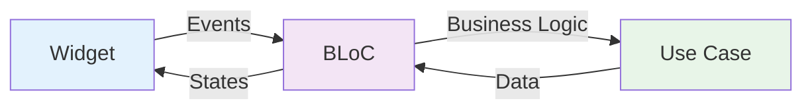

# 🎨 Module 6: BLoC Pattern & State Management

> **Master the BLoC pattern for scalable and testable state management in Flutter**

---

## 🎯 **Learning Objectives**

After completing this module, you will:
- ✅ Understand BLoC pattern fundamentals and architecture
- ✅ Create events and states with proper type safety
- ✅ Implement business logic separation from UI
- ✅ Handle different state transitions effectively
- ✅ Test BLoCs thoroughly with unit tests
- ✅ Apply BLoC best practices in real applications

---

## 📚 **BLoC Pattern Fundamentals**

### **What is BLoC?**

**BLoC (Business Logic Component)** is a design pattern that:
- ✅ **Separates business logic** from presentation layer
- ✅ **Makes state predictable** through events and states
- ✅ **Enables easy testing** of business logic
- ✅ **Provides reactive programming** with streams
- ✅ **Supports time-travel debugging** in development

### **Core Concepts**



### **BLoC Components**

1. **Events**: What can happen (user actions, system events)
2. **States**: What the UI can be in (loading, loaded, error)
3. **BLoC**: Processes events and emits states
4. **Transitions**: State changes with event and state info

---

## 🔧 **Project BLoC Implementation**

### **Event Definition**

```dart
// lib/articles_list/presentation/bloc/article_list_event.dart
part of 'article_list_bloc.dart';

@freezed
class ArticleListEvent with _$ArticleListEvent {
  const factory ArticleListEvent.loadArticles() = LoadArticles;
  const factory ArticleListEvent.refreshArticles() = RefreshArticles;
  const factory ArticleListEvent.markAsFavorite(Article article) = MarkAsFavorite;
  const factory ArticleListEvent.unMarkAsFavorite(Article article) = UnMarkAsFavorite;
}
```

### **State Definition**

```dart
// lib/articles_list/presentation/bloc/article_list_state.dart
part of 'article_list_bloc.dart';

@freezed
class ArticleListState with _$ArticleListState {
  const factory ArticleListState({
    @Default(false) bool isLoading,
    required Option<List<Article>> articles,
    Option<Error>? error,
    @Default(<Article>[]) List<Article> favorites,
  }) = _ArticleListState;

  factory ArticleListState.initial() => ArticleListState(articles: none());
}
```

### **BLoC Implementation**

```dart
// lib/articles_list/presentation/bloc/article_list_bloc.dart
@injectable
class ArticleListBloc extends Bloc<ArticleListEvent, ArticleListState> {
  ArticleListBloc(this._articleUseCase) : super(ArticleListState.initial()) {
    on<LoadArticles>(_onLoadArticles);
    on<RefreshArticles>(_onRefreshArticles);
    on<MarkAsFavorite>(_onMarkAsFavorite);
    on<UnMarkAsFavorite>(_onUnMarkAsFavorite);
  }

  final ArticleUseCase _articleUseCase;

  Future<void> _onLoadArticles(
    LoadArticles event,
    Emitter<ArticleListState> emit,
  ) async {
    emit(state.copyWith(isLoading: true, error: none()));
    
    final result = await _articleUseCase.requestNews();
    
    result.fold(
      (error) => emit(state.copyWith(
        isLoading: false,
        error: some(error),
        articles: none(),
      )),
      (response) => emit(state.copyWith(
        isLoading: false,
        error: none(),
        articles: some(response.articles),
      )),
    );
  }

  Future<void> _onRefreshArticles(
    RefreshArticles event,
    Emitter<ArticleListState> emit,
  ) async {
    // Don't show loading for refresh
    final result = await _articleUseCase.requestNews();
    
    result.fold(
      (error) => emit(state.copyWith(error: some(error))),
      (response) => emit(state.copyWith(
        error: none(),
        articles: some(response.articles),
      )),
    );
  }

  Future<void> _onMarkAsFavorite(
    MarkAsFavorite event,
    Emitter<ArticleListState> emit,
  ) async {
    final updatedFavorites = [...state.favorites, event.article];
    emit(state.copyWith(favorites: updatedFavorites));
  }

  Future<void> _onUnMarkAsFavorite(
    UnMarkAsFavorite event,
    Emitter<ArticleListState> emit,
  ) async {
    final updatedFavorites = state.favorites
        .where((article) => article.id != event.article.id)
        .toList();
    emit(state.copyWith(favorites: updatedFavorites));
  }
}
```

---

## 🎨 **Advanced State Patterns**

### **Union States with Freezed**

```dart
@freezed
class ArticleListState with _$ArticleListState {
  const factory ArticleListState.initial() = Initial;
  const factory ArticleListState.loading() = Loading;
  const factory ArticleListState.loaded(List<Article> articles) = Loaded;
  const factory ArticleListState.error(String message) = ArticleError;
  const factory ArticleListState.empty() = Empty;
}
```

### **Complex State with Multiple Properties**

```dart
@freezed
class ArticleListState with _$ArticleListState {
  const factory ArticleListState({
    @Default(false) bool isLoading,
    @Default(false) bool isRefreshing,
    required Option<List<Article>> articles,
    Option<Error>? error,
    @Default(<Article>[]) List<Article> favorites,
    @Default('') String searchQuery,
    @Default(<String>[]) List<String> selectedCategories,
    @Default(SortOption.date) SortOption sortBy,
  }) = _ArticleListState;

  factory ArticleListState.initial() => ArticleListState(articles: none());
}

enum SortOption { date, popularity, title }
```

### **State Extensions for Business Logic**

```dart
extension ArticleListStateX on ArticleListState {
  bool get hasArticles => articles.isSome();
  bool get hasError => error?.isSome() ?? false;
  bool get isEmpty => articles.fold(() => false, (list) => list.isEmpty);
  
  List<Article> get filteredArticles {
    return articles.fold(
      () => <Article>[],
      (list) => list
          .where((article) => _matchesSearch(article))
          .where((article) => _matchesCategories(article))
          .toList()
        ..sort(_getSortComparator()),
    );
  }
  
  bool _matchesSearch(Article article) {
    if (searchQuery.isEmpty) return true;
    return article.title.toLowerCase().contains(searchQuery.toLowerCase()) ||
           article.abstract.toLowerCase().contains(searchQuery.toLowerCase());
  }
  
  bool _matchesCategories(Article article) {
    if (selectedCategories.isEmpty) return true;
    // Implementation depends on article category field
    return true;
  }
  
  int Function(Article, Article) _getSortComparator() {
    switch (sortBy) {
      case SortOption.date:
        return (a, b) => b.publishedData?.compareTo(a.publishedData ?? '') ?? 0;
      case SortOption.popularity:
        return (a, b) => 0; // Implement based on view count
      case SortOption.title:
        return (a, b) => a.title.compareTo(b.title);
    }
  }
}
```

---

## 🖼️ **UI Integration**

### **BLoC Provider Setup**

```dart
// In main.dart or app setup
MaterialApp(
  home: BlocProvider(
    create: (context) => getIt<ArticleListBloc>(),
    child: ArticlesListScreen(),
  ),
)
```

### **BLoC Builder Pattern**

```dart
class ArticlesListScreen extends StatefulWidget {
  @override
  State<ArticlesListScreen> createState() => _ArticlesListScreenState();
}

class _ArticlesListScreenState extends State<ArticlesListScreen> {
  late final ArticleListBloc _bloc;

  @override
  void initState() {
    super.initState();
    _bloc = context.read<ArticleListBloc>();
    _bloc.add(const ArticleListEvent.loadArticles());
  }

  @override
  Widget build(BuildContext context) {
    return Scaffold(
      appBar: AppBar(title: const Text('Articles')),
      body: BlocBuilder<ArticleListBloc, ArticleListState>(
        builder: (context, state) {
          return state.articles.fold(
            () => _buildEmptyOrLoading(state),
            (articles) => _buildArticleList(articles, state),
          );
        },
      ),
      floatingActionButton: BlocBuilder<ArticleListBloc, ArticleListState>(
        buildWhen: (previous, current) => previous.isLoading != current.isLoading,
        builder: (context, state) {
          return FloatingActionButton(
            onPressed: state.isLoading 
                ? null 
                : () => _bloc.add(const ArticleListEvent.refreshArticles()),
            child: state.isLoading 
                ? const CircularProgressIndicator() 
                : const Icon(Icons.refresh),
          );
        },
      ),
    );
  }

  Widget _buildEmptyOrLoading(ArticleListState state) {
    if (state.isLoading) {
      return const Center(child: CircularProgressIndicator());
    }
    
    if (state.error?.isSome() ?? false) {
      return Center(
        child: Column(
          mainAxisAlignment: MainAxisAlignment.center,
          children: [
            const Icon(Icons.error, size: 64, color: Colors.red),
            const SizedBox(height: 16),
            Text(state.error!.value.toString()),
            const SizedBox(height: 16),
            ElevatedButton(
              onPressed: () => _bloc.add(const ArticleListEvent.loadArticles()),
              child: const Text('Retry'),
            ),
          ],
        ),
      );
    }
    
    return const Center(child: Text('No articles available'));
  }

  Widget _buildArticleList(List<Article> articles, ArticleListState state) {
    return ListView.builder(
      itemCount: articles.length,
      itemBuilder: (context, index) {
        final article = articles[index];
        final isFavorite = state.favorites.contains(article);
        
        return ArticleListItem(
          article: article,
          isFavorite: isFavorite,
          onFavoriteToggle: () {
            if (isFavorite) {
              _bloc.add(ArticleListEvent.unMarkAsFavorite(article));
            } else {
              _bloc.add(ArticleListEvent.markAsFavorite(article));
            }
          },
          onTap: () => Navigator.pushNamed(
            context,
            ArticleDetailScreen.routeName,
            arguments: article,
          ),
        );
      },
    );
  }
}
```

### **BLoC Listener for Side Effects**

```dart
BlocListener<ArticleListBloc, ArticleListState>(
  listener: (context, state) {
    state.error?.fold(
      () => null,
      (error) => ScaffoldMessenger.of(context).showSnackBar(
        SnackBar(
          content: Text(error.toString()),
          backgroundColor: Colors.red,
          action: SnackBarAction(
            label: 'Retry',
            textColor: Colors.white,
            onPressed: () => context
                .read<ArticleListBloc>()
                .add(const ArticleListEvent.loadArticles()),
          ),
        ),
      ),
    );
  },
  child: BlocBuilder<ArticleListBloc, ArticleListState>(
    builder: (context, state) => _buildUI(state),
  ),
)
```

---

## 🧪 **Testing BLoCs**

### **BLoC Testing Setup**

```dart
// test/unit-tests/bloc/article_list_bloc_test.dart
import 'package:bloc_test/bloc_test.dart';

void main() {
  group('ArticleListBloc', () {
    late ArticleListBloc bloc;
    late MockArticleUseCase mockUseCase;

    setUp(() {
      mockUseCase = MockArticleUseCase();
      bloc = ArticleListBloc(mockUseCase);
    });

    tearDown(() {
      bloc.close();
    });

    test('initial state should be ArticleListState.initial()', () {
      expect(bloc.state, ArticleListState.initial());
    });

    group('LoadArticles', () {
      final testArticles = [
        Article('Title 1', 'Abstract 1', 1, 'url1', 'date1', []),
        Article('Title 2', 'Abstract 2', 2, 'url2', 'date2', []),
      ];
      final testResponse = MostPopularResponse('ok', 'copyright', testArticles);

      blocTest<ArticleListBloc, ArticleListState>(
        'should emit loading then loaded when articles are fetched successfully',
        build: () {
          when(mockUseCase.requestNews())
              .thenAnswer((_) async => right(testResponse));
          return bloc;
        },
        act: (bloc) => bloc.add(const ArticleListEvent.loadArticles()),
        expect: () => [
          ArticleListState.initial().copyWith(isLoading: true, error: none()),
          ArticleListState.initial().copyWith(
            isLoading: false,
            error: none(),
            articles: some(testArticles),
          ),
        ],
        verify: (_) {
          verify(mockUseCase.requestNews()).called(1);
        },
      );

      blocTest<ArticleListBloc, ArticleListState>(
        'should emit loading then error when fetch fails',
        build: () {
          when(mockUseCase.requestNews())
              .thenAnswer((_) async => left(const Error.networkError('No connection')));
          return bloc;
        },
        act: (bloc) => bloc.add(const ArticleListEvent.loadArticles()),
        expect: () => [
          ArticleListState.initial().copyWith(isLoading: true, error: none()),
          ArticleListState.initial().copyWith(
            isLoading: false,
            error: some(const Error.networkError('No connection')),
            articles: none(),
          ),
        ],
      );
    });

    group('MarkAsFavorite', () {
      final testArticle = Article('Title', 'Abstract', 1, 'url', 'date', []);

      blocTest<ArticleListBloc, ArticleListState>(
        'should add article to favorites',
        build: () => bloc,
        act: (bloc) => bloc.add(ArticleListEvent.markAsFavorite(testArticle)),
        expect: () => [
          ArticleListState.initial().copyWith(favorites: [testArticle]),
        ],
      );
    });

    group('UnMarkAsFavorite', () {
      final testArticle = Article('Title', 'Abstract', 1, 'url', 'date', []);
      
      blocTest<ArticleListBloc, ArticleListState>(
        'should remove article from favorites',
        build: () => bloc,
        seed: () => ArticleListState.initial().copyWith(favorites: [testArticle]),
        act: (bloc) => bloc.add(ArticleListEvent.unMarkAsFavorite(testArticle)),
        expect: () => [
          ArticleListState.initial().copyWith(favorites: <Article>[]),
        ],
      );
    });
  });
}
```

### **Integration Testing with BLoC**

```dart
// integration_test/bloc_integration_test.dart
void main() {
  group('Article List BLoC Integration', () {
    late ArticleListBloc bloc;
    
    setUp(() {
      // Setup with real dependencies for integration testing
      configureDependencies();
      bloc = getIt<ArticleListBloc>();
    });

    testWidgets('should load articles from real API', (tester) async {
      // Pump the widget tree with BLoC provider
      await tester.pumpWidget(
        MaterialApp(
          home: BlocProvider.value(
            value: bloc,
            child: ArticlesListScreen(),
          ),
        ),
      );

      // Trigger loading
      bloc.add(const ArticleListEvent.loadArticles());
      await tester.pump();

      // Should show loading indicator
      expect(find.byType(CircularProgressIndicator), findsOneWidget);

      // Wait for API response
      await tester.pumpAndSettle(const Duration(seconds: 5));

      // Should show articles or error
      expect(
        find.byType(ArticleListItem).or(find.text('Retry')),
        findsWidgets,
      );
    });
  });
}
```

---

## 💡 **BLoC Best Practices**

### **Event Design Principles**

#### **✅ Do:**
```dart
// Descriptive event names
const factory ArticleListEvent.loadArticles() = LoadArticles;
const factory ArticleListEvent.refreshArticles() = RefreshArticles;

// Include necessary data
const factory ArticleListEvent.searchArticles(String query) = SearchArticles;
const factory ArticleListEvent.filterByCategory(String category) = FilterByCategory;

// Specific actions
const factory ArticleListEvent.markAsFavorite(Article article) = MarkAsFavorite;
```

#### **❌ Don't:**
```dart
// Generic event names
const factory ArticleListEvent.buttonPressed() = ButtonPressed;
const factory ArticleListEvent.dataChanged() = DataChanged;

// Too much data in events
const factory ArticleListEvent.updateEverything(
  List<Article> articles,
  List<String> categories,
  String query,
  bool isLoading,
) = UpdateEverything;
```

### **State Design Principles**

#### **✅ Do:**
```dart
// Immutable state with copyWith
@freezed
class ArticleListState with _$ArticleListState {
  const factory ArticleListState({
    @Default(false) bool isLoading,
    required Option<List<Article>> articles,
  }) = _ArticleListState;
}

// Meaningful default values
factory ArticleListState.initial() => ArticleListState(articles: none());

// State extensions for computed properties
extension ArticleListStateX on ArticleListState {
  bool get hasArticles => articles.isSome();
  int get articleCount => articles.fold(() => 0, (list) => list.length);
}
```

#### **❌ Don't:**
```dart
// Mutable state
class ArticleListState {
  bool isLoading = false;  // Mutable
  List<Article>? articles; // Nullable without Option
}

// Unclear state structure
class ArticleListState {
  final dynamic data;      // Too generic
  final String status;     // String status instead of types
}
```

### **Business Logic Separation**

#### **✅ Do:**
```dart
// BLoC focuses on state management
class ArticleListBloc extends Bloc<ArticleListEvent, ArticleListState> {
  Future<void> _onLoadArticles(LoadArticles event, Emitter emit) async {
    emit(state.copyWith(isLoading: true));
    final result = await _useCase.requestNews(); // Delegate to use case
    // Handle result and emit state
  }
}

// Business logic in use case
class ArticleUseCaseImpl implements ArticleUseCase {
  Future<Either<Error, MostPopularResponse>> requestNews() async {
    // Business logic here
    return _repository.requestNews();
  }
}
```

#### **❌ Don't:**
```dart
// Business logic in BLoC
class ArticleListBloc extends Bloc<ArticleListEvent, ArticleListState> {
  Future<void> _onLoadArticles(LoadArticles event, Emitter emit) async {
    // Don't do complex business logic here
    final response = await http.get(Uri.parse(apiUrl));
    final json = jsonDecode(response.body);
    final articles = json['results'].map((item) => Article.fromJson(item)).toList();
    // More business logic...
  }
}
```

---

## 🔍 **Advanced BLoC Patterns**

### **Multiple BLoCs Communication**

```dart
class HomeBloc extends Bloc<HomeEvent, HomeState> {
  HomeBloc(this._articleBloc, this._userBloc) : super(HomeState.initial()) {
    // Listen to other BLoCs
    _articleSubscription = _articleBloc.stream.listen((articleState) {
      add(HomeEvent.articlesUpdated(articleState));
    });
    
    _userSubscription = _userBloc.stream.listen((userState) {
      add(HomeEvent.userUpdated(userState));
    });
  }

  final ArticleListBloc _articleBloc;
  final UserBloc _userBloc;
  late StreamSubscription _articleSubscription;
  late StreamSubscription _userSubscription;

  @override
  Future<void> close() {
    _articleSubscription.cancel();
    _userSubscription.cancel();
    return super.close();
  }
}
```

### **BLoC with Repository Caching**

```dart
class ArticleListBloc extends Bloc<ArticleListEvent, ArticleListState> {
  ArticleListBloc(this._useCase) : super(ArticleListState.initial()) {
    on<LoadArticles>(_onLoadArticles);
    on<LoadFromCache>(_onLoadFromCache);
    
    // Auto-load from cache on initialization
    add(const ArticleListEvent.loadFromCache());
  }

  Future<void> _onLoadFromCache(LoadFromCache event, Emitter emit) async {
    final cachedResult = await _useCase.getCachedNews();
    cachedResult.fold(
      (error) => null, // No cache available
      (response) => emit(state.copyWith(articles: some(response.articles))),
    );
  }

  Future<void> _onLoadArticles(LoadArticles event, Emitter emit) async {
    emit(state.copyWith(isLoading: true));
    
    final result = await _useCase.requestNews(
      forceRefresh: event.forceRefresh,
    );
    
    result.fold(
      (error) => emit(state.copyWith(isLoading: false, error: some(error))),
      (response) => emit(state.copyWith(
        isLoading: false,
        articles: some(response.articles),
        error: none(),
      )),
    );
  }
}
```

---

## 🎯 **Hands-On Exercise**

### **Exercise 1: Create Search BLoC**

Implement a search functionality with the following requirements:

```dart
// Create SearchBloc with these events:
@freezed
class SearchEvent with _$SearchEvent {
  const factory SearchEvent.searchStarted(String query) = SearchStarted;
  const factory SearchEvent.searchCleared() = SearchCleared;
  const factory SearchEvent.suggestionSelected(String suggestion) = SuggestionSelected;
}

// Create SearchState with these properties:
@freezed
class SearchState with _$SearchState {
  const factory SearchState({
    @Default('') String query,
    @Default(false) bool isSearching,
    @Default(<Article>[]) List<Article> results,
    @Default(<String>[]) List<String> suggestions,
    Option<Error>? error,
  }) = _SearchState;
}

// Implement the BLoC with:
// - Debounced search (wait 500ms after user stops typing)
// - Search history storage
// - Auto-suggestions based on previous searches
// - Error handling for search failures
```

### **Exercise 2: Multi-State Management**

Create a complex state that handles:
- Loading different sections independently
- Pagination support
- Filter and sort combinations
- Offline/online state awareness

### **Exercise 3: BLoC Testing**

Write comprehensive tests for your SearchBloc:
- Test debouncing behavior
- Test error scenarios
- Test state transitions
- Integration tests with mock data

---

## 🎓 **Knowledge Check**

### **Questions**:

1. **What's the difference between BlocBuilder and BlocListener?**
2. **When should you create a new BLoC vs. adding events to existing one?**
3. **How do you handle asynchronous operations in BLoC?**
4. **What's the purpose of the `buildWhen` parameter in BlocBuilder?**

### **Practical Scenarios**:

1. **User Authentication**: Design BLoC for login/logout/session management
2. **Shopping Cart**: Handle add/remove items, calculate totals, apply discounts
3. **Chat Application**: Manage real-time messages, typing indicators, online status

---

## 🔗 **What's Next?**

Now that you've mastered state management, let's explore how to create beautiful and responsive UIs:

**Next Module**: [Module 7: UI Implementation & Best Practices](09-ui-implementation-best-practices.md)

---

## 📚 **Additional Resources**

- [BLoC Library Documentation](https://bloclibrary.dev/)
- [Flutter BLoC Concepts](https://bloclibrary.dev/bloc-concepts/)
- [BLoC Testing Guide](https://bloclibrary.dev/testing/)
- [Effective BLoC Patterns](https://verygood.ventures/blog/bloc-pattern-usage)

---

**Outstanding!** You've mastered BLoC pattern and state management. Ready to build amazing UIs? 🚀 