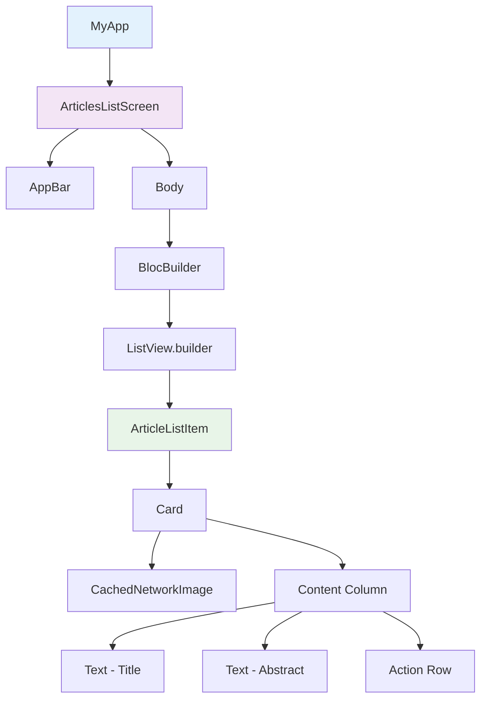

# 🎨 Module 7: UI Implementation & Best Practices

> **Master Flutter UI development with modern design patterns and performance optimization**

---

## 🎯 **Learning Objectives**

After completing this module, you will:
- ✅ Create responsive and adaptive UI components
- ✅ Implement proper widget composition patterns
- ✅ Optimize UI performance and rendering
- ✅ Handle different screen sizes and orientations
- ✅ Apply Material Design principles effectively
- ✅ Create reusable and maintainable widgets

---

## 📚 **Flutter UI Fundamentals**

### **Widget Tree Architecture**



### **UI Layer Responsibilities**

- **📱 Screens**: Top-level pages and navigation
- **🔧 Widgets**: Reusable UI components
- **🎨 Themes**: Consistent styling and branding
- **📐 Layouts**: Responsive design and positioning
- **⚡ State**: UI state management and user interactions

---

## 🏗️ **Project UI Structure Analysis**

### **Articles List Screen**

```dart
// lib/articles_list/presentation/screen/articles_list_screen.dart
class ArticlesListScreen extends StatefulWidget {
  const ArticlesListScreen({super.key});

  @override
  State<ArticlesListScreen> createState() => _ArticlesListScreenState();
}

class _ArticlesListScreenState extends State<ArticlesListScreen> {
  late final ArticleListBloc _bloc;

  @override
  void initState() {
    super.initState();
    _bloc = context.read<ArticleListBloc>();
    _bloc.add(const ArticleListEvent.loadArticles());
  }

  @override
  Widget build(BuildContext context) {
    return Scaffold(
      appBar: _buildAppBar(),
      body: _buildBody(),
      floatingActionButton: _buildFAB(),
    );
  }

  PreferredSizeWidget _buildAppBar() {
    return AppBar(
      title: const Text('NY Times - Most Popular'),
      elevation: 2,
      backgroundColor: Theme.of(context).colorScheme.surface,
      foregroundColor: Theme.of(context).colorScheme.onSurface,
      actions: [
        IconButton(
          icon: const Icon(Icons.search),
          onPressed: () => _showSearch(),
        ),
        IconButton(
          icon: const Icon(Icons.refresh),
          onPressed: () => _bloc.add(const ArticleListEvent.refreshArticles()),
        ),
      ],
    );
  }

  Widget _buildBody() {
    return BlocBuilder<ArticleListBloc, ArticleListState>(
      builder: (context, state) {
        return state.articles.fold(
          () => _buildEmptyState(state),
          (articles) => _buildArticlesList(articles, state),
        );
      },
    );
  }

  Widget _buildEmptyState(ArticleListState state) {
    if (state.isLoading) {
      return const Center(
        child: CircularProgressIndicator(),
      );
    }

    if (state.error?.isSome() ?? false) {
      return _buildErrorState(state.error!.value);
    }

    return const EmptyStateWidget(
      icon: Icons.article_outlined,
      title: 'No Articles',
      message: 'No articles available at the moment',
    );
  }

  Widget _buildErrorState(Error error) {
    return ErrorStateWidget(
      error: error,
      onRetry: () => _bloc.add(const ArticleListEvent.loadArticles()),
    );
  }

  Widget _buildArticlesList(List<Article> articles, ArticleListState state) {
    return RefreshIndicator(
      onRefresh: () async {
        _bloc.add(const ArticleListEvent.refreshArticles());
        await _bloc.stream
            .firstWhere((state) => !state.isLoading);
      },
      child: ListView.builder(
        padding: const EdgeInsets.all(16),
        itemCount: articles.length,
        itemBuilder: (context, index) {
          final article = articles[index];
          return ArticleListItem(
            article: article,
            isFavorite: state.favorites.contains(article),
            onTap: () => _navigateToDetail(article),
            onFavoriteToggle: () => _toggleFavorite(article, state),
          );
        },
      ),
    );
  }
}
```

---

## 🧩 **Reusable Widget Components**

### **Article List Item Widget**

```dart
// lib/articles_list/presentation/widget/article_list_item.dart
class ArticleListItem extends StatelessWidget {
  const ArticleListItem({
    super.key,
    required this.article,
    required this.onTap,
    this.isFavorite = false,
    this.onFavoriteToggle,
  });

  final Article article;
  final VoidCallback onTap;
  final bool isFavorite;
  final VoidCallback? onFavoriteToggle;

  @override
  Widget build(BuildContext context) {
    return Card(
      margin: const EdgeInsets.only(bottom: 16),
      elevation: 2,
      shape: RoundedRectangleBorder(
        borderRadius: BorderRadius.circular(12),
      ),
      child: InkWell(
        onTap: onTap,
        borderRadius: BorderRadius.circular(12),
        child: Padding(
          padding: const EdgeInsets.all(16),
          child: Column(
            crossAxisAlignment: CrossAxisAlignment.start,
            children: [
              _buildHeader(),
              const SizedBox(height: 12),
              _buildImage(),
              const SizedBox(height: 12),
              _buildContent(),
              const SizedBox(height: 8),
              _buildFooter(),
            ],
          ),
        ),
      ),
    );
  }

  Widget _buildHeader() {
    return Row(
      children: [
        Expanded(
          child: Text(
            article.title,
            style: const TextStyle(
              fontSize: 18,
              fontWeight: FontWeight.bold,
              height: 1.3,
            ),
            maxLines: 2,
            overflow: TextOverflow.ellipsis,
          ),
        ),
        if (onFavoriteToggle != null) ...[
          const SizedBox(width: 8),
          FavoriteButton(
            isFavorite: isFavorite,
            onToggle: onFavoriteToggle!,
          ),
        ],
      ],
    );
  }

  Widget _buildImage() {
    if (article.media.isEmpty) {
      return Container(
        height: 200,
        decoration: BoxDecoration(
          color: Colors.grey[200],
          borderRadius: BorderRadius.circular(8),
        ),
        child: const Center(
          child: Icon(
            Icons.image_not_supported,
            size: 48,
            color: Colors.grey,
          ),
        ),
      );
    }

    final imageUrl = article.media.first.metaData.isNotEmpty
        ? article.media.first.metaData.first.url
        : defaultImage;

    return ClipRRect(
      borderRadius: BorderRadius.circular(8),
      child: CachedNetworkImage(
        imageUrl: imageUrl,
        height: 200,
        width: double.infinity,
        fit: BoxFit.cover,
        placeholder: (context, url) => const ImagePlaceholder(),
        errorWidget: (context, url, error) => const ImageErrorWidget(),
        memCacheWidth: 600, // Optimize memory usage
        memCacheHeight: 400,
      ),
    );
  }

  Widget _buildContent() {
    return Text(
      article.abstract,
      style: TextStyle(
        fontSize: 14,
        color: Colors.grey[600],
        height: 1.4,
      ),
      maxLines: 3,
      overflow: TextOverflow.ellipsis,
    );
  }

  Widget _buildFooter() {
    return Row(
      children: [
        Icon(
          Icons.calendar_today,
          size: 16,
          color: Colors.grey[500],
        ),
        const SizedBox(width: 4),
        Text(
          _formatDate(article.publishedData),
          style: TextStyle(
            fontSize: 12,
            color: Colors.grey[500],
          ),
        ),
        const Spacer(),
        Icon(
          Icons.arrow_forward_ios,
          size: 16,
          color: Colors.grey[400],
        ),
      ],
    );
  }

  String _formatDate(String? date) {
    if (date == null || date.isEmpty) return 'Unknown date';
    
    try {
      final dateTime = DateTime.parse(date);
      return DateFormat('MMM d, yyyy').format(dateTime);
    } catch (e) {
      return 'Invalid date';
    }
  }
}
```

### **Favorite Button Component**

```dart
// lib/shared/widgets/favorite_button.dart
class FavoriteButton extends StatefulWidget {
  const FavoriteButton({
    super.key,
    required this.isFavorite,
    required this.onToggle,
    this.size = 24,
  });

  final bool isFavorite;
  final VoidCallback onToggle;
  final double size;

  @override
  State<FavoriteButton> createState() => _FavoriteButtonState();
}

class _FavoriteButtonState extends State<FavoriteButton>
    with SingleTickerProviderStateMixin {
  late AnimationController _animationController;
  late Animation<double> _scaleAnimation;

  @override
  void initState() {
    super.initState();
    _animationController = AnimationController(
      duration: const Duration(milliseconds: 200),
      vsync: this,
    );
    _scaleAnimation = Tween<double>(
      begin: 1.0,
      end: 1.2,
    ).animate(CurvedAnimation(
      parent: _animationController,
      curve: Curves.elasticOut,
    ));
  }

  @override
  void dispose() {
    _animationController.dispose();
    super.dispose();
  }

  @override
  Widget build(BuildContext context) {
    return GestureDetector(
      onTap: () {
        _animationController.forward().then((_) {
          _animationController.reverse();
        });
        widget.onToggle();
      },
      child: AnimatedBuilder(
        animation: _scaleAnimation,
        builder: (context, child) {
          return Transform.scale(
            scale: _scaleAnimation.value,
            child: Icon(
              widget.isFavorite ? Icons.favorite : Icons.favorite_border,
              size: widget.size,
              color: widget.isFavorite ? Colors.red : Colors.grey,
            ),
          );
        },
      ),
    );
  }
}
```

---

## 🎨 **State-Based UI Components**

### **Empty State Widget**

```dart
// lib/shared/widgets/empty_state_widget.dart
class EmptyStateWidget extends StatelessWidget {
  const EmptyStateWidget({
    super.key,
    required this.icon,
    required this.title,
    required this.message,
    this.actionText,
    this.onAction,
  });

  final IconData icon;
  final String title;
  final String message;
  final String? actionText;
  final VoidCallback? onAction;

  @override
  Widget build(BuildContext context) {
    return Center(
      child: Padding(
        padding: const EdgeInsets.all(32),
        child: Column(
          mainAxisAlignment: MainAxisAlignment.center,
          children: [
            Icon(
              icon,
              size: 80,
              color: Colors.grey[400],
            ),
            const SizedBox(height: 24),
            Text(
              title,
              style: Theme.of(context).textTheme.headlineSmall?.copyWith(
                color: Colors.grey[600],
                fontWeight: FontWeight.w600,
              ),
              textAlign: TextAlign.center,
            ),
            const SizedBox(height: 12),
            Text(
              message,
              style: Theme.of(context).textTheme.bodyMedium?.copyWith(
                color: Colors.grey[500],
                height: 1.5,
              ),
              textAlign: TextAlign.center,
            ),
            if (actionText != null && onAction != null) ...[
              const SizedBox(height: 24),
              ElevatedButton(
                onPressed: onAction,
                child: Text(actionText!),
              ),
            ],
          ],
        ),
      ),
    );
  }
}
```

### **Error State Widget**

```dart
// lib/shared/widgets/error_state_widget.dart
class ErrorStateWidget extends StatelessWidget {
  const ErrorStateWidget({
    super.key,
    required this.error,
    this.onRetry,
  });

  final Error error;
  final VoidCallback? onRetry;

  @override
  Widget build(BuildContext context) {
    return Center(
      child: Padding(
        padding: const EdgeInsets.all(32),
        child: Column(
          mainAxisAlignment: MainAxisAlignment.center,
          children: [
            Icon(
              _getErrorIcon(),
              size: 80,
              color: Colors.red[300],
            ),
            const SizedBox(height: 24),
            Text(
              _getErrorTitle(),
              style: Theme.of(context).textTheme.headlineSmall?.copyWith(
                color: Colors.red[600],
                fontWeight: FontWeight.w600,
              ),
              textAlign: TextAlign.center,
            ),
            const SizedBox(height: 12),
            Text(
              _getErrorMessage(),
              style: Theme.of(context).textTheme.bodyMedium?.copyWith(
                color: Colors.grey[600],
                height: 1.5,
              ),
              textAlign: TextAlign.center,
            ),
            if (onRetry != null) ...[
              const SizedBox(height: 24),
              ElevatedButton.icon(
                onPressed: onRetry,
                icon: const Icon(Icons.refresh),
                label: const Text('Retry'),
                style: ElevatedButton.styleFrom(
                  backgroundColor: Colors.blue,
                  foregroundColor: Colors.white,
                ),
              ),
            ],
          ],
        ),
      ),
    );
  }

  IconData _getErrorIcon() {
    return error.when(
      networkError: (_) => Icons.wifi_off,
      timeoutError: () => Icons.access_time,
      httpUnAuthorizedError: () => Icons.lock,
      httpInternalServerError: (_) => Icons.error,
      httpUnknownError: (_) => Icons.help_outline,
    );
  }

  String _getErrorTitle() {
    return error.when(
      networkError: (_) => 'Connection Error',
      timeoutError: () => 'Request Timeout',
      httpUnAuthorizedError: () => 'Authorization Error',
      httpInternalServerError: (_) => 'Server Error',
      httpUnknownError: (_) => 'Unknown Error',
    );
  }

  String _getErrorMessage() {
    return error.when(
      networkError: (message) => 'Please check your internet connection and try again.',
      timeoutError: () => 'The request took too long to complete. Please try again.',
      httpUnAuthorizedError: () => 'Please check your API key configuration.',
      httpInternalServerError: (message) => 'Server is experiencing issues. Please try again later.',
      httpUnknownError: (message) => message.isNotEmpty ? message : 'An unexpected error occurred.',
    );
  }
}
```

---

## 📱 **Responsive Design**

### **Responsive Layout Builder**

```dart
// lib/shared/widgets/responsive_layout.dart
class ResponsiveLayout extends StatelessWidget {
  const ResponsiveLayout({
    super.key,
    required this.mobile,
    this.tablet,
    this.desktop,
  });

  final Widget mobile;
  final Widget? tablet;
  final Widget? desktop;

  @override
  Widget build(BuildContext context) {
    return LayoutBuilder(
      builder: (context, constraints) {
        if (constraints.maxWidth >= 1200) {
          return desktop ?? tablet ?? mobile;
        } else if (constraints.maxWidth >= 800) {
          return tablet ?? mobile;
        } else {
          return mobile;
        }
      },
    );
  }
}

// Usage in ArticlesListScreen
class ArticlesListScreen extends StatelessWidget {
  @override
  Widget build(BuildContext context) {
    return ResponsiveLayout(
      mobile: _buildMobileLayout(),
      tablet: _buildTabletLayout(),
      desktop: _buildDesktopLayout(),
    );
  }

  Widget _buildMobileLayout() {
    return Scaffold(
      appBar: AppBar(title: const Text('Articles')),
      body: _buildArticlesList(),
    );
  }

  Widget _buildTabletLayout() {
    return Scaffold(
      body: Row(
        children: [
          // Side navigation
          const NavigationRail(
            destinations: [
              NavigationRailDestination(
                icon: Icon(Icons.article),
                label: Text('Articles'),
              ),
              NavigationRailDestination(
                icon: Icon(Icons.favorite),
                label: Text('Favorites'),
              ),
            ],
            selectedIndex: 0,
          ),
          // Main content
          Expanded(
            child: _buildArticlesList(),
          ),
        ],
      ),
    );
  }

  Widget _buildDesktopLayout() {
    return Scaffold(
      body: Row(
        children: [
          // Sidebar
          Container(
            width: 300,
            child: _buildSidebar(),
          ),
          // Main content
          Expanded(
            flex: 2,
            child: _buildArticlesList(),
          ),
          // Detail panel
          Expanded(
            flex: 1,
            child: _buildDetailPanel(),
          ),
        ],
      ),
    );
  }
}
```

### **Adaptive Grid Layout**

```dart
// lib/shared/widgets/adaptive_grid.dart
class AdaptiveGrid extends StatelessWidget {
  const AdaptiveGrid({
    super.key,
    required this.children,
    this.minItemWidth = 300,
    this.spacing = 16,
  });

  final List<Widget> children;
  final double minItemWidth;
  final double spacing;

  @override
  Widget build(BuildContext context) {
    return LayoutBuilder(
      builder: (context, constraints) {
        final crossAxisCount = (constraints.maxWidth / minItemWidth).floor().clamp(1, 4);
        
        return GridView.builder(
          padding: EdgeInsets.all(spacing),
          gridDelegate: SliverGridDelegateWithFixedCrossAxisCount(
            crossAxisCount: crossAxisCount,
            crossAxisSpacing: spacing,
            mainAxisSpacing: spacing,
            childAspectRatio: 0.8,
          ),
          itemCount: children.length,
          itemBuilder: (context, index) => children[index],
        );
      },
    );
  }
}
```

---

## 🎭 **Loading States & Skeletons**

### **Skeleton Loading Widget**

```dart
// lib/shared/widgets/skeleton_loader.dart
class SkeletonLoader extends StatefulWidget {
  const SkeletonLoader({
    super.key,
    this.width,
    this.height = 16,
    this.borderRadius,
  });

  final double? width;
  final double height;
  final BorderRadius? borderRadius;

  @override
  State<SkeletonLoader> createState() => _SkeletonLoaderState();
}

class _SkeletonLoaderState extends State<SkeletonLoader>
    with SingleTickerProviderStateMixin {
  late AnimationController _animationController;
  late Animation<double> _animation;

  @override
  void initState() {
    super.initState();
    _animationController = AnimationController(
      duration: const Duration(milliseconds: 1500),
      vsync: this,
    );
    _animation = Tween<double>(begin: 0.0, end: 1.0).animate(
      CurvedAnimation(parent: _animationController, curve: Curves.easeInOut),
    );
    _animationController.repeat();
  }

  @override
  void dispose() {
    _animationController.dispose();
    super.dispose();
  }

  @override
  Widget build(BuildContext context) {
    return AnimatedBuilder(
      animation: _animation,
      builder: (context, child) {
        return Container(
          width: widget.width,
          height: widget.height,
          decoration: BoxDecoration(
            borderRadius: widget.borderRadius ?? BorderRadius.circular(4),
            gradient: LinearGradient(
              begin: Alignment.centerLeft,
              end: Alignment.centerRight,
              colors: [
                Colors.grey[300]!,
                Colors.grey[100]!,
                Colors.grey[300]!,
              ],
              stops: [
                _animation.value - 0.3,
                _animation.value,
                _animation.value + 0.3,
              ].map((stop) => stop.clamp(0.0, 1.0)).toList(),
            ),
          ),
        );
      },
    );
  }
}

// Article List Item Skeleton
class ArticleListItemSkeleton extends StatelessWidget {
  const ArticleListItemSkeleton({super.key});

  @override
  Widget build(BuildContext context) {
    return Card(
      margin: const EdgeInsets.only(bottom: 16),
      child: Padding(
        padding: const EdgeInsets.all(16),
        child: Column(
          crossAxisAlignment: CrossAxisAlignment.start,
          children: [
            // Title skeleton
            const SkeletonLoader(height: 20, width: double.infinity),
            const SizedBox(height: 8),
            const SkeletonLoader(height: 20, width: 200),
            const SizedBox(height: 12),
            
            // Image skeleton
            SkeletonLoader(
              height: 200,
              width: double.infinity,
              borderRadius: BorderRadius.circular(8),
            ),
            const SizedBox(height: 12),
            
            // Content skeleton
            const SkeletonLoader(height: 16, width: double.infinity),
            const SizedBox(height: 4),
            const SkeletonLoader(height: 16, width: double.infinity),
            const SizedBox(height: 4),
            const SkeletonLoader(height: 16, width: 150),
            const SizedBox(height: 8),
            
            // Footer skeleton
            const Row(
              children: [
                SkeletonLoader(height: 12, width: 80),
                Spacer(),
                SkeletonLoader(height: 12, width: 12),
              ],
            ),
          ],
        ),
      ),
    );
  }
}
```

---

## 🎯 **Performance Optimization**

### **Image Optimization**

```dart
// lib/shared/widgets/optimized_image.dart
class OptimizedImage extends StatelessWidget {
  const OptimizedImage({
    super.key,
    required this.imageUrl,
    this.width,
    this.height,
    this.fit = BoxFit.cover,
    this.placeholder,
    this.errorWidget,
  });

  final String imageUrl;
  final double? width;
  final double? height;
  final BoxFit fit;
  final Widget? placeholder;
  final Widget? errorWidget;

  @override
  Widget build(BuildContext context) {
    // Calculate optimal cache size based on device pixel ratio
    final pixelRatio = MediaQuery.of(context).devicePixelRatio;
    final cacheWidth = width != null ? (width! * pixelRatio).round() : null;
    final cacheHeight = height != null ? (height! * pixelRatio).round() : null;

    return CachedNetworkImage(
      imageUrl: imageUrl,
      width: width,
      height: height,
      fit: fit,
      memCacheWidth: cacheWidth,
      memCacheHeight: cacheHeight,
      placeholder: (context, url) => 
          placeholder ?? const SkeletonLoader(height: 200),
      errorWidget: (context, url, error) => 
          errorWidget ?? const ImageErrorWidget(),
      fadeInDuration: const Duration(milliseconds: 300),
      fadeOutDuration: const Duration(milliseconds: 100),
    );
  }
}

class ImageErrorWidget extends StatelessWidget {
  const ImageErrorWidget({super.key});

  @override
  Widget build(BuildContext context) {
    return Container(
      decoration: BoxDecoration(
        color: Colors.grey[200],
        borderRadius: BorderRadius.circular(8),
      ),
      child: const Center(
        child: Column(
          mainAxisAlignment: MainAxisAlignment.center,
          children: [
            Icon(
              Icons.broken_image,
              size: 48,
              color: Colors.grey,
            ),
            SizedBox(height: 8),
            Text(
              'Image not available',
              style: TextStyle(
                color: Colors.grey,
                fontSize: 12,
              ),
            ),
          ],
        ),
      ),
    );
  }
}
```

### **List Performance Optimization**

```dart
// lib/shared/widgets/optimized_list.dart
class OptimizedArticleList extends StatelessWidget {
  const OptimizedArticleList({
    super.key,
    required this.articles,
    required this.onItemTap,
    this.isLoading = false,
    this.onRefresh,
  });

  final List<Article> articles;
  final Function(Article) onItemTap;
  final bool isLoading;
  final Future<void> Function()? onRefresh;

  @override
  Widget build(BuildContext context) {
    return RefreshIndicator(
      onRefresh: onRefresh ?? () async {},
      child: ListView.builder(
        // Performance optimizations
        cacheExtent: 1000, // Cache off-screen items
        addAutomaticKeepAlives: false, // Don't keep non-visible items alive
        addRepaintBoundaries: false, // Reduce layer overhead
        
        itemCount: articles.length + (isLoading ? 1 : 0),
        itemBuilder: (context, index) {
          if (index == articles.length) {
            // Loading indicator at the end
            return const Padding(
              padding: EdgeInsets.all(16),
              child: Center(child: CircularProgressIndicator()),
            );
          }

          final article = articles[index];
          return ArticleListItem(
            key: ValueKey(article.id), // Stable keys for performance
            article: article,
            onTap: () => onItemTap(article),
          );
        },
      ),
    );
  }
}
```

---

## 🎨 **Custom Animations**

### **Page Transition Animations**

```dart
// lib/shared/navigation/custom_page_route.dart
class SlidePageRoute<T> extends PageRouteBuilder<T> {
  final Widget child;
  final SlideDirection direction;

  SlidePageRoute({
    required this.child,
    this.direction = SlideDirection.rightToLeft,
  }) : super(
          pageBuilder: (context, animation, secondaryAnimation) => child,
          transitionDuration: const Duration(milliseconds: 300),
          transitionsBuilder: (context, animation, secondaryAnimation, child) {
            return SlideTransition(
              position: Tween<Offset>(
                begin: _getBeginOffset(direction),
                end: Offset.zero,
              ).animate(CurvedAnimation(
                parent: animation,
                curve: Curves.easeInOut,
              )),
              child: child,
            );
          },
        );

  static Offset _getBeginOffset(SlideDirection direction) {
    switch (direction) {
      case SlideDirection.rightToLeft:
        return const Offset(1.0, 0.0);
      case SlideDirection.leftToRight:
        return const Offset(-1.0, 0.0);
      case SlideDirection.topToBottom:
        return const Offset(0.0, -1.0);
      case SlideDirection.bottomToTop:
        return const Offset(0.0, 1.0);
    }
  }
}

enum SlideDirection {
  rightToLeft,
  leftToRight,
  topToBottom,
  bottomToTop,
}

// Usage
Navigator.of(context).push(
  SlidePageRoute(
    child: ArticleDetailScreen(article: article),
    direction: SlideDirection.rightToLeft,
  ),
);
```

---

## 🎓 **UI Testing**

### **Widget Testing Examples**

```dart
// test/widget-tests/article_list_item_test.dart
void main() {
  group('ArticleListItem Widget Tests', () {
    late Article testArticle;

    setUp(() {
      testArticle = Article(
        'Test Title',
        'Test Abstract',
        123,
        'https://example.com',
        '2023-01-01',
        [],
      );
    });

    testWidgets('should display article information correctly', (tester) async {
      await tester.pumpWidget(
        MaterialApp(
          home: Scaffold(
            body: ArticleListItem(
              article: testArticle,
              onTap: () {},
            ),
          ),
        ),
      );

      expect(find.text('Test Title'), findsOneWidget);
      expect(find.text('Test Abstract'), findsOneWidget);
      expect(find.byType(CachedNetworkImage), findsOneWidget);
    });

    testWidgets('should handle favorite toggle correctly', (tester) async {
      var isFavorite = false;
      
      await tester.pumpWidget(
        MaterialApp(
          home: Scaffold(
            body: StatefulBuilder(
              builder: (context, setState) {
                return ArticleListItem(
                  article: testArticle,
                  isFavorite: isFavorite,
                  onFavoriteToggle: () => setState(() => isFavorite = !isFavorite),
                  onTap: () {},
                );
              },
            ),
          ),
        ),
      );

      // Initial state
      expect(find.byIcon(Icons.favorite_border), findsOneWidget);
      
      // Tap favorite button
      await tester.tap(find.byIcon(Icons.favorite_border));
      await tester.pump();

      // Should show filled favorite
      expect(find.byIcon(Icons.favorite), findsOneWidget);
    });
  });
}
```

---

## 🎯 **Hands-On Exercise**

### **Exercise 1: Create a Search Widget**

Implement a search bar with the following features:

```dart
// TODO: Create SearchWidget
class SearchWidget extends StatefulWidget {
  const SearchWidget({
    super.key,
    required this.onSearch,
    this.hintText = 'Search articles...',
  });

  final Function(String) onSearch;
  final String hintText;

  @override
  State<SearchWidget> createState() => _SearchWidgetState();
}

// Features to implement:
// - Debounced search (500ms delay)
// - Clear button when text is entered
// - Search suggestions
// - Animated search bar expansion
```

### **Exercise 2: Create a Filter Widget**

Design a filter widget for article categories:

```dart
// TODO: Create FilterWidget
class FilterWidget extends StatelessWidget {
  const FilterWidget({
    super.key,
    required this.categories,
    required this.selectedCategories,
    required this.onCategoryToggle,
  });

  final List<String> categories;
  final Set<String> selectedCategories;
  final Function(String) onCategoryToggle;

  // Features to implement:
  // - Chip-based category selection
  // - Select all / Clear all buttons
  // - Category count indicators
  // - Animated transitions
}
```

---

## 🔗 **What's Next?**

Now that you've mastered UI implementation, let's explore dependency injection for clean code organization:

**Next Module**: [Module 8: Dependency Injection](10-dependency-injection.md)

---

## 📚 **Additional Resources**

- [Flutter Widget Catalog](https://docs.flutter.dev/development/ui/widgets)
- [Material Design Guidelines](https://material.io/design)
- [Flutter Performance Best Practices](https://docs.flutter.dev/perf/best-practices)
- [Responsive Design in Flutter](https://docs.flutter.dev/development/ui/layout/responsive)

---

**Fantastic!** You've mastered Flutter UI development. Ready to organize dependencies? 🚀 