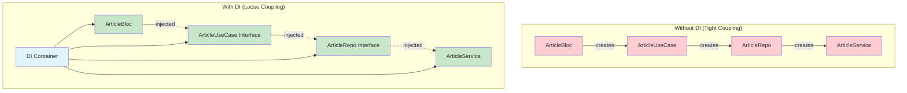

# 💉 Module 8: Dependency Injection

> **Master dependency injection for clean, testable, and maintainable Flutter applications**

---

## 🎯 **Learning Objectives**

After completing this module, you will:
- ✅ Understand dependency injection principles and benefits
- ✅ Implement DI with Injectable and get_it packages
- ✅ Create modular and testable code architecture
- ✅ Configure environment-specific dependencies
- ✅ Set up proper service registration and lifecycle management
- ✅ Test components with dependency injection

---

## 📚 **Dependency Injection Fundamentals**

### **What is Dependency Injection?**

Dependency Injection (DI) is a design pattern that implements **Inversion of Control (IoC)** for resolving dependencies. Instead of objects creating their own dependencies, they receive them from an external source.



### **Benefits of Dependency Injection**

- ✅ **Testability**: Easy to mock dependencies for unit testing
- ✅ **Flexibility**: Swap implementations without changing client code
- ✅ **Maintainability**: Clear separation of concerns
- ✅ **Reusability**: Components can be reused with different dependencies
- ✅ **Configuration**: Environment-specific setups

---

## 🔧 **Project DI Implementation**

### **DI Setup Structure**

```dart
// lib/di/di_setup.dart
import 'package:get_it/get_it.dart';
import 'package:injectable/injectable.dart';

import 'di_setup.config.dart';

final getIt = GetIt.instance;

@InjectableInit(
  initializerName: r'$initGetIt',
  preferRelativeImports: true,
  asExtension: false,
)
void configureDependencies() => $initGetIt(getIt);
```

### **App Module Configuration**

```dart
// lib/di/app_module.dart
@module
abstract class AppModule {
  @lazySingleton
  Dio dio() {
    final dio = Dio(BaseOptions(
      baseUrl: baseUrl,
      connectTimeout: const Duration(seconds: 30),
      receiveTimeout: const Duration(seconds: 30),
    ));

    // Add interceptors
    dio.interceptors.addAll([
      LogInterceptor(requestBody: true, responseBody: true),
      ApiKeyInterceptor(),
      ErrorInterceptor(),
    ]);

    return dio;
  }

  @lazySingleton
  ArticleService articleService(Dio dio) => ArticleService(dio);

  @singleton
  @preResolve
  Future<SharedPreferences> get prefs => SharedPreferences.getInstance();

  @lazySingleton
  Logger logger() => Logger('AppLogger');
}
```

### **Service Registration Patterns**

```dart
// Different registration scopes and patterns

// 1. Singleton - One instance for the entire app lifecycle
@singleton
class DatabaseService {
  // Heavy resource, created once
}

// 2. Lazy Singleton - Created when first requested
@lazySingleton
class ApiService {
  // Created only when needed
}

// 3. Factory - New instance every time
@injectable
class ArticleListBloc {
  // New instance for each screen/widget
}

// 4. Named instances
@Named('production')
@injectable
class ProductionApiConfig implements ApiConfig {}

@Named('development')
@injectable
class DevelopmentApiConfig implements ApiConfig {}

// 5. Environment-specific registration
@Environment('dev')
@injectable
class MockArticleService implements ArticleService {}

@Environment('prod')
@injectable
class LiveArticleService implements ArticleService {}

// 6. PreResolve for async initialization
@singleton
@preResolve
Future<DatabaseManager> get database async {
  final db = DatabaseManager();
  await db.initialize();
  return db;
}
```

---

## 🏗️ **Complete DI Architecture**

### **Data Layer Registration**

```dart
// lib/articles_list/data/di/data_module.dart
@module
abstract class DataModule {
  @lazySingleton
  ArticleService articleService(Dio dio) => ArticleService(dio);

  @Injectable(as: ArticleRemoteDataSource)
  ArticleRemoteDataSourceImpl articleRemoteDataSource(
    ArticleService service,
  ) => ArticleRemoteDataSourceImpl(service);

  @Injectable(as: ArticleLocalDataSource)
  ArticleLocalDataSourceImpl articleLocalDataSource(
    SharedPreferences prefs,
    Logger logger,
  ) => ArticleLocalDataSourceImpl(prefs, logger);

  @Injectable(as: ArticleRepo)
  ArticleRepoImpl articleRepository(
    ArticleRemoteDataSource remoteDataSource,
    ArticleLocalDataSource localDataSource,
    ConnectivityService connectivityService,
    CacheService cacheService,
    Logger logger,
  ) => ArticleRepoImpl(
    remoteDataSource,
    localDataSource,
    connectivityService,
    cacheService,
    logger,
  );
}
```

### **Domain Layer Registration**

```dart
// lib/articles_list/domain/di/domain_module.dart
@module
abstract class DomainModule {
  @Injectable(as: ArticleUseCase)
  ArticleUseCaseImpl articleUseCase(
    ArticleRepo repository,
    UserRepo userRepo,
    AnalyticsService analyticsService,
    Logger logger,
  ) => ArticleUseCaseImpl(
    repository,
    userRepo,
    analyticsService,
    logger,
  );

  @Injectable(as: SearchUseCase)
  SearchUseCaseImpl searchUseCase(
    ArticleRepo repository,
    UserRepo userRepo,
    Logger logger,
  ) => SearchUseCaseImpl(repository, userRepo, logger);
}
```

### **Presentation Layer Registration**

```dart
// lib/articles_list/presentation/di/presentation_module.dart
@module
abstract class PresentationModule {
  @injectable
  ArticleListBloc articleListBloc(
    ArticleUseCase useCase,
    ConnectivityService connectivityService,
  ) => ArticleListBloc(useCase, connectivityService);

  @injectable
  SearchBloc searchBloc(
    SearchUseCase useCase,
    Logger logger,
  ) => SearchBloc(useCase, logger);
}
```

### **Core Services Registration**

```dart
// lib/core/di/core_module.dart
@module
abstract class CoreModule {
  @lazySingleton
  ConnectivityService connectivityService() => ConnectivityServiceImpl();

  @lazySingleton
  CacheService cacheService(SharedPreferences prefs) => 
      CacheServiceImpl(prefs);

  @lazySingleton
  AnalyticsService analyticsService() => FirebaseAnalyticsService();

  @lazySingleton
  @Named('api')
  Logger apiLogger() => Logger('API');

  @lazySingleton
  @Named('bloc')
  Logger blocLogger() => Logger('BLoC');

  @singleton
  ErrorTrackingService errorTracking() => ErrorTrackingService();
}
```

---

## 🎛️ **Environment Configuration**

### **Environment-Specific Setup**

```dart
// lib/di/environments.dart
abstract class Environment {
  static const String dev = 'dev';
  static const String staging = 'staging';
  static const String prod = 'prod';
}

// Usage in main.dart
void main() {
  configureDependencies(Environment.prod);
  runApp(MyApp());
}

// Modified di_setup.dart
@InjectableInit(
  initializerName: r'$initGetIt',
  preferRelativeImports: true,
  asExtension: false,
)
void configureDependencies(String environment) => 
    $initGetIt(getIt, environment: environment);
```

### **Environment-Specific Services**

```dart
// Development services
@Environment(Environment.dev)
@Injectable(as: ApiConfig)
class DevApiConfig implements ApiConfig {
  @override
  String get baseUrl => 'https://dev-api.example.com';
  
  @override
  Duration get timeout => const Duration(seconds: 10);
  
  @override
  bool get enableLogging => true;
}

// Production services  
@Environment(Environment.prod)
@Injectable(as: ApiConfig)
class ProdApiConfig implements ApiConfig {
  @override
  String get baseUrl => 'https://api.example.com';
  
  @override
  Duration get timeout => const Duration(seconds: 30);
  
  @override
  bool get enableLogging => false;
}

// Mock services for testing
@Environment('test')
@Injectable(as: ArticleService)
class MockArticleService implements ArticleService {
  @override
  Future<MostPopularResponse> getEmailedArticles(int period) async {
    return MostPopularResponse('OK', 'Test', []);
  }
}
```

---

## 🧪 **Testing with Dependency Injection**

### **Unit Testing Setup**

```dart
// test/unit-tests/setup/test_di_setup.dart
void setupTestDependencies() {
  // Reset GetIt
  GetIt.instance.reset();
  
  // Register test dependencies
  GetIt.instance.registerFactory<ArticleRepo>(
    () => MockArticleRepo(),
  );
  
  GetIt.instance.registerFactory<ArticleUseCase>(
    () => MockArticleUseCase(),
  );
  
  GetIt.instance.registerFactory<Logger>(
    () => MockLogger(),
  );
}

// test/unit-tests/bloc/article_list_bloc_test.dart
void main() {
  setUpAll(() {
    setupTestDependencies();
  });

  tearDownAll(() {
    GetIt.instance.reset();
  });

  group('ArticleListBloc with DI', () {
    late ArticleListBloc bloc;
    late MockArticleUseCase mockUseCase;

    setUp(() {
      mockUseCase = GetIt.instance<ArticleUseCase>() as MockArticleUseCase;
      bloc = ArticleListBloc(mockUseCase);
    });

    // Tests here
  });
}
```

### **Integration Testing with DI**

```dart
// integration_test/di_integration_test.dart
void main() {
  group('DI Integration Tests', () {
    setUp(() {
      // Use test environment
      configureDependencies('test');
    });

    tearDown(() {
      GetIt.instance.reset();
    });

    testWidgets('should inject real services in integration test', (tester) async {
      // Verify services are properly registered
      expect(GetIt.instance.isRegistered<ArticleService>(), true);
      expect(GetIt.instance.isRegistered<ArticleRepo>(), true);
      expect(GetIt.instance.isRegistered<ArticleUseCase>(), true);

      // Get service and verify it works
      final articleService = GetIt.instance<ArticleService>();
      expect(articleService, isA<MockArticleService>());

      // Test complete widget tree with DI
      await tester.pumpWidget(MyApp());
      
      // Verify app starts correctly with injected dependencies
      expect(find.byType(ArticlesListScreen), findsOneWidget);
    });
  });
}
```

---

## 🎭 **Advanced DI Patterns**

### **Factory Pattern with Parameters**

```dart
// Factory that creates instances with runtime parameters
@module
abstract class FactoryModule {
  @injectable
  ArticleDetailBloc articleDetailBloc(
    ArticleUseCase useCase,
    @factoryParam Article article,
  ) => ArticleDetailBloc(useCase, article);
}

// Usage
final bloc = GetIt.instance<ArticleDetailBloc>(
  param1: selectedArticle,
);
```

### **Conditional Registration**

```dart
@module
abstract class ConditionalModule {
  @injectable
  NetworkService networkService(ConnectivityService connectivity) {
    return connectivity.isConnected 
        ? OnlineNetworkService()
        : OfflineNetworkService();
  }
}
```

### **Decorator Pattern with DI**

```dart
// Base service
@Injectable(as: ArticleRepo)
class BaseArticleRepo implements ArticleRepo {
  // Base implementation
}

// Cached decorator
@Named('cached')
@Injectable(as: ArticleRepo)
class CachedArticleRepo implements ArticleRepo {
  final ArticleRepo _baseRepo;
  final CacheService _cache;

  CachedArticleRepo(
    @Named('base') this._baseRepo,
    this._cache,
  );

  @override
  Future<Either<Error, MostPopularResponse>> requestNews() async {
    // Check cache first, then delegate to base repo
    final cached = await _cache.get('news');
    if (cached != null) return right(cached);
    
    final result = await _baseRepo.requestNews();
    if (result.isRight()) {
      await _cache.set('news', result.getOrElse(() => throw Exception()));
    }
    return result;
  }
}
```

### **Scope Management**

```dart
// Custom scope for user session
class UserScope {
  static final GetIt _userScopeContainer = GetIt.asNewInstance();
  
  static void initializeUserScope(User user) {
    _userScopeContainer.reset();
    
    _userScopeContainer.registerSingleton<User>(user);
    _userScopeContainer.registerFactory<UserPreferencesService>(
      () => UserPreferencesService(user),
    );
    _userScopeContainer.registerFactory<UserAnalyticsService>(
      () => UserAnalyticsService(user),
    );
  }
  
  static T get<T extends Object>() => _userScopeContainer<T>();
  
  static void clearUserScope() {
    _userScopeContainer.reset();
  }
}

// Usage in authentication flow
class AuthenticationService {
  Future<void> login(String email, String password) async {
    final user = await _performLogin(email, password);
    UserScope.initializeUserScope(user);
  }
  
  Future<void> logout() async {
    await _performLogout();
    UserScope.clearUserScope();
  }
}
```

---

## 🔧 **Lifecycle Management**

### **Disposal Pattern**

```dart
// Services that need cleanup
abstract class Disposable {
  Future<void> dispose();
}

@lazySingleton
class NetworkManager implements Disposable {
  final StreamController _controller = StreamController();
  
  @override
  Future<void> dispose() async {
    await _controller.close();
  }
}

// App disposal
class AppContainer {
  static Future<void> dispose() async {
    final disposables = GetIt.instance.allReady()
        .where((instance) => instance is Disposable)
        .cast<Disposable>();
    
    await Future.wait(disposables.map((d) => d.dispose()));
    GetIt.instance.reset();
  }
}

// Usage in app lifecycle
class MyApp extends StatefulWidget {
  @override
  _MyAppState createState() => _MyAppState();
}

class _MyAppState extends State<MyApp> with WidgetsBindingObserver {
  @override
  void initState() {
    super.initState();
    WidgetsBinding.instance.addObserver(this);
  }

  @override
  void dispose() {
    WidgetsBinding.instance.removeObserver(this);
    AppContainer.dispose();
    super.dispose();
  }

  @override
  Future<void> didChangeAppLifecycleState(AppLifecycleState state) async {
    if (state == AppLifecycleState.detached) {
      await AppContainer.dispose();
    }
  }
}
```

### **Async Initialization**

```dart
// Services requiring async setup
@singleton
@preResolve
Future<DatabaseService> get database async {
  final service = DatabaseService();
  await service.initialize();
  return service;
}

@singleton  
@preResolve
Future<ConfigService> get config async {
  final service = ConfigService();
  await service.loadConfiguration();
  return service;
}

// App initialization with async dependencies
void main() async {
  WidgetsFlutterBinding.ensureInitialized();
  
  // Configure DI with async dependencies
  await configureDependencies();
  
  // Ensure all async dependencies are ready
  await GetIt.instance.allReady();
  
  runApp(MyApp());
}
```

---

## 📊 **DI Debugging and Monitoring**

### **Registration Validation**

```dart
// Validate DI setup in debug mode
void validateDependencies() {
  if (kDebugMode) {
    final requiredServices = [
      ArticleRepo,
      ArticleUseCase,
      ArticleService,
      ConnectivityService,
      CacheService,
    ];
    
    for (final serviceType in requiredServices) {
      if (!GetIt.instance.isRegistered(type: serviceType)) {
        throw Exception('Required service $serviceType is not registered');
      }
    }
    
    print('✅ All required services are registered');
  }
}
```

### **Dependency Graph Visualization**

```dart
// Debug helper to visualize dependency graph
void printDependencyGraph() {
  if (kDebugMode) {
    print('🔍 Dependency Registration Summary:');
    print('Singletons: ${GetIt.instance.allReady().length}');
    print('Factories: ${GetIt.instance.allFactories().length}');
    
    // Print all registered types
    for (final registration in GetIt.instance.allReady()) {
      print('  📦 ${registration.runtimeType}');
    }
  }
}
```

---

## 🎯 **Hands-On Exercise**

### **Exercise 1: Multi-Module DI Setup**

Create a modular DI setup for a complex app:

```dart
// TODO: Create modules for different features
@module
abstract class AuthModule {
  // Register authentication services
}

@module  
abstract class PaymentModule {
  // Register payment services
}

@module
abstract class NotificationModule {
  // Register notification services
}

// TODO: Create environment-specific configurations
// TODO: Implement proper service lifecycle management
// TODO: Add validation and error handling
```

### **Exercise 2: Custom Scope Implementation**

Implement custom scopes for different app contexts:

```dart
// TODO: Create FeatureScope
class FeatureScope {
  // Manage dependencies for specific features
  // Implement scope isolation
  // Handle scope cleanup
}

// TODO: Create RequestScope
class RequestScope {
  // Manage dependencies for HTTP requests
  // Implement request-scoped services
  // Handle request completion cleanup
}
```

---

## 🎓 **Knowledge Check**

### **Questions**:

1. **What's the difference between singleton and factory registration?**
2. **When should you use @preResolve for async initialization?**
3. **How do you handle circular dependencies in DI?**
4. **What are the benefits of environment-specific registration?**

### **Practical Scenarios**:

1. **Multi-tenant App**: How would you handle tenant-specific services?
2. **Plugin Architecture**: How would you dynamically register plugin services?
3. **A/B Testing**: How would you inject different implementations based on feature flags?

---

## 🔗 **What's Next?**

Now that you understand dependency injection, let's explore comprehensive testing strategies:

**Next Module**: [Module 9: Testing](11-testing.md)

---

## 📚 **Additional Resources**

- [Injectable Package Documentation](https://pub.dev/packages/injectable)
- [Get It Package Documentation](https://pub.dev/packages/get_it)
- [Dependency Injection Patterns](https://martinfowler.com/articles/injection.html)
- [Flutter DI Best Practices](https://resocoder.com/2020/02/04/flutter-dependency-injection-guide-get_it-injectable/)

---

**Excellent!** You've mastered dependency injection for scalable Flutter apps. Ready to ensure quality with testing? 🚀 