# 🧪 Module 9: Testing

> **Master comprehensive testing strategies for reliable and maintainable Flutter applications**

---

## 🎯 **Learning Objectives**

After completing this module, you will:
- ✅ Understand different types of testing in Flutter
- ✅ Write effective unit tests for business logic
- ✅ Create widget tests for UI components
- ✅ Implement integration tests for user flows
- ✅ Use mocking and test doubles effectively
- ✅ Achieve meaningful test coverage
- ✅ Apply testing best practices

---

## 📚 **Testing Fundamentals**

### **The Testing Pyramid**

```mermaid
graph TB
    subgraph "Testing Pyramid"
        E2E[Integration Tests<br/>🔄 Few, Slow, Expensive<br/>End-to-end user flows]
        Widget[Widget Tests<br/>🖼️ Some, Medium, Moderate<br/>UI component testing]
        Unit[Unit Tests<br/>⚡ Many, Fast, Cheap<br/>Business logic testing]
    end
    
    E2E --> Widget --> Unit
    
    style E2E fill:#ffcdd2
    style Widget fill:#fff9c4
    style Unit fill:#c8e6c9
```



### **Testing Types in Flutter**

1. **Unit Tests**: Test individual functions, methods, and classes
2. **Widget Tests**: Test individual widgets and their interactions
3. **Integration Tests**: Test complete app flows on real devices/simulators

### **Benefits of Testing**

- ✅ **Catch bugs early** in the development cycle
- ✅ **Ensure code quality** and reliability
- ✅ **Enable confident refactoring** without breaking functionality
- ✅ **Document behavior** through test cases
- ✅ **Facilitate team collaboration** with clear expectations

---

## ⚡ **Unit Testing**

### **Unit Testing Setup**

```dart
// test/unit-tests/articles_list/data/repository/article_repo_impl_test.dart
import 'package:flutter_test/flutter_test.dart';
import 'package:mockito/annotations.dart';
import 'package:mockito/mockito.dart';
import 'package:dartz/dartz.dart';

// Generate mocks
@GenerateMocks([ArticleRemoteDataSource])
void main() {
  group('ArticleRepoImpl', () {
    late ArticleRepoImpl repository;
    late MockArticleRemoteDataSource mockDataSource;

    setUp(() {
      mockDataSource = MockArticleRemoteDataSource();
      repository = ArticleRepoImpl(mockDataSource);
    });

    // Test cases here
  });
}
```

### **Repository Testing**

```dart
group('requestNews', () {
  final testArticles = [
    Article('Title 1', 'Abstract 1', 1, 'url1', 'date1', []),
    Article('Title 2', 'Abstract 2', 2, 'url2', 'date2', []),
  ];
  final testResponse = MostPopularResponse('ok', 'copyright', testArticles);

  test('should return articles when remote call is successful', () async {
    // Arrange
    when(mockDataSource.getTasks(any))
        .thenAnswer((_) async => testResponse);

    // Act
    final result = await repository.requestNews();

    // Assert
    expect(result.isRight(), true);
    result.fold(
      (error) => fail('Expected success but got error: $error'),
      (response) => expect(response.articles, testArticles),
    );
    verify(mockDataSource.getTasks(apiKey)).called(1);
  });

  test('should return error when remote call fails with DioException', () async {
    // Arrange
    when(mockDataSource.getTasks(any))
        .thenThrow(DioException(
          requestOptions: RequestOptions(path: ''),
          type: DioExceptionType.connectionTimeout,
        ));

    // Act
    final result = await repository.requestNews();

    // Assert
    expect(result.isLeft(), true);
    result.fold(
      (error) => expect(error, isA<NetworkError>()),
      (response) => fail('Expected error but got success'),
    );
  });

  test('should return unauthorized error when API returns 401', () async {
    // Arrange
    when(mockDataSource.getTasks(any))
        .thenThrow(DioException(
          requestOptions: RequestOptions(path: ''),
          type: DioExceptionType.badResponse,
          response: Response(
            requestOptions: RequestOptions(path: ''),
            statusCode: 401,
          ),
        ));

    // Act
    final result = await repository.requestNews();

    // Assert
    expect(result.isLeft(), true);
    result.fold(
      (error) => expect(error, const Error.httpUnAuthorizedError()),
      (response) => fail('Expected error but got success'),
    );
  });
});
```

### **Use Case Testing**

```dart
// test/unit-tests/articles_list/domain/article_usecase_impl_test.dart
@GenerateMocks([ArticleRepo])
void main() {
  group('ArticleUseCaseImpl', () {
    late ArticleUseCaseImpl useCase;
    late MockArticleRepo mockRepo;

    setUp(() {
      mockRepo = MockArticleRepo();
      useCase = ArticleUseCaseImpl(mockRepo);
    });

    test('should return articles when repository call is successful', () async {
      // Arrange
      final testResponse = MostPopularResponse('ok', 'copyright', []);
      when(mockRepo.requestNews())
          .thenAnswer((_) async => right(testResponse));

      // Act
      final result = await useCase.requestNews();

      // Assert
      expect(result, right(testResponse));
      verify(mockRepo.requestNews()).called(1);
      verifyNoMoreInteractions(mockRepo);
    });

    test('should return error when repository call fails', () async {
      // Arrange
      const testError = Error.networkError('No connection');
      when(mockRepo.requestNews())
          .thenAnswer((_) async => left(testError));

      // Act
      final result = await useCase.requestNews();

      // Assert
      expect(result, left(testError));
      verify(mockRepo.requestNews()).called(1);
    });
  });
}
```

### **Model Testing**

```dart
// test/unit-tests/models/article_test.dart
void main() {
  group('Article Model', () {
    test('should serialize to JSON correctly', () {
      // Arrange
      final article = Article(
        'Test Title',
        'Test Abstract',
        123,
        'https://example.com',
        '2023-01-01',
        [],
      );

      // Act
      final json = article.toJson();

      // Assert
      expect(json, {
        'id': 123,
        'title': 'Test Title',
        'abstract': 'Test Abstract',
        'url': 'https://example.com',
        'published_date': '2023-01-01',
        'media': [],
      });
    });

    test('should deserialize from JSON correctly', () {
      // Arrange
      final json = {
        'title': 'Test Title',
        'abstract': 'Test Abstract',
        'id': 123,
        'url': 'https://example.com',
        'published_date': '2023-01-01',
        'media': [],
      };

      // Act
      final article = Article.fromJson(json);

      // Assert
      expect(article.title, 'Test Title');
      expect(article.id, 123);
      expect(article.publishedData, '2023-01-01');
    });

    test('should handle null published_date gracefully', () {
      // Arrange
      final json = {
        'title': 'Test Title',
        'abstract': 'Test Abstract',
        'id': 123,
        'url': 'https://example.com',
        'published_date': null,
        'media': [],
      };

      // Act
      final article = Article.fromJson(json);

      // Assert
      expect(article.publishedData, null);
    });

    test('should create instances with required fields', () {
      // Act
      final article = Article(
        'Title',
        'Abstract',
        1,
        'url',
        null,
        [],
      );

      // Assert
      expect(article.title, 'Title');
      expect(article.id, 1);
      expect(article.publishedData, null);
    });
  });
}
```

---

## 🎨 **BLoC Testing**

### **BLoC Testing Setup**

```dart
// test/unit-tests/bloc/article_list_bloc_test.dart
import 'package:bloc_test/bloc_test.dart';

@GenerateMocks([ArticleUseCase])
void main() {
  group('ArticleListBloc', () {
    late ArticleListBloc bloc;
    late MockArticleUseCase mockUseCase;

    setUp(() {
      mockUseCase = MockArticleUseCase();
      bloc = ArticleListBloc(mockUseCase);
    });

    tearDown(() {
      bloc.close();
    });

    test('initial state should be ArticleListState.initial()', () {
      expect(bloc.state, ArticleListState.initial());
    });
  });
}
```

### **Testing State Transitions**

```dart
group('LoadArticles', () {
  final testArticles = [
    Article('Title 1', 'Abstract 1', 1, 'url1', 'date1', []),
  ];
  final testResponse = MostPopularResponse('ok', 'copyright', testArticles);

  blocTest<ArticleListBloc, ArticleListState>(
    'should emit loading then loaded when articles are fetched successfully',
    build: () {
      when(mockUseCase.requestNews())
          .thenAnswer((_) async => right(testResponse));
      return bloc;
    },
    act: (bloc) => bloc.add(const ArticleListEvent.loadArticles()),
    expect: () => [
      ArticleListState.initial().copyWith(isLoading: true, error: none()),
      ArticleListState.initial().copyWith(
        isLoading: false,
        error: none(),
        articles: some(testArticles),
      ),
    ],
    verify: (_) {
      verify(mockUseCase.requestNews()).called(1);
    },
  );

  blocTest<ArticleListBloc, ArticleListState>(
    'should emit loading then error when fetch fails',
    build: () {
      when(mockUseCase.requestNews())
          .thenAnswer((_) async => left(const Error.networkError('No connection')));
      return bloc;
    },
    act: (bloc) => bloc.add(const ArticleListEvent.loadArticles()),
    expect: () => [
      ArticleListState.initial().copyWith(isLoading: true, error: none()),
      ArticleListState.initial().copyWith(
        isLoading: false,
        error: some(const Error.networkError('No connection')),
        articles: none(),
      ),
    ],
  );
});
```

### **Testing Multiple Events**

```dart
blocTest<ArticleListBloc, ArticleListState>(
  'should handle multiple events in sequence',
  build: () {
    when(mockUseCase.requestNews())
        .thenAnswer((_) async => right(testResponse));
    return bloc;
  },
  act: (bloc) {
    bloc.add(const ArticleListEvent.loadArticles());
    bloc.add(ArticleListEvent.markAsFavorite(testArticles.first));
  },
  expect: () => [
    // Loading state
    ArticleListState.initial().copyWith(isLoading: true, error: none()),
    // Loaded state
    ArticleListState.initial().copyWith(
      isLoading: false,
      error: none(),
      articles: some(testArticles),
    ),
    // Favorite added state
    ArticleListState.initial().copyWith(
      isLoading: false,
      error: none(),
      articles: some(testArticles),
      favorites: [testArticles.first],
    ),
  ],
);
```

---

## 🖼️ **Widget Testing**

### **Widget Testing Setup**

```dart
// test/widget-tests/article_list_item_test.dart
void main() {
  group('ArticleListItem', () {
    late Article testArticle;

    setUp(() {
      testArticle = Article(
        'Test Title',
        'Test Abstract',
        123,
        'https://example.com',
        '2023-01-01',
        [],
      );
    });

    testWidgets('should display article information', (tester) async {
      // Act
      await tester.pumpWidget(
        MaterialApp(
          home: Scaffold(
            body: ArticleListItem(
              article: testArticle,
              onTap: () {},
            ),
          ),
        ),
      );

      // Assert
      expect(find.text('Test Title'), findsOneWidget);
      expect(find.text('Test Abstract'), findsOneWidget);
    });
  });
}
```

### **Testing User Interactions**

```dart
testWidgets('should call onTap when tapped', (tester) async {
  // Arrange
  var wasTapped = false;
  await tester.pumpWidget(
    MaterialApp(
      home: Scaffold(
        body: ArticleListItem(
          article: testArticle,
          onTap: () => wasTapped = true,
        ),
      ),
    ),
  );

  // Act
  await tester.tap(find.byType(ArticleListItem));
  await tester.pump();

  // Assert
  expect(wasTapped, true);
});

testWidgets('should toggle favorite state when favorite button is tapped', (tester) async {
  // Arrange
  var isFavorite = false;
  await tester.pumpWidget(
    MaterialApp(
      home: Scaffold(
        body: StatefulBuilder(
          builder: (context, setState) {
            return ArticleListItem(
              article: testArticle,
              isFavorite: isFavorite,
              onFavoriteToggle: () => setState(() => isFavorite = !isFavorite),
              onTap: () {},
            );
          },
        ),
      ),
    ),
  );

  // Assert initial state
  expect(find.byIcon(Icons.favorite_border), findsOneWidget);
  expect(find.byIcon(Icons.favorite), findsNothing);

  // Act
  await tester.tap(find.byIcon(Icons.favorite_border));
  await tester.pump();

  // Assert favorite state
  expect(find.byIcon(Icons.favorite), findsOneWidget);
  expect(find.byIcon(Icons.favorite_border), findsNothing);
});
```

### **Testing with BLoC**

```dart
// test/widget-tests/articles_list_screen_test.dart
void main() {
  group('ArticlesListScreen', () {
    late MockArticleListBloc mockBloc;

    setUp(() {
      mockBloc = MockArticleListBloc();
    });

    testWidgets('should show loading indicator when loading', (tester) async {
      // Arrange
      when(() => mockBloc.state).thenReturn(
        ArticleListState.initial().copyWith(isLoading: true),
      );
      when(() => mockBloc.stream).thenAnswer(
        (_) => Stream.value(ArticleListState.initial().copyWith(isLoading: true)),
      );

      // Act
      await tester.pumpWidget(
        MaterialApp(
          home: BlocProvider<ArticleListBloc>.value(
            value: mockBloc,
            child: const ArticlesListScreen(),
          ),
        ),
      );

      // Assert
      expect(find.byType(CircularProgressIndicator), findsOneWidget);
    });

    testWidgets('should show articles when loaded', (tester) async {
      // Arrange
      final testArticles = [
        Article('Title 1', 'Abstract 1', 1, 'url1', 'date1', []),
        Article('Title 2', 'Abstract 2', 2, 'url2', 'date2', []),
      ];
      when(() => mockBloc.state).thenReturn(
        ArticleListState.initial().copyWith(articles: some(testArticles)),
      );
      when(() => mockBloc.stream).thenAnswer(
        (_) => Stream.value(
          ArticleListState.initial().copyWith(articles: some(testArticles)),
        ),
      );

      // Act
      await tester.pumpWidget(
        MaterialApp(
          home: BlocProvider<ArticleListBloc>.value(
            value: mockBloc,
            child: const ArticlesListScreen(),
          ),
        ),
      );

      // Assert
      expect(find.byType(ArticleListItem), findsNWidgets(2));
      expect(find.text('Title 1'), findsOneWidget);
      expect(find.text('Title 2'), findsOneWidget);
    });

    testWidgets('should show error message when error occurs', (tester) async {
      // Arrange
      const error = Error.networkError('No connection');
      when(() => mockBloc.state).thenReturn(
        ArticleListState.initial().copyWith(error: some(error)),
      );
      when(() => mockBloc.stream).thenAnswer(
        (_) => Stream.value(
          ArticleListState.initial().copyWith(error: some(error)),
        ),
      );

      // Act
      await tester.pumpWidget(
        MaterialApp(
          home: BlocProvider<ArticleListBloc>.value(
            value: mockBloc,
            child: const ArticlesListScreen(),
          ),
        ),
      );

      // Assert
      expect(find.text('No connection'), findsOneWidget);
      expect(find.text('Retry'), findsOneWidget);
    });
  });
}
```

---

## 🔄 **Integration Testing**

### **Integration Test Setup**

```dart
// integration_test/app_test.dart
import 'package:flutter/material.dart';
import 'package:flutter_test/flutter_test.dart';
import 'package:integration_test/integration_test.dart';
import 'package:nyt_flutter/main.dart' as app;

void main() {
  IntegrationTestWidgetsFlutterBinding.ensureInitialized();

  group('End-to-End Tests', () {
    testWidgets('should load and display articles', (tester) async {
      // Launch the app
      app.main();
      await tester.pumpAndSettle();

      // Wait for articles to load
      await tester.pumpAndSettle(const Duration(seconds: 5));

      // Verify articles are displayed
      expect(find.byType(ArticleListItem), findsWidgets);
    });
  });
}
```

### **Testing User Flows**

```dart
testWidgets('complete article reading flow', (tester) async {
  // Setup
  app.main();
  await tester.pumpAndSettle();

  // Wait for articles to load
  await tester.pumpAndSettle(const Duration(seconds: 5));

  // Verify articles list is displayed
  expect(find.byType(ArticleListItem), findsWidgets);

  // Tap on first article
  await tester.tap(find.byType(ArticleListItem).first);
  await tester.pumpAndSettle();

  // Verify article detail screen is shown
  expect(find.byType(ArticleDetailScreen), findsOneWidget);

  // Verify article content is displayed
  expect(find.byType(CachedNetworkImage), findsOneWidget);

  // Navigate back
  await tester.pageBack();
  await tester.pumpAndSettle();

  // Verify back to articles list
  expect(find.byType(ArticleListItem), findsWidgets);
});
```

### **Testing with Mock Data**

```dart
// integration_test/mock_integration_test.dart
void main() {
  IntegrationTestWidgetsFlutterBinding.ensureInitialized();

  group('Mock Integration Tests', () {
    setUp(() {
      // Setup mock dependencies
      setupMockDependencies();
    });

    testWidgets('should handle network errors gracefully', (tester) async {
      // Configure mock to return error
      when(mockArticleService.getTasks(any))
          .thenThrow(DioException(
            requestOptions: RequestOptions(path: ''),
          ));

      // Launch app
      await tester.pumpWidget(const MyApp());
      await tester.pumpAndSettle();

      // Verify error is displayed
      expect(find.text('Retry'), findsOneWidget);
      expect(find.byIcon(Icons.error), findsOneWidget);

      // Tap retry button
      await tester.tap(find.text('Retry'));
      await tester.pumpAndSettle();

      // Verify retry action is triggered
      verify(mockArticleService.getTasks(any)).called(2);
    });
  });
}
```

---

## 🎭 **Mocking and Test Doubles**

### **Creating Mocks with Mockito**

```dart
// Generate mocks using annotations
@GenerateMocks([
  ArticleRemoteDataSource,
  ArticleRepo,
  ArticleUseCase,
  Dio,
])
void main() {
  // Generated mocks will be available as:
  // MockArticleRemoteDataSource
  // MockArticleRepo
  // MockArticleUseCase
  // MockDio
}
```

### **Mock Behavior Configuration**

```dart
setUp(() {
  mockDataSource = MockArticleRemoteDataSource();
  
  // Configure default behavior
  when(mockDataSource.getTasks(any))
      .thenAnswer((_) async => MostPopularResponse('ok', '', []));
});

test('should return specific response for specific input', () async {
  // Arrange
  const specificApiKey = 'test-key';
  final specificResponse = MostPopularResponse('ok', '', [testArticle]);
  
  when(mockDataSource.getTasks(specificApiKey))
      .thenAnswer((_) async => specificResponse);

  // Act
  final result = await repository.requestNews();

  // Assert
  verify(mockDataSource.getTasks(specificApiKey)).called(1);
  expect(result.getOrElse(() => throw Exception()), specificResponse);
});
```

### **Verifying Interactions**

```dart
test('should call use case exactly once', () async {
  // Arrange
  when(mockUseCase.requestNews())
      .thenAnswer((_) async => right(testResponse));

  // Act
  bloc.add(const ArticleListEvent.loadArticles());
  await bloc.stream.first;

  // Assert
  verify(mockUseCase.requestNews()).called(1);
  verifyNoMoreInteractions(mockUseCase);
});

test('should not call use case when already loading', () async {
  // Arrange
  when(mockUseCase.requestNews())
      .thenAnswer((_) async {
        await Future.delayed(const Duration(seconds: 1));
        return right(testResponse);
      });

  // Act - Add multiple events quickly
  bloc.add(const ArticleListEvent.loadArticles());
  bloc.add(const ArticleListEvent.loadArticles());
  bloc.add(const ArticleListEvent.loadArticles());

  await Future.delayed(const Duration(seconds: 2));

  // Assert - Should only call once due to loading state
  verify(mockUseCase.requestNews()).called(1);
});
```

---

## 📊 **Test Coverage**

### **Generating Coverage Reports**

```bash
# Run tests with coverage
flutter test --coverage

# Generate HTML report (requires lcov)
genhtml coverage/lcov.info -o coverage/html

# Open coverage report
open coverage/html/index.html
```

### **Coverage Configuration**

```yaml
# test_coverage.yaml
# Exclude generated files from coverage
exclude:
  - "lib/**/*.g.dart"
  - "lib/**/*.freezed.dart"
  - "lib/**/*.config.dart"
  - "lib/**/*.mocks.dart"
  - "lib/main.dart"  # Entry point
```

### **Understanding Coverage Metrics**

- **Line Coverage**: Percentage of code lines executed
- **Function Coverage**: Percentage of functions called
- **Branch Coverage**: Percentage of code branches taken

**Target Coverage Goals:**
- ✅ **Business Logic**: 90%+ coverage
- ✅ **Data Layer**: 85%+ coverage
- ✅ **Presentation Layer**: 70%+ coverage
- ✅ **Overall Project**: 80%+ coverage

---

## 💡 **Testing Best Practices**

### **Test Structure (AAA Pattern)**

```dart
test('should return articles when API call succeeds', () async {
  // Arrange - Set up test data and conditions
  final expectedArticles = [testArticle];
  when(mockDataSource.getTasks(any))
      .thenAnswer((_) async => MostPopularResponse('', '', expectedArticles));

  // Act - Execute the action being tested
  final result = await repository.requestNews();

  // Assert - Verify the expected outcome
  expect(result.isRight(), true);
  expect(result.getOrElse(() => throw Exception()).articles, expectedArticles);
});
```

### **Test Naming Convention**

```dart
// ✅ Good: Descriptive test names
test('should return articles when API call succeeds', () {});
test('should return network error when connection fails', () {});
test('should emit loading state before making API call', () {});

// ❌ Bad: Vague test names
test('test repository', () {});
test('test error case', () {});
test('test bloc', () {});
```

### **Test Data Management**

```dart
// Create test data factories
class TestDataFactory {
  static Article createArticle({
    String title = 'Default Title',
    int id = 1,
    String url = 'https://example.com',
  }) {
    return Article(title, 'Abstract', id, url, '2023-01-01', []);
  }

  static List<Article> createArticleList(int count) {
    return List.generate(
      count,
      (index) => createArticle(title: 'Title $index', id: index),
    );
  }

  static MostPopularResponse createResponse({
    List<Article>? articles,
  }) {
    return MostPopularResponse(
      'ok',
      'copyright',
      articles ?? createArticleList(3),
    );
  }
}
```

### **Error Testing**

```dart
group('Error Scenarios', () {
  test('should handle timeout errors', () async {
    // Arrange
    when(mockDataSource.getTasks(any))
        .thenThrow(DioException(
          requestOptions: RequestOptions(path: ''),
          type: DioExceptionType.connectionTimeout,
        ));

    // Act
    final result = await repository.requestNews();

    // Assert
    expect(result.isLeft(), true);
    result.fold(
      (error) => expect(error, isA<TimeoutError>()),
      (success) => fail('Expected error but got success'),
    );
  });

  test('should handle JSON parsing errors', () async {
    // Arrange
    when(mockDataSource.getTasks(any))
        .thenThrow(const FormatException('Invalid JSON'));

    // Act
    final result = await repository.requestNews();

    // Assert
    expect(result.isLeft(), true);
  });
});
```

---

## 🎯 **Hands-On Exercise**

### **Exercise 1: Complete Repository Testing**

Write comprehensive tests for `ArticleRepoImpl`:

```dart
// TODO: Test these scenarios:
// 1. Successful API response
// 2. Network timeout
// 3. Server error (500)
// 4. Unauthorized error (401)
// 5. JSON parsing error
// 6. Empty response
// 7. Null response handling
// 8. Multiple concurrent calls
```

### **Exercise 2: BLoC Testing Suite**

Create a complete test suite for `ArticleListBloc`:

```dart
// TODO: Test these scenarios:
// 1. Initial state
// 2. Loading articles successfully
// 3. Loading articles with error
// 4. Refreshing articles
// 5. Adding/removing favorites
// 6. Multiple events handling
// 7. Stream subscription cleanup
```

### **Exercise 3: Widget Integration Testing**

Test the complete article list widget:

```dart
// TODO: Test these scenarios:
// 1. Display loading state
// 2. Display articles list
// 3. Display error state
// 4. Handle user interactions
// 5. Navigation to detail screen
// 6. Pull-to-refresh functionality
// 7. Favorite toggle actions
```

---

## 🎓 **Knowledge Check**

### **Questions**:

1. **What's the difference between unit tests and integration tests?**
2. **When should you use mocks vs real implementations?**
3. **How do you test asynchronous code in Flutter?**
4. **What is the AAA pattern in testing?**
5. **How do you achieve good test coverage without over-testing?**

### **Practical Scenarios**:

1. **Testing a login flow** with validation and error handling
2. **Testing offline functionality** with cached data
3. **Testing real-time features** like chat or notifications
4. **Testing complex state management** with multiple BLoCs

---

## 🔗 **What's Next?**

Now that you've mastered testing, let's explore error handling and user experience:

**Next Module**: [Module 10: Error Handling & User Experience](12-error-handling-ux.md)

---

## 📚 **Additional Resources**

- [Flutter Testing Documentation](https://docs.flutter.dev/testing)
- [Mockito Package](https://pub.dev/packages/mockito)
- [BLoC Test Package](https://pub.dev/packages/bloc_test)
- [Integration Testing Guide](https://docs.flutter.dev/testing/integration-tests)
- [Test Coverage Tools](https://docs.flutter.dev/testing/code-coverage)

---

**Fantastic!** You've mastered testing strategies for reliable Flutter apps. Ready to handle errors gracefully? 🚀 