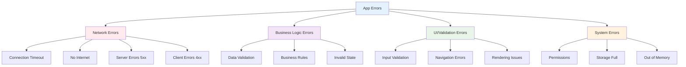

# 🔧 Module 10: Error Handling & User Experience

> **Master comprehensive error handling strategies and create exceptional user experiences**

---

## 🎯 **Learning Objectives**

After completing this module, you will:
- ✅ Implement comprehensive error handling strategies
- ✅ Create user-friendly error states and messages
- ✅ Build retry mechanisms and offline support
- ✅ Handle different types of errors gracefully
- ✅ Provide excellent user experience during failures
- ✅ Implement proper logging and monitoring

---

## 📚 **Error Handling Fundamentals**

### **Types of Errors in Mobile Apps**



---

## 🚨 **Project Error Handling Architecture**

### **Error Model with Freezed**

```dart
// lib/core/error/error.dart
@freezed
class Error with _$Error {
  // Network Errors
  const factory Error.networkError(String message) = NetworkError;
  const factory Error.timeoutError() = TimeoutError;
  const factory Error.connectionError() = ConnectionError;
  
  // HTTP Errors
  const factory Error.httpBadRequest(String message) = HttpBadRequest;
  const factory Error.httpUnAuthorizedError() = HttpUnAuthorizedError;
  const factory Error.httpForbiddenError() = HttpForbiddenError;
  const factory Error.httpNotFoundError() = HttpNotFoundError;
  const factory Error.httpRateLimitError() = HttpRateLimitError;
  const factory Error.httpInternalServerError(String errorBody) = HttpInternalServerError;
  const factory Error.httpServerUnavailableError() = HttpServerUnavailableError;
  const factory Error.httpUnknownError(String message) = HttpUnknownError;
  
  // Business Logic Errors
  const factory Error.validationError(String field, String message) = ValidationError;
  const factory Error.businessRuleError(String message) = BusinessRuleError;
  const factory Error.dataNotFoundError() = DataNotFoundError;
  
  // System Errors
  const factory Error.permissionDeniedError() = PermissionDeniedError;
  const factory Error.storageFullError() = StorageFullError;
  const factory Error.cacheError(String message) = CacheError;
  
  // Unknown Errors
  const factory Error.unknown(String message) = UnknownError;
}
```

### **Error Extensions for User-Friendly Messages**

```dart
// lib/core/error/error_extensions.dart
extension ErrorX on Error {
  String get userMessage {
    return when(
      // Network Errors
      networkError: (message) => 'Connection problem. Please check your internet connection.',
      timeoutError: () => 'Request took too long. Please try again.',
      connectionError: () => 'Unable to connect. Please check your connection.',
      
      // HTTP Errors
      httpBadRequest: (message) => 'Invalid request. Please try again.',
      httpUnAuthorizedError: () => 'Authentication failed. Please check your credentials.',
      httpForbiddenError: () => 'Access denied. You don\'t have permission to perform this action.',
      httpNotFoundError: () => 'Requested content not found.',
      httpRateLimitError: () => 'Too many requests. Please wait a moment and try again.',
      httpInternalServerError: (_) => 'Server error. Please try again later.',
      httpServerUnavailableError: () => 'Service temporarily unavailable. Please try again later.',
      httpUnknownError: (message) => 'Something went wrong. Please try again.',
      
      // Business Logic Errors
      validationError: (field, message) => 'Validation error in $field: $message',
      businessRuleError: (message) => message,
      dataNotFoundError: () => 'No data found. Please try refreshing.',
      
      // System Errors
      permissionDeniedError: () => 'Permission denied. Please check app permissions.',
      storageFullError: () => 'Storage is full. Please free up some space.',
      cacheError: (message) => 'Cache error. Please clear app data and try again.',
      
      // Unknown
      unknown: (message) => 'An unexpected error occurred. Please try again.',
    );
  }

  String get technicalMessage {
    return when(
      networkError: (message) => 'Network Error: $message',
      timeoutError: () => 'Timeout Error: Request exceeded time limit',
      connectionError: () => 'Connection Error: Unable to establish connection',
      httpBadRequest: (message) => 'HTTP 400: $message',
      httpUnAuthorizedError: () => 'HTTP 401: Unauthorized',
      httpForbiddenError: () => 'HTTP 403: Forbidden',
      httpNotFoundError: () => 'HTTP 404: Not Found',
      httpRateLimitError: () => 'HTTP 429: Rate Limit Exceeded',
      httpInternalServerError: (body) => 'HTTP 500: Internal Server Error - $body',
      httpServerUnavailableError: () => 'HTTP 503: Service Unavailable',
      httpUnknownError: (message) => 'HTTP Error: $message',
      validationError: (field, message) => 'Validation Error [$field]: $message',
      businessRuleError: (message) => 'Business Rule Error: $message',
      dataNotFoundError: () => 'Data Not Found Error',
      permissionDeniedError: () => 'Permission Denied Error',
      storageFullError: () => 'Storage Full Error',
      cacheError: (message) => 'Cache Error: $message',
      unknown: (message) => 'Unknown Error: $message',
    );
  }

  bool get isRetryable {
    return when(
      networkError: (_) => true,
      timeoutError: () => true,
      connectionError: () => true,
      httpInternalServerError: (_) => true,
      httpServerUnavailableError: () => true,
      httpRateLimitError: () => true,
      httpBadRequest: (_) => false,
      httpUnAuthorizedError: () => false,
      httpForbiddenError: () => false,
      httpNotFoundError: () => false,
      httpUnknownError: (_) => false,
      validationError: (_, __) => false,
      businessRuleError: (_) => false,
      dataNotFoundError: () => true,
      permissionDeniedError: () => false,
      storageFullError: () => false,
      cacheError: (_) => true,
      unknown: (_) => true,
    );
  }

  IconData get icon {
    return when(
      networkError: (_) => Icons.wifi_off,
      timeoutError: () => Icons.access_time,
      connectionError: () => Icons.signal_wifi_connected_no_internet_4,
      httpUnAuthorizedError: () => Icons.lock,
      httpForbiddenError: () => Icons.block,
      httpNotFoundError: () => Icons.search_off,
      httpRateLimitError: () => Icons.speed,
      httpInternalServerError: (_) => Icons.error,
      httpServerUnavailableError: () => Icons.cloud_off,
      httpBadRequest: (_) => Icons.warning,
      httpUnknownError: (_) => Icons.help_outline,
      validationError: (_, __) => Icons.error_outline,
      businessRuleError: (_) => Icons.business,
      dataNotFoundError: () => Icons.inbox,
      permissionDeniedError: () => Icons.security,
      storageFullError: () => Icons.storage,
      cacheError: (_) => Icons.cached,
      unknown: (_) => Icons.error,
    );
  }
}
```

---

## 🔄 **Retry Mechanisms**

### **Exponential Backoff Strategy**

```dart
// lib/core/network/retry_strategy.dart
class RetryStrategy {
  final int maxRetries;
  final Duration initialDelay;
  final double backoffMultiplier;
  final Duration maxDelay;

  const RetryStrategy({
    this.maxRetries = 3,
    this.initialDelay = const Duration(seconds: 1),
    this.backoffMultiplier = 2.0,
    this.maxDelay = const Duration(seconds: 30),
  });

  static const RetryStrategy conservative = RetryStrategy(
    maxRetries = 2,
    initialDelay: Duration(seconds: 2),
    backoffMultiplier: 1.5,
  );

  static const RetryStrategy aggressive = RetryStrategy(
    maxRetries = 5,
    initialDelay: Duration(milliseconds: 500),
    backoffMultiplier: 2.0,
  );

  Duration getDelay(int attemptNumber) {
    final delay = Duration(
      milliseconds: (initialDelay.inMilliseconds * 
          math.pow(backoffMultiplier, attemptNumber)).round(),
    );
    return delay > maxDelay ? maxDelay : delay;
  }
}

class RetryHelper {
  static Future<T> execute<T>(
    Future<T> Function() operation, {
    RetryStrategy strategy = const RetryStrategy(),
    bool Function(dynamic error)? shouldRetry,
  }) async {
    dynamic lastError;
    
    for (int attempt = 0; attempt <= strategy.maxRetries; attempt++) {
      try {
        return await operation();
      } catch (error) {
        lastError = error;
        
        // Don't retry on the last attempt
        if (attempt == strategy.maxRetries) {
          rethrow;
        }
        
        // Check if we should retry this error
        if (shouldRetry != null && !shouldRetry(error)) {
          rethrow;
        }
        
        // Default retry logic for common errors
        if (!_shouldRetryByDefault(error)) {
          rethrow;
        }
        
        // Wait before retrying
        final delay = strategy.getDelay(attempt);
        AppLogger.info('Retrying operation in ${delay.inMilliseconds}ms (attempt ${attempt + 1}/${strategy.maxRetries})');
        await Future.delayed(delay);
      }
    }
    
    throw lastError;
  }

  static bool _shouldRetryByDefault(dynamic error) {
    if (error is DioException) {
      switch (error.type) {
        case DioExceptionType.connectionTimeout:
        case DioExceptionType.receiveTimeout:
        case DioExceptionType.sendTimeout:
        case DioExceptionType.connectionError:
          return true;
        case DioExceptionType.badResponse:
          final statusCode = error.response?.statusCode;
          return statusCode != null && statusCode >= 500;
        default:
          return false;
      }
    }
    
    if (error is SocketException || error is TimeoutException) {
      return true;
    }
    
    return false;
  }
}
```

### **Repository with Retry Logic**

```dart
// lib/articles_list/data/repository/article_repo_impl.dart
@Injectable(as: ArticleRepo)
class ArticleRepoImpl implements ArticleRepo {
  final ArticleRemoteDataSource _remoteDataSource;
  final ConnectivityService _connectivityService;
  final CacheService _cacheService;

  const ArticleRepoImpl(
    this._remoteDataSource,
    this._connectivityService,
    this._cacheService,
  );

  @override
  Future<Either<Error, MostPopularResponse>> requestNews() async {
    // Check connectivity first
    final isConnected = await _connectivityService.isConnected();
    if (!isConnected) {
      return _handleOfflineRequest();
    }

    try {
      final result = await RetryHelper.execute(
        () => _remoteDataSource.getTasks(apiKey),
        strategy: RetryStrategy.conservative,
        shouldRetry: (error) => _shouldRetryRequest(error),
      );

      // Cache successful response
      await _cacheService.cacheArticles(result.articles);
      
      return right(result);
    } on DioException catch (exception) {
      AppLogger.error('Network request failed', exception, exception.stackTrace);
      return left(_handleDioError(exception));
    } catch (error, stackTrace) {
      AppLogger.error('Unexpected error', error, stackTrace);
      return left(Error.unknown(error.toString()));
    }
  }

  Future<Either<Error, MostPopularResponse>> _handleOfflineRequest() async {
    try {
      final cachedArticles = await _cacheService.getCachedArticles();
      if (cachedArticles.isNotEmpty) {
        final response = MostPopularResponse('OK', 'Cached', cachedArticles);
        return right(response);
      }
      return left(const Error.networkError('No internet connection and no cached data available'));
    } catch (e) {
      return left(Error.cacheError('Failed to load cached data: $e'));
    }
  }

  bool _shouldRetryRequest(dynamic error) {
    if (error is DioException) {
      // Don't retry on authentication errors or client errors
      if (error.response?.statusCode == 401 || 
          error.response?.statusCode == 403 ||
          (error.response?.statusCode != null && 
           error.response!.statusCode! >= 400 && 
           error.response!.statusCode! < 500)) {
        return false;
      }
    }
    return true;
  }

  Error _handleDioError(DioException exception) {
    switch (exception.type) {
      case DioExceptionType.connectionTimeout:
      case DioExceptionType.receiveTimeout:
      case DioExceptionType.sendTimeout:
        return const Error.timeoutError();
        
      case DioExceptionType.connectionError:
        return Error.networkError(exception.message ?? 'Connection failed');
        
      case DioExceptionType.badResponse:
        return _handleHttpError(exception.response!);
        
      case DioExceptionType.cancel:
        return const Error.networkError('Request was cancelled');
        
      case DioExceptionType.unknown:
      default:
        return Error.unknown(exception.message ?? 'Unknown network error');
    }
  }

  Error _handleHttpError(Response response) {
    final statusCode = response.statusCode!;
    final responseData = response.data;
    
    switch (statusCode) {
      case 400:
        return Error.httpBadRequest(_extractErrorMessage(responseData));
      case 401:
        return const Error.httpUnAuthorizedError();
      case 403:
        return const Error.httpForbiddenError();
      case 404:
        return const Error.httpNotFoundError();
      case 429:
        return const Error.httpRateLimitError();
      case 500:
        return Error.httpInternalServerError(_extractErrorMessage(responseData));
      case 502:
      case 503:
      case 504:
        return const Error.httpServerUnavailableError();
      default:
        return Error.httpUnknownError('HTTP $statusCode: ${_extractErrorMessage(responseData)}');
    }
  }

  String _extractErrorMessage(dynamic data) {
    if (data is Map<String, dynamic>) {
      return data['message'] ?? 
             data['error'] ?? 
             data['fault']?['faultstring'] ?? 
             'Unknown error occurred';
    }
    return data?.toString() ?? 'Unknown error occurred';
  }
}
```

---

## 🎨 **User Experience Patterns**

### **Error State BLoC Integration**

```dart
// lib/articles_list/presentation/bloc/article_list_bloc.dart
@injectable
class ArticleListBloc extends Bloc<ArticleListEvent, ArticleListState> {
  final ArticleUseCase _articleUseCase;
  final ConnectivityService _connectivityService;
  Timer? _retryTimer;

  ArticleListBloc(
    this._articleUseCase,
    this._connectivityService,
  ) : super(ArticleListState.initial()) {
    on<LoadArticles>(_onLoadArticles);
    on<RefreshArticles>(_onRefreshArticles);
    on<RetryLoadArticles>(_onRetryLoadArticles);
    on<ConnectivityChanged>(_onConnectivityChanged);
    
    // Listen to connectivity changes
    _connectivityService.connectivityStream.listen((isConnected) {
      add(ArticleListEvent.connectivityChanged(isConnected));
    });
  }

  Future<void> _onLoadArticles(
    LoadArticles event,
    Emitter<ArticleListState> emit,
  ) async {
    emit(state.copyWith(
      isLoading: true,
      error: none(),
      retryCount: 0,
    ));
    
    await _fetchArticles(emit);
  }

  Future<void> _onRefreshArticles(
    RefreshArticles event,
    Emitter<ArticleListState> emit,
  ) async {
    emit(state.copyWith(
      isRefreshing: true,
      error: none(),
    ));
    
    await _fetchArticles(emit, isRefresh: true);
  }

  Future<void> _onRetryLoadArticles(
    RetryLoadArticles event,
    Emitter<ArticleListState> emit,
  ) async {
    final newRetryCount = state.retryCount + 1;
    emit(state.copyWith(
      isLoading: true,
      error: none(),
      retryCount: newRetryCount,
    ));
    
    // Add exponential backoff for retries
    if (newRetryCount > 1) {
      final delay = Duration(seconds: math.pow(2, newRetryCount - 1).toInt());
      await Future.delayed(delay);
    }
    
    await _fetchArticles(emit);
  }

  Future<void> _onConnectivityChanged(
    ConnectivityChanged event,
    Emitter<ArticleListState> emit,
  ) async {
    emit(state.copyWith(isOffline: !event.isConnected));
    
    // Auto-retry when connection is restored
    if (event.isConnected && 
        state.error?.isSome() == true && 
        state.articles.isNone()) {
      add(const ArticleListEvent.retryLoadArticles());
    }
  }

  Future<void> _fetchArticles(
    Emitter<ArticleListState> emit, {
    bool isRefresh = false,
  }) async {
    final result = await _articleUseCase.requestNews();
    
    result.fold(
      (error) => emit(state.copyWith(
        isLoading: false,
        isRefreshing: false,
        error: some(error),
        lastFailureTime: DateTime.now(),
      )),
      (response) => emit(state.copyWith(
        isLoading: false,
        isRefreshing: false,
        error: none(),
        articles: some(response.articles),
        lastSuccessTime: DateTime.now(),
        retryCount: 0,
      )),
    );
  }

  @override
  Future<void> close() {
    _retryTimer?.cancel();
    return super.close();
  }
}
```

### **Enhanced Article State**

```dart
// lib/articles_list/presentation/bloc/article_list_state.dart
@freezed
class ArticleListState with _$ArticleListState {
  const factory ArticleListState({
    @Default(false) bool isLoading,
    @Default(false) bool isRefreshing,
    @Default(false) bool isOffline,
    required Option<List<Article>> articles,
    Option<Error>? error,
    @Default(<Article>[]) List<Article> favorites,
    @Default(0) int retryCount,
    DateTime? lastSuccessTime,
    DateTime? lastFailureTime,
  }) = _ArticleListState;

  factory ArticleListState.initial() => ArticleListState(articles: none());
}

extension ArticleListStateX on ArticleListState {
  bool get hasError => error?.isSome() ?? false;
  bool get hasArticles => articles.isSome();
  bool get isEmpty => !isLoading && articles.fold(() => true, (list) => list.isEmpty);
  bool get canRetry => hasError && retryCount < 5;
  bool get shouldShowRetry => hasError && !isLoading && !isRefreshing;
  
  String get retryButtonText {
    if (retryCount == 0) return 'Retry';
    return 'Retry (${retryCount + 1})';
  }
  
  Duration? get timeSinceLastSuccess {
    if (lastSuccessTime == null) return null;
    return DateTime.now().difference(lastSuccessTime!);
  }
  
  Duration? get timeSinceLastFailure {
    if (lastFailureTime == null) return null;
    return DateTime.now().difference(lastFailureTime!);
  }
}
```

---

## 🎭 **Advanced Error UI Components**

### **Smart Error Widget**

```dart
// lib/shared/widgets/smart_error_widget.dart
class SmartErrorWidget extends StatelessWidget {
  const SmartErrorWidget({
    super.key,
    required this.error,
    this.onRetry,
    this.retryCount = 0,
    this.isOffline = false,
    this.lastSuccessTime,
  });

  final Error error;
  final VoidCallback? onRetry;
  final int retryCount;
  final bool isOffline;
  final DateTime? lastSuccessTime;

  @override
  Widget build(BuildContext context) {
    return Container(
      width: double.infinity,
      padding: const EdgeInsets.all(24),
      child: Column(
        mainAxisAlignment: MainAxisAlignment.center,
        children: [
          _buildErrorIcon(),
          const SizedBox(height: 16),
          _buildErrorTitle(context),
          const SizedBox(height: 8),
          _buildErrorMessage(context),
          if (_shouldShowAdditionalInfo()) ...[
            const SizedBox(height: 12),
            _buildAdditionalInfo(context),
          ],
          if (_shouldShowRetryButton()) ...[
            const SizedBox(height: 24),
            _buildRetryButton(context),
          ],
          if (isOffline) ...[
            const SizedBox(height: 16),
            _buildOfflineIndicator(context),
          ],
        ],
      ),
    );
  }

  Widget _buildErrorIcon() {
    return AnimatedContainer(
      duration: const Duration(milliseconds: 300),
      child: Icon(
        error.icon,
        size: 64,
        color: _getErrorColor(),
      ),
    );
  }

  Widget _buildErrorTitle(BuildContext context) {
    return Text(
      _getErrorTitle(),
      style: Theme.of(context).textTheme.headlineSmall?.copyWith(
        color: _getErrorColor(),
        fontWeight: FontWeight.w600,
      ),
      textAlign: TextAlign.center,
    );
  }

  Widget _buildErrorMessage(BuildContext context) {
    return Text(
      error.userMessage,
      style: Theme.of(context).textTheme.bodyMedium?.copyWith(
        color: Colors.grey[600],
        height: 1.5,
      ),
      textAlign: TextAlign.center,
    );
  }

  Widget _buildAdditionalInfo(BuildContext context) {
    final info = <String>[];
    
    if (retryCount > 0) {
      info.add('Retried $retryCount time${retryCount > 1 ? 's' : ''}');
    }
    
    if (lastSuccessTime != null) {
      final timeSince = DateTime.now().difference(lastSuccessTime!);
      if (timeSince.inMinutes < 60) {
        info.add('Last success: ${timeSince.inMinutes}m ago');
      } else if (timeSince.inHours < 24) {
        info.add('Last success: ${timeSince.inHours}h ago');
      } else {
        info.add('Last success: ${timeSince.inDays}d ago');
      }
    }
    
    if (info.isEmpty) return const SizedBox.shrink();
    
    return Container(
      padding: const EdgeInsets.symmetric(horizontal: 16, vertical: 8),
      decoration: BoxDecoration(
        color: Colors.grey[100],
        borderRadius: BorderRadius.circular(8),
      ),
      child: Text(
        info.join(' • '),
        style: Theme.of(context).textTheme.bodySmall?.copyWith(
          color: Colors.grey[600],
        ),
        textAlign: TextAlign.center,
      ),
    );
  }

  Widget _buildRetryButton(BuildContext context) {
    return ElevatedButton.icon(
      onPressed: onRetry,
      icon: const Icon(Icons.refresh),
      label: Text(_getRetryButtonText()),
      style: ElevatedButton.styleFrom(
        backgroundColor: _getErrorColor(),
        foregroundColor: Colors.white,
        padding: const EdgeInsets.symmetric(horizontal: 24, vertical: 12),
      ),
    );
  }

  Widget _buildOfflineIndicator(BuildContext context) {
    return Container(
      padding: const EdgeInsets.symmetric(horizontal: 16, vertical: 8),
      decoration: BoxDecoration(
        color: Colors.orange[100],
        borderRadius: BorderRadius.circular(8),
        border: Border.all(color: Colors.orange[300]!),
      ),
      child: Row(
        mainAxisSize: MainAxisSize.min,
        children: [
          Icon(Icons.wifi_off, size: 16, color: Colors.orange[700]),
          const SizedBox(width: 8),
          Text(
            'No internet connection',
            style: TextStyle(color: Colors.orange[700], fontSize: 12),
          ),
        ],
      ),
    );
  }

  Color _getErrorColor() {
    return error.when(
      networkError: (_) => Colors.orange,
      timeoutError: () => Colors.amber,
      connectionError: () => Colors.red,
      httpUnAuthorizedError: () => Colors.purple,
      httpForbiddenError: () => Colors.red[700]!,
      httpNotFoundError: () => Colors.blue,
      httpRateLimitError: () => Colors.orange,
      httpInternalServerError: (_) => Colors.red,
      httpServerUnavailableError: () => Colors.grey,
      httpBadRequest: (_) => Colors.orange,
      httpUnknownError: (_) => Colors.grey,
      validationError: (_, __) => Colors.orange,
      businessRuleError: (_) => Colors.blue,
      dataNotFoundError: () => Colors.grey,
      permissionDeniedError: () => Colors.red,
      storageFullError: () => Colors.orange,
      cacheError: (_) => Colors.amber,
      unknown: (_) => Colors.grey,
    );
  }

  String _getErrorTitle() {
    return error.when(
      networkError: (_) => 'Connection Problem',
      timeoutError: () => 'Request Timeout',
      connectionError: () => 'No Connection',
      httpUnAuthorizedError: () => 'Authentication Failed',
      httpForbiddenError: () => 'Access Denied',
      httpNotFoundError: () => 'Not Found',
      httpRateLimitError: () => 'Rate Limit Exceeded',
      httpInternalServerError: (_) => 'Server Error',
      httpServerUnavailableError: () => 'Service Unavailable',
      httpBadRequest: (_) => 'Invalid Request',
      httpUnknownError: (_) => 'Request Failed',
      validationError: (_, __) => 'Validation Error',
      businessRuleError: (_) => 'Business Rule Error',
      dataNotFoundError: () => 'No Data Found',
      permissionDeniedError: () => 'Permission Denied',
      storageFullError: () => 'Storage Full',
      cacheError: (_) => 'Cache Error',
      unknown: (_) => 'Unknown Error',
    );
  }

  bool _shouldShowRetryButton() {
    return onRetry != null && error.isRetryable && retryCount < 5;
  }

  bool _shouldShowAdditionalInfo() {
    return retryCount > 0 || lastSuccessTime != null;
  }

  String _getRetryButtonText() {
    if (retryCount == 0) return 'Try Again';
    return 'Retry (${retryCount + 1})';
  }
}
```

### **Snackbar Error Handler**

```dart
// lib/shared/widgets/error_snackbar.dart
class ErrorSnackbarManager {
  static void showError(
    BuildContext context,
    Error error, {
    VoidCallback? onRetry,
    Duration duration = const Duration(seconds: 4),
  }) {
    ScaffoldMessenger.of(context).removeCurrentSnackBar();
    
    ScaffoldMessenger.of(context).showSnackBar(
      SnackBar(
        content: Row(
          children: [
            Icon(error.icon, color: Colors.white, size: 20),
            const SizedBox(width: 12),
            Expanded(
              child: Column(
                crossAxisAlignment: CrossAxisAlignment.start,
                mainAxisSize: MainAxisSize.min,
                children: [
                  Text(
                    _getErrorTitle(error),
                    style: const TextStyle(
                      fontWeight: FontWeight.w600,
                      color: Colors.white,
                    ),
                  ),
                  Text(
                    error.userMessage,
                    style: const TextStyle(
                      fontSize: 12,
                      color: Colors.white70,
                    ),
                    maxLines: 2,
                    overflow: TextOverflow.ellipsis,
                  ),
                ],
              ),
            ),
          ],
        ),
        backgroundColor: _getErrorColor(error),
        duration: duration,
        behavior: SnackBarBehavior.floating,
        shape: RoundedRectangleBorder(
          borderRadius: BorderRadius.circular(8),
        ),
        action: error.isRetryable && onRetry != null
            ? SnackBarAction(
                label: 'Retry',
                textColor: Colors.white,
                onPressed: onRetry,
              )
            : null,
      ),
    );
  }

  static String _getErrorTitle(Error error) {
    return error.when(
      networkError: (_) => 'Connection Error',
      timeoutError: () => 'Timeout',
      connectionError: () => 'No Connection',
      httpUnAuthorizedError: () => 'Auth Error',
      httpForbiddenError: () => 'Access Denied',
      httpNotFoundError: () => 'Not Found',
      httpRateLimitError: () => 'Rate Limited',
      httpInternalServerError: (_) => 'Server Error',
      httpServerUnavailableError: () => 'Service Down',
      httpBadRequest: (_) => 'Bad Request',
      httpUnknownError: (_) => 'Request Failed',
      validationError: (_, __) => 'Validation Failed',
      businessRuleError: (_) => 'Business Error',
      dataNotFoundError: () => 'No Data',
      permissionDeniedError: () => 'Permission Denied',
      storageFullError: () => 'Storage Full',
      cacheError: (_) => 'Cache Error',
      unknown: (_) => 'Error',
    );
  }

  static Color _getErrorColor(Error error) {
    return error.when(
      networkError: (_) => Colors.orange[600]!,
      timeoutError: () => Colors.amber[600]!,
      connectionError: () => Colors.red[600]!,
      httpUnAuthorizedError: () => Colors.purple[600]!,
      httpForbiddenError: () => Colors.red[700]!,
      httpNotFoundError: () => Colors.blue[600]!,
      httpRateLimitError: () => Colors.orange[600]!,
      httpInternalServerError: (_) => Colors.red[600]!,
      httpServerUnavailableError: () => Colors.grey[600]!,
      httpBadRequest: (_) => Colors.orange[600]!,
      httpUnknownError: (_) => Colors.grey[600]!,
      validationError: (_, __) => Colors.orange[600]!,
      businessRuleError: (_) => Colors.blue[600]!,
      dataNotFoundError: () => Colors.grey[600]!,
      permissionDeniedError: () => Colors.red[600]!,
      storageFullError: () => Colors.orange[600]!,
      cacheError: (_) => Colors.amber[600]!,
      unknown: (_) => Colors.grey[600]!,
    );
  }
}
```

---

## 📊 **Error Monitoring & Analytics**

### **Error Tracking Service**

```dart
// lib/core/monitoring/error_tracking_service.dart
class ErrorTrackingService {
  static final FirebaseCrashlytics _crashlytics = FirebaseCrashlytics.instance;
  static final FirebaseAnalytics _analytics = FirebaseAnalytics.instance;

  static Future<void> initialize() async {
    // Enable crashlytics collection in release mode
    await _crashlytics.setCrashlyticsCollectionEnabled(!kDebugMode);
    
    // Set up global error handling
    FlutterError.onError = (FlutterErrorDetails details) {
      _crashlytics.recordFlutterFatalError(details);
    };
    
    PlatformDispatcher.instance.onError = (error, stack) {
      _crashlytics.recordError(error, stack, fatal: true);
      return true;
    };
  }

  static void recordError(
    Error error, {
    StackTrace? stackTrace,
    Map<String, dynamic>? context,
    bool isFatal = false,
  }) {
    // Record to Crashlytics
    _crashlytics.recordError(
      error,
      stackTrace,
      fatal: isFatal,
    );

    // Log custom analytics event
    _analytics.logEvent(
      name: 'error_occurred',
      parameters: {
        'error_type': error.runtimeType.toString(),
        'error_message': error.userMessage,
        'is_retryable': error.isRetryable,
        'context': context?.toString() ?? 'unknown',
        'timestamp': DateTime.now().millisecondsSinceEpoch,
      },
    );

    // Log to console in debug mode
    if (kDebugMode) {
      debugPrint('Error recorded: ${error.technicalMessage}');
      if (stackTrace != null) {
        debugPrint('Stack trace: $stackTrace');
      }
    }
  }

  static void recordNetworkError(
    Error error,
    String endpoint, {
    int? statusCode,
    Duration? responseTime,
    int? retryCount,
  }) {
    _analytics.logEvent(
      name: 'network_error',
      parameters: {
        'endpoint': endpoint,
        'error_type': error.runtimeType.toString(),
        'status_code': statusCode,
        'response_time_ms': responseTime?.inMilliseconds,
        'retry_count': retryCount ?? 0,
        'timestamp': DateTime.now().millisecondsSinceEpoch,
      },
    );
  }

  static void recordUserAction(
    String action, {
    Map<String, dynamic>? parameters,
  }) {
    _analytics.logEvent(
      name: 'user_action',
      parameters: {
        'action': action,
        ...?parameters,
        'timestamp': DateTime.now().millisecondsSinceEpoch,
      },
    );
  }

  static void setUserContext({
    required String userId,
    Map<String, String>? customKeys,
  }) {
    _crashlytics.setUserIdentifier(userId);
    
    customKeys?.forEach((key, value) {
      _crashlytics.setCustomKey(key, value);
    });
  }
}
```

---

## 🎯 **Hands-On Exercise**

### **Exercise 1: Implement Offline Support**

Create a comprehensive offline support system:

```dart
// TODO: Create OfflineManager
class OfflineManager {
  // Features to implement:
  // - Detect online/offline state
  // - Queue failed requests for retry
  // - Sync data when connection restored
  // - Show offline indicators
  // - Cache critical data
}
```

### **Exercise 2: Create Error Recovery Widget**

Design an error recovery widget that:

```dart
// TODO: Create ErrorRecoveryWidget
class ErrorRecoveryWidget extends StatefulWidget {
  // Features to implement:
  // - Automatic retry with exponential backoff
  // - Different recovery strategies based on error type
  // - Progress indication during recovery
  // - Success/failure animations
  // - Customizable recovery actions
}
```

### **Exercise 3: Implement Error Boundaries**

Create error boundaries for different parts of the app:

```dart
// TODO: Create ErrorBoundary
class ErrorBoundary extends StatefulWidget {
  // Features to implement:
  // - Catch and handle widget tree errors
  // - Provide fallback UI for crashed sections
  // - Allow partial app recovery
  // - Report errors to monitoring service
  // - Graceful degradation
}
```

---

## 🎓 **Knowledge Check**

### **Questions**:

1. **What's the difference between user-facing and technical error messages?**
2. **When should you implement automatic retry vs manual retry?**
3. **How do you handle errors that occur during error handling?**
4. **What information should you log when an error occurs?**

### **Practical Scenarios**:

1. **API Rate Limiting**: How would you handle and recover from rate limiting?
2. **Partial Service Failure**: How would you handle when only some features fail?
3. **Data Corruption**: How would you detect and recover from corrupted cache?

---

## 🔗 **What's Next?**

Congratulations! You've mastered error handling and UX. Continue with practical exercises:

**Next Module**: [Hands-On Exercises](13-hands-on-exercises.md)

---

## 📚 **Additional Resources**

- [Flutter Error Handling Best Practices](https://docs.flutter.dev/testing/errors)
- [Firebase Crashlytics](https://firebase.google.com/docs/crashlytics)
- [UX Guidelines for Error States](https://material.io/design/communication/empty-states.html)
- [Network Error Handling Patterns](https://blog.flutter.dev/exception-handling-in-flutter-4bdffa8bfd56)

---

**Excellent work!** You've mastered comprehensive error handling. Ready for hands-on practice? 🚀 